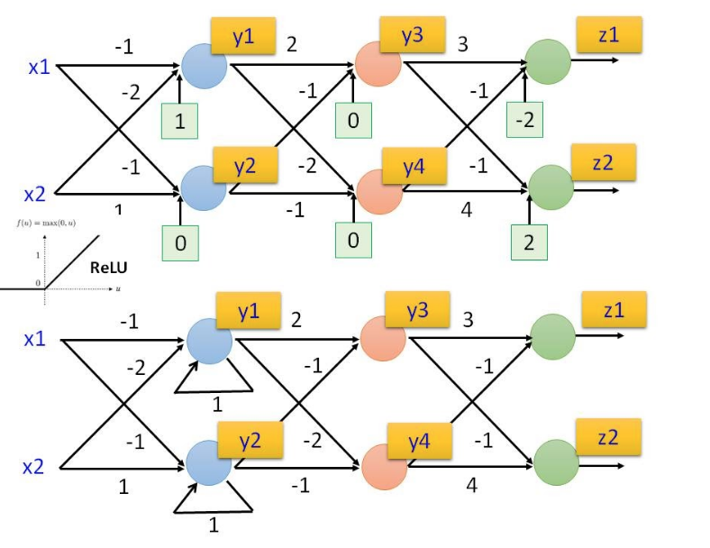
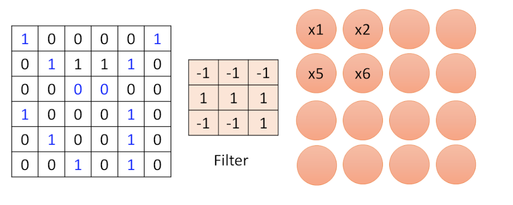

# Question 1:

After conducting a blood test, the doctor told you that you were tested positive for a fatal disease. Worse, the test is quite accurate: the probability of false positive (one is tested positive without the disease) is 0.05, and the probability of false negative (one is tested negative with the disease) is 0.02. Seeing that you are desperate, the doctor told you that overall the disease is rather rare, only 1 in 10,000 people.

- (a). What is the chance now that you have the disease? 

- (b). Naturally, the doctor orders a retest on you. The result of the second independent test is still positive. What is now your chance of having the disease?

F: fatal disease, T: blood test
- (a)
$$
\begin{aligned}
P(F^+) &= 0.0001\\
P(T^+|F^-) &= 0.05\\
P(T^-|F^+) &= 0.02
\end{aligned}
$$

$$
\begin{aligned}
P(F^+|T^+) &= \frac{P(T^+|F^+)P(F^+)}{P(T^+)}\\
&= \frac{P(T^+|F^+)P(F^+)}{P(T^+|F^+)P(F^+) + P(T^+|F^-)P(F^-)}\\
&= \frac{0.98\times 0.0001}{0.98\times 0.0001 + 0.05\times 0.9999}\\
&= 0.00195
\end{aligned}
$$

- (b)
  
$$
\begin{aligned}
P(F^+|T^+) &= \frac{P(T^+|F^+)P(F^+)}{P(T^+)}\\
&= \frac{P(T^+|F^+)P(F^+)}{P(T^+|F^+)P(F^+) + P(T^+|F^-)P(F^-)}\\
&= \frac{0.98\times 0.00195}{0.98\times 0.00195 + 0.05\times 0.9805}\\
&= 0.03751

\end{aligned}
$$

# Question 2:

|  Training Example | N(Running nose) |C(Coughing)  | R(Reddend skin) | F(Fever)         |Classification  |
| :------------- | :-------------: | :-------------: | :-------------: | :-------------: | :-------------: |
| d1              |+                  |+            | +              |-                  |positive(ill)|
| d2              |+                  |+            | -              |-                  |positive(ill)|
| d3 	            |-                  |-            | +              |+                  |positive(ill)|
| d4              |+                  |-            | -              |-                  |negative(healthy)|
| d5              |-                  |-            | -              |-                  |negative(healthy)|
| d6              |-                  |+            | +              |-                  |negative(healthy)|

Apply naive Bayes classifier to calculate (predict) the probability of the following subjects being ill:  
- d7: a person who is coughing and has a fever, but no running nose and no reddened skin.  
- d8: a person who is coughing, but no running nose and no reddened skin, and it is unknown if the person has a fever or not. 

Note: Use Laplace estimate with k=1 in your calculation. 

I: ill, H: healthy

## Naive Bayes Classifier:

  - First, by apply Laplace estimate with k=1, we have:
  
$$
\begin{aligned}
p(I) = \frac{1}{2} &\qquad
P(H) = \frac{1}{2}\\

P(C|I) = \frac{3}{5} &\qquad
P(C|H) = \frac{2}{5}\\
P(F|I) = \frac{2}{5} &\qquad
P(F|H) = \frac{1}{5}\\
P(\neg N|I) = \frac{2}{5} &\qquad
P(\neg N|H) = \frac{3}{5}\\
P(\neg R|I) = \frac{2}{5} &\qquad
P(\neg R|H) = \frac{3}{5}\\
\end{aligned}
$$
  - Then for d7, we can calculate the probability:

$$
\begin{aligned}
P(I| C, F, \neg N, \neg R) &= \alpha P(C|I)P(F|I)P(\neg N|I)P(\neg R|I)P(I) \\
&= \alpha \cdot  \frac{3}{5} \cdot \frac{2}{5} \cdot \frac{2}{5} \cdot\frac{2}{5} \cdot\frac{1}{2}\\
&= \alpha \cdot \frac{12}{1250}\\

P(H| C, F, \neg N, \neg R) &= \alpha P(C|H)P(F|H)P(\neg N|H)P(\neg R|H)P(H)  \\
&= \alpha \frac{2}{5} \cdot \frac{1}{5} \cdot \frac{3}{5} \cdot \frac{3}{5} \cdot \frac{1}{2}\\
&= \alpha \cdot \frac{9}{1250}

\end{aligned}
$$

  Then we can say d7 has more probability to be ill

  - For d8:

$$
\begin{aligned}
P(I| C,  \neg N, \neg R) &= \alpha P(C|I)P(\neg N|I)P(\neg R|I)P(I) \\
&= \alpha \cdot \frac{3}{5} \cdot \frac{2}{5}  \cdot\frac{2}{5} \cdot\frac{1}{2}\\
&= \alpha \cdot \frac{6}{250}\\

P(H| C, \neg N, \neg R) &= \alpha P(C|H)P(\neg N|H)P(\neg R|H)P(H)  \\
&= \alpha \cdot \frac{2}{5} \cdot \frac{3}{5}  \cdot \frac{3}{5} \cdot \frac{1}{2}\\
&= \alpha \cdot \frac{9}{250}

\end{aligned}
$$

  Then we can say d7 has more probability to be healthy

## KNN Classifier:

  For d7, use k-NN (with k = 3) to make the prediction, d7: $\neg N, C,\neg R, F$, then we can calculate the distance between d7 and each point:

  - d1: $N, C, R, \neg F$, distance = 3, ill

  - d2: $N, C, \neg R,  \neg F$, distance = 2, ill

  - d3: $\neg N, \neg C, R, F$, distance = 2, ill

  - d4: $N, \neg C, \neg R, \neg F$, distance = 3, healthy

  - d5: $\neg N, \neg C, \neg R, \neg F$, distance = 2, healthy

  - d6: $\neg N, C, R, \neg F$, distance = 2, healthy

Then we sort and take first 3 closest instance, we can predict that d7 is ill

## k-means

For d1 to d6, include all attributes and the class label, apply k-Means with k = 2 make two clusters of the data. 

First we pick two center points d1 and d2, we let positive be 1 and negative be 0, then we get:

|  Training Example | N|C  | R | F       |Classification  |
| :------------- | :-------------: | :-------------: | :-------------: | :-------------: | :-------------: |
| d1              |1                  |1            | 1             |0                  |1|
| d2              |1                  |1            | 0              |0                  |1|
| d3 	            |0                  |0            | 1              |1                  |1|
| d4              |1                  |0            | 0              |0                  |0|
| d5              |0                  |0            | 0              |0                  |0|
| d6              |0                  |1            | 1              |0                  |0|

$$
D(d1, d3) = 3, D(d2, d3) = 4\\

D(d1, d4) = 3, D(d2, d4) = 2\\

D(d1, d5) = 4, D(d2, d5) = 3\\

D(d1, d6) = 2, D(d2, d6) = 3\\

$$

Hence, {d1, d3, d6}, {d2, d4, d5} are two cluster, the new center is:

$$
C_1 = \{\frac{2}{3}, \frac{2}{3}, 1, \frac{1}{3}, \frac{2}{3} \}\\
C_2 = \{\frac{2}{3}, \frac{1}{3}, 0,0, \frac{1}{3}\}
$$

## Decision Tree:

First we decide the root node:

|N|Ill  |Healthy| 
|:-------------|:-------------:|:-------------:|
|+|2    |1      |
|-|1    |2      |
|Total |3    |3      |

|C|Ill  |Healthy| 
|:-------------|:-------------:|:-------------:|
|+|2    |1      |
|-|1    |2      |
|Total  |3    |3      |

|R|Ill  |Healthy| 
|:-------------|:-------------:|:-------------:|
|+|2    |1      |
|-|1    |2      |
|Total  |3    |3      |

$$
\begin{aligned}
Gain(N)=Gain(C) =Gain(R)  &= I(\frac{3}{6}, \frac{3}{6}) - (\frac{3}{6}I(\frac{2}{3}, \frac{1}{3}), \frac{3}{6}I(\frac{2}{3}, \frac{1}{3}))\\
&= 1 - I(\frac{2}{3}, \frac{1}{3})\\
&= 0.081
\end{aligned}
$$

|F|Ill  |Healthy| 
|:-------------|:-------------:|:-------------:|
|+|1    |0      |
|-|2    |3      |
|Total  |3    |3      |

$$
\begin{aligned}
Gain(F) &= I(\frac{3}{6}, \frac{3}{6}) - (\frac{1}{6}I(\frac{1}{1}, \frac{0}{1}), \frac{5}{6}I(\frac{2}{5}, \frac{3}{5}))\\
&= 0.191
\end{aligned}
$$

Hence, the root node should be F

|N|Ill  |Healthy| 
|:-------------|:-------------:|:-------------:|
|+|2    |1      |
|-|0    |2      |
|Total  |2    |3      |

|C|Ill  |Healthy| 
|:-------------|:-------------:|:-------------:|
|+|2    |1      |
|-|0    |2      |
|Total|2    |3      |

$$
\begin{aligned}
Gain(N)=Gain(C)  &= I(\frac{2}{5}, \frac{3}{5}) - (\frac{3}{5}I(\frac{2}{3}, \frac{1}{3}), \frac{2}{5}I(\frac{2}{2}, \frac{0}{2}))\\
&= 0.971 - \frac{3}{5} \times 0.918\\
&= 0.081
\end{aligned}
$$

|R|Ill  |Healthy| 
|:-------------|:-------------:|:-------------:|
|+|1    |1      |
|-|1    |2      |
|Total|2    |3      |

$$
\begin{aligned}
Gain(R) &= I(\frac{2}{5}, \frac{3}{5}) - (\frac{2}{5}I(\frac{1}{2}, \frac{1}{2}), \frac{3}{5}I(\frac{2}{3}, \frac{1}{3}))\\
&= 0.020
\end{aligned}
$$

# Question 3:

      

A simple deep neural network with given weights and biases is as the top figure shown above. The activation function is the ReLU function (see the insert).  When (x1, x2) = (0, 1) and (1, -1), what will the outputs (z1, z2) be, respectively?  (Note: to show your work, also write down the hidden layer output (y1, y2), and (y3, y4) in your solutions). 

## First Network:

$$
\begin{aligned}
y_1 &= Relu((-1)\cdot x_1 + (-2) \cdot x_2 + 1) \\
    &= Relu(-1)\\
    &= 0\\
y_2 &= Relu((-1)\cdot x_1 + (1) \cdot x_2 + 0) = 1\\
    &= Relu(1)\\
    &= 1\\
\end{aligned}
$$

$$
\begin{aligned}
y_3 &= Relu((2)\cdot y_1 + (-1) \cdot y_2 + 0) \\
    &= Relu(-1)\\
    &= 0\\
y_4 &= Relu((-2)\cdot y_1 + (-1) \cdot y_2 + 0)\\
    &= Relu(-1)\\
    &= 0\\
\end{aligned}
$$

$$
\begin{aligned}
z_1 &= Relu((3)\cdot y_3 + (-1) \cdot y_4 -2) \\
    &= Relu(-1)\\
    &= 0\\
z_2 &= Relu((-1)\cdot y_3 + (4) \cdot y_4 + 2)\\
    &= Relu(2)\\
    &= 2\\
\end{aligned}
$$

# Question 4:

      

1. A small image on the left is convolved with a filter in the middle, to produce a feature map on the right.  The stride is 1.  What are the values of x1, x2, x5, and x6? What kind of “pattern” that this filter may be detecting (use this example to explain)? 
   
   This filter is going to detect a pattern which has values in middle line and bottom right but do not have have in other gird.

$$
\begin{aligned}
x_1 &= -1 + 1 + 1 = 1\\
x_2 &= 1 + 1 + 1 = 3\\

x_5 &= -1 + -1 + -1 = -3\\
x_6 &= -1 + -1 + -1 = -3\\
\end{aligned}
$$

1. Discuss the main differences between fully connected feedforward and convolutional neural networks.  
   - A fully connected neural network consists of a series of fully connected layers that connect every neuron in one layer to every neuron in the other layer.
   - A simple CNN is a sequence of layers, and every layer of a CNN transforms one volume of activations to another through a differentiable function. Three main types of layers are used to build CNN architecture: Convolutional Layer, Pooling Layer, and Fully-Connected Layer.

2. Explain how to judge and prevent overfitting in training feedforward deep neural networks.
   - To judge a overfitting, we can check the accuracy of the training set and validation set, if the accuracy on training set is less than the accuracy on validation set, then the overfitting occurs.
   - To precent a overgitting, we can do early stop, data argumentation, dropout or add regularlization to over model.
  
3. You are asked to train a deep neural network to output a short English description (e.g., caption) for an image.  What training data would you need?  How would you pre-process the data before training the DNN? What high-level network architecture would you design? How would you evaluate your network? 

$$
\begin{aligned}
  P(X \land Y) &= P(X|Y) P(Y) = P(Y|X) P(X)\\
  P(X|Y) &= \frac{P(Y|X) \times P(X)}{P(Y)}\\
  &= \frac{P(Y|X)  P(X)}{P(Y\wedge X) + P(Y\land \neg X) }\\
  &= \frac{P(Y|X)  P(X)}{P(Y|X)P(X) + P(Y| \neg X)P(\neg X) }\\

  P(C|x_1, \cdots, x_n) &= \alpha P(C) \prod_{i = 1}^n P(x_i| C)

\end{aligned}

$$
