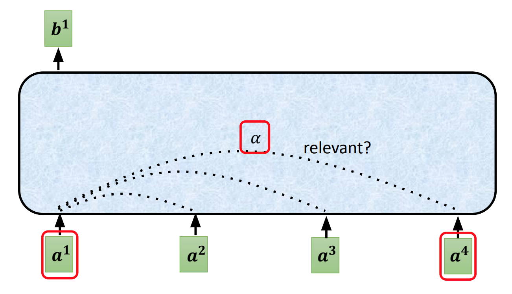
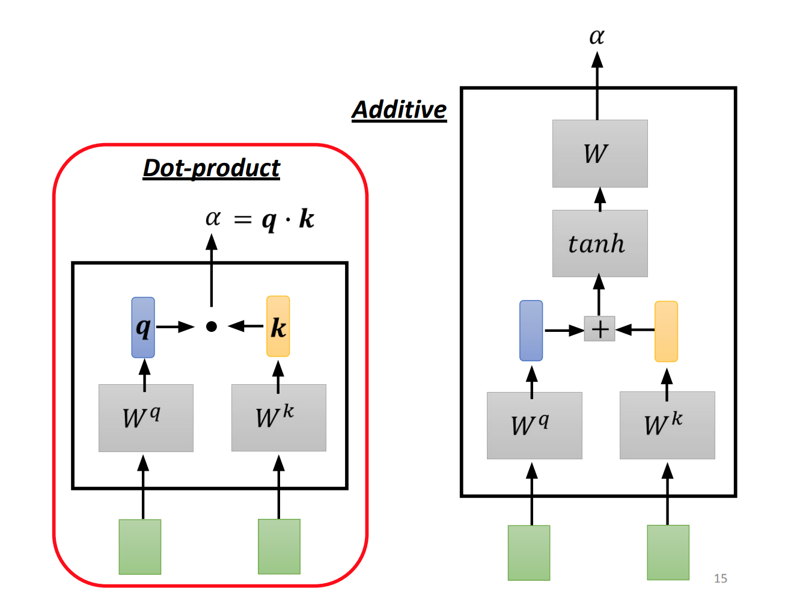
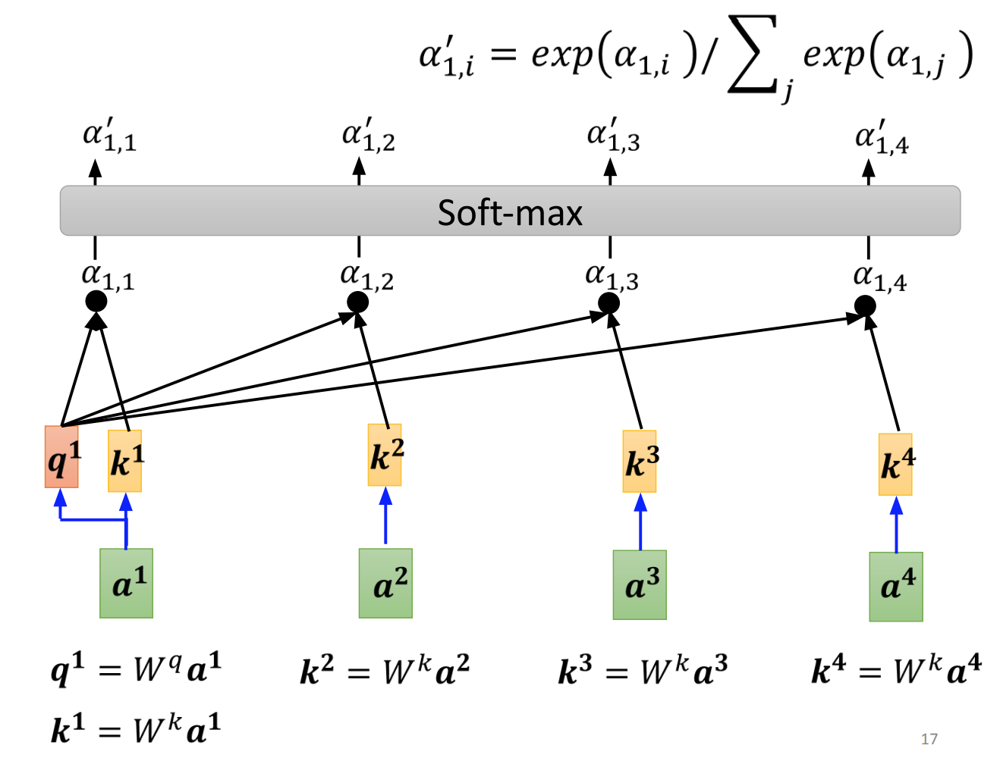
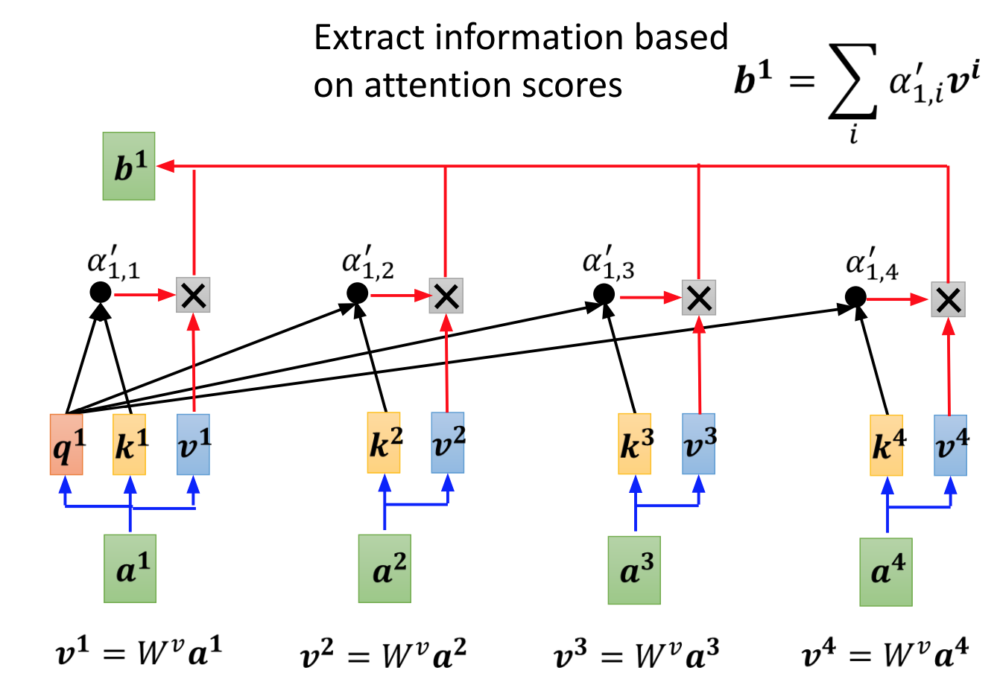
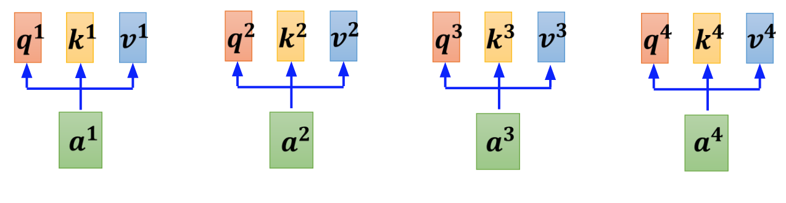
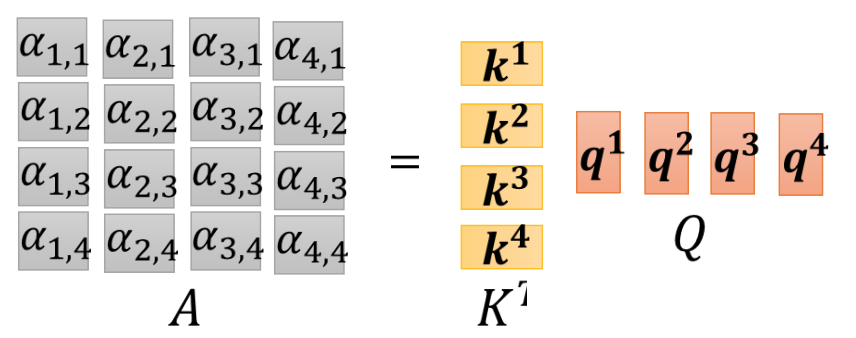
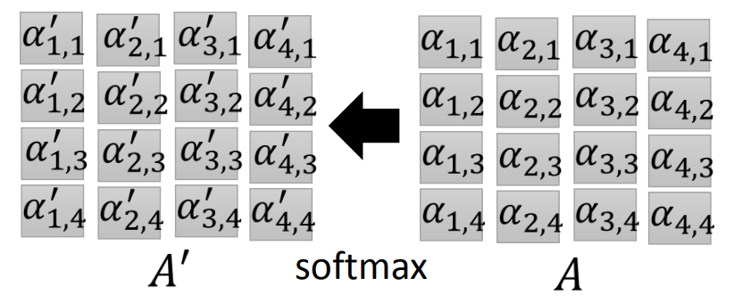
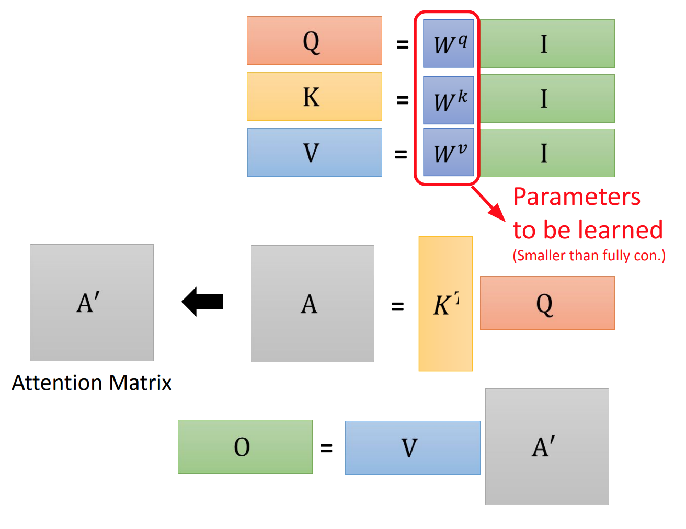

# Self Attention

## Find the relevant vectors in a sequence.

      

We use $\alpha$ to determine measure how relevant each vector.

### Way to calculate $\alpha$

      

### Example:

      

If we have:
$$
a_1 = 
\begin{bmatrix}
    1       \\
    0       \\
    1       
\end{bmatrix}, 
a_2 = 

\begin{bmatrix}
    1       \\
    2       \\
    0       
\end{bmatrix}, 
a_3 = 
\begin{bmatrix}
    3       \\
    1       \\
    1      
\end{bmatrix}, 
a_4 = 
\begin{bmatrix}
    2       \\
    1       \\
    2      
\end{bmatrix}\\

W_k = \begin{bmatrix}
    1 & 0 & 1       \\
    1 & 1 & 1      \\
    2 & 1 &0    
\end{bmatrix}

W_q = \begin{bmatrix}
    3 & 2 &0\\
    1 & 1 &2\\
    2 & 1 &0
\end{bmatrix},
$$

Then we can calculate $q_1$ as:
$$
q_1 = W_q a_1= \begin{bmatrix}
    3 & 2 &0\\
    1 & 1 &2\\
    2 & 1 &0
\end{bmatrix}
\begin{bmatrix}
    1       \\
    0       \\
    1       
\end{bmatrix} = 
\begin{bmatrix}
    3       \\
    3       \\
    2      
\end{bmatrix} 
$$

We can calculate $[k_1, k_2, k_3, k_4]$ by:

$$
\begin{aligned}
\begin{bmatrix}
  k_1 & k_2 & k_3 & k_4
\end{bmatrix}  
&=
W_k \begin{bmatrix}
  a_1 & a_2 & a_3 & a_4
\end{bmatrix} \\
&=
 \begin{bmatrix}
    1 & 0 & 1       \\
    1 & 1 & 1      \\
    2 & 1 & 0    
\end{bmatrix}
\begin{bmatrix}
    1 & 1 & 3 & 2      \\
    0 & 2 & 1 &  1    \\
    1 & 0 & 1 &  2 
\end{bmatrix}\\
&=
\begin{bmatrix}
    2 & 1 & 4 & 4      \\
    2 & 3 & 5 & 5    \\
    2 & 4 & 7 & 5 
\end{bmatrix}
\end{aligned}

$$

Next we perform a inner product;

$$
\begin{aligned}

\begin{bmatrix}
    \alpha_1 \\
    \alpha_2 \\
    \alpha_3 \\
    \alpha_4
\end{bmatrix} &=

\begin{bmatrix}
  k_1 & k_2 & k_3 & k_4
\end{bmatrix} ^T q_1\\

&=
\begin{bmatrix}
    2 & 2 & 2       \\
    1 & 3 & 4     \\
    4 & 5 & 7\\
    4 & 5 & 5
\end{bmatrix}

\begin{bmatrix}
    3       \\
    3       \\
    2      
\end{bmatrix} \\
&= 

\begin{bmatrix}
    16      \\
    20      \\
    41\\
    37     
\end{bmatrix} 

\end{aligned}
$$

Then we perform softmax of each $\alpha$
$$
\begin{aligned}
\alpha_{1,1}^{\prime} &= \frac{e^{16}}{e^{16} + e^{20} + e^{41} + e^{37}}\\
\alpha_{1,2}^{\prime} &= \frac{e^{20}}{e^{16} + e^{20} + e^{41} + e^{37}}\\
\alpha_{1,3}^{\prime} &= \frac{e^{41}}{e^{16} + e^{20} + e^{41} + e^{37}}\\
\alpha_{1,4}^{\prime} &= \frac{e^{37}}{e^{16} + e^{20} + e^{41} + e^{37}}
\end{aligned}
$$

Next we will calculate $b_1$:

      

$$
\begin{aligned}
V &=
\begin{bmatrix}
  v_1 & v_2 & v_3 & v_4
\end{bmatrix}
= 
W_v\begin{bmatrix}
  a_1 & a_2 & a_3 & a_4
\end{bmatrix}\\

b_1 &= V 
\begin{bmatrix}
  \alpha_{1,1}^{\prime} \\
   \alpha_{1,2}^{\prime} \\
    \alpha_{1,3}^{\prime}\\
     \alpha_{1,4}^{\prime}\\
\end{bmatrix}  \\

&=\alpha_{1,1}^{\prime}W_va_1 + \alpha_{1,2}^{\prime}W_va_2 + \alpha_{1,3}^{\prime}W_va_3 + \alpha_{1,4}^{\prime}W_va_4
\end{aligned}
$$

## In general:

We define Q, K and V:

$$
\begin{aligned}
Q &= \begin{bmatrix} q_1 & q_2 & q_3 & q_4 \end{bmatrix} 
= W_q \begin{bmatrix} a_1 & a_2 & a_3 & a_4 \end{bmatrix}\\
K &= \begin{bmatrix} k_1 & k_2 & k_3 & k_4 \end{bmatrix}
= W_k \begin{bmatrix} a_1 & a_2 & a_3 & a_4 \end{bmatrix}\\
V &= \begin{bmatrix} v_1 & v_2 & v_3 & v_4 \end{bmatrix}
= W_v \begin{bmatrix} a_1 & a_2 & a_3 & a_4 \end{bmatrix}
\end{aligned}
$$

      

Then we calculate the inner product to find $\alpha$

$$
\begin{aligned}
A &= K^TQ\\
& = \begin{bmatrix} k_1 \\ k_2 \\ k_3 \\ k_4 \end{bmatrix} 
\begin{bmatrix} q_1 & q_2 & q_3 & q_4 \end{bmatrix}
\\
&=  

\begin{bmatrix} 
\alpha_{11} & \alpha_{21} & \alpha_{31} & \alpha_{41}\\
\alpha_{12} & \alpha_{22} & \alpha_{32} & \alpha_{42}\\
\alpha_{13} & \alpha_{23} & \alpha_{33} & \alpha_{43}\\
\alpha_{14} & \alpha_{24} & \alpha_{34} & \alpha_{44}\\
 \end{bmatrix}

\end{aligned}
$$

      

Next we perform softmax on each $\alpha$

      

Then we can find B by:
$$
\begin{aligned}
B &= VA^{\prime}\\
& = \begin{bmatrix} v_1 & v_2 & v_3 & v_4 \end{bmatrix}

\begin{bmatrix} 
\alpha_{11}^{\prime} & \alpha_{21}^{\prime} & \alpha_{31}^{\prime} & \alpha_{41}^{\prime}\\
\alpha_{12}^{\prime} & \alpha_{22}^{\prime} & \alpha_{32}^{\prime} & \alpha_{42}^{\prime}\\
\alpha_{13}^{\prime} & \alpha_{23}^{\prime} & \alpha_{33}^{\prime} & \alpha_{43}^{\prime}\\
\alpha_{14}^{\prime} & \alpha_{24}^{\prime} & \alpha_{34}^{\prime} & \alpha_{44}^{\prime}\\
 \end{bmatrix}\\
 &= 
 \begin{bmatrix} b_1 & b_2 & b_3 & b_4 \end{bmatrix}

\end{aligned}
$$

## Overall:

      

## Positional Encoding
- No position information in self-attenttion
- Each position has a unique position value $e^i$

## Self-attention vs CNN
- CNN only consider the data in a receptive field
- Self-attention consider the data in hole image
- CNN is a simplified self-attention that can only attends in a receptive field
- Self-attention is a CNN with learnable receptive field