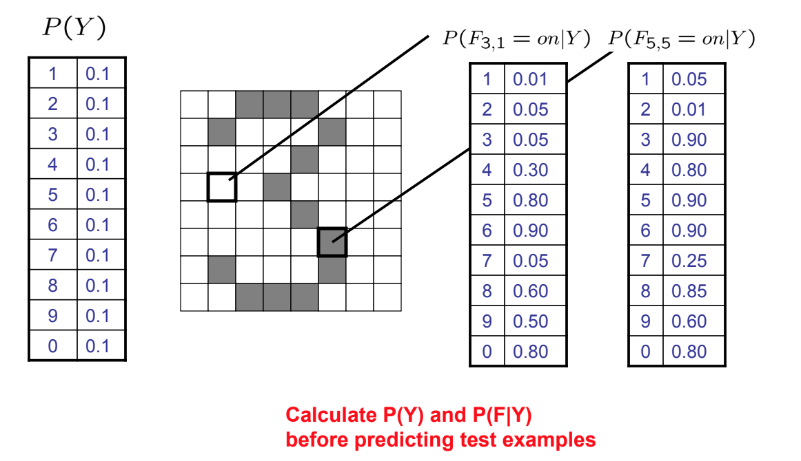
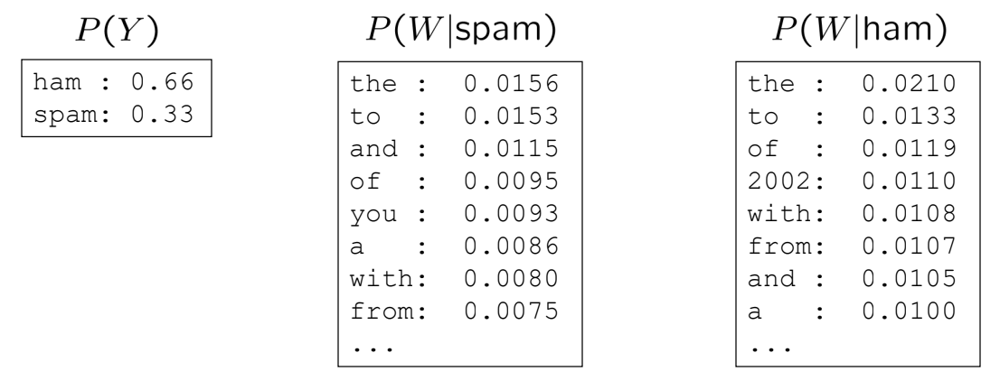

# Statistical Machine Learning

## Bayes' rule

$$
\begin{aligned}
    P(x, y) &= P(x | y)P(y) = P(y | x)P(x)\\
    P(x | y) &= \frac{P (y | x)}{P(y)}P(x)
\end{aligned}
$$

### Example 1: 
M: meningitis, S: stiff neck
$$
\begin{aligned}
    P(+m) &= 0.0001\\
    P(+s|+m) &= 0.8\\
    P(+s|-m) &= 0.01\\
\end{aligned}
$$

$$
\begin{aligned}
P(+m|+s) &= \frac{P(+s|+m)}{P(+s)}P(+m)\\
 &= \frac{P(+s|+m)P(+m)}{P(+s|+m)P(+m) + P(+s|-m)P(-m)}\\
 &= \frac{0.8\times0.0001}{0.8\times0.0001 + 0.01\times0.999}
\end{aligned}
$$
### Example 2:

D: Disease, T: Test
- A medical test is 98\% accuracte. 
$$P(T+|D+) = 98\%\\ P(T-|D-) = 98\%$$
- $P(D+) = 3\%$
- If a person is tested +, what is $P(D+|T+)$
$$
\begin{aligned}
P(D+|T+) &= \frac{P(T+|D+)}{P(T+)}P(D+)\\
&= \frac{P(T+|D+)P(D+)}{P(T+|D+)P(D+)+ P(T+|D-)P(D-)}
\end{aligned}
$$

## Bayesian Learning

Example: suppose we have five kinds of bag of candies.
- 10\% are h1, 100\% cherry candies
- 20\% are h2, 75\% cherry candies + 25\% lime candies
- 40\% are h3, 50\% cherry candies + 50\% lime candies
- 20\% are h4, 25\% cherry candies + 75\% lime candies
- 10\% are h5, 100\% lime candies

Then if we observe candies drawn from some bag is 5 lime candies, What kind of bag is it? What flavour will the next candy be?

$$
\begin{aligned}

P(h_1 | 5\text{ limes})&= \alpha P(5\text{ limes} | h_1)P(h_1) = 
\alpha \cdot (0.0)^5 \cdot 0.1 = 0\\
P(h_2 | 5\text{ limes})&= \alpha P(5\text{ limes} | h_2)P(h_2) = 
\alpha \cdot (0.25)^5 \cdot 0.20 = 0.000195 \alpha\\

P(h_3 | 5\text{ limes})&= \alpha P(5\text{ limes} | h_3)P(h_3) = 
\alpha \cdot (0.5)^5 \cdot 0.40 = 0.0125 \alpha\\

P(h_4 | 5\text{ limes})&= \alpha P(5\text{ limes} | h_4)P(h_4) = 
\alpha \cdot (0.75)^5 \cdot 0.20 = 0.0475 \alpha\\

P(h_5 | 5\text{ limes})&= \alpha P(5\text{ limes} | h_5)P(h_5) = 
\alpha \cdot (1.0)^5 \cdot 0.1 = 0.1 \alpha

\end{aligned}
$$

Since $\sum_{i=1}^5P(h_i | 5\text{ limes})=1$, then we can write:

$$
\begin{aligned}
0 + 0.000195 \alpha + 0.0125 \alpha + 0.0475 \alpha + 0.1 \alpha &= 1\\
\alpha &= 6.2424
\end{aligned}
$$

Hence, 
$$
\begin{aligned}
P(h_1| 5\text{ limes}) &= 0\\
P(h_2| 5\text{ limes}) &= 0.00122\\
P(h_3| 5\text{ limes}) &= 0.07803\\
P(h_4| 5\text{ limes}) &= 0.29650\\
P(h_5| 5\text{ limes}) &= 0.62424\\
\end{aligned}
$$

$$
\begin{aligned}
P(\text{lime on} 6 | 5\text{ limes})
&= P(\text{lime on } 6 | h_1)P(h_1|5\text{ limes})
+ P(\text{lime on } 6 | h_2)P(h_2|5\text{ limes})\\

&+ P(\text{lime on } 6 | h_3)P(h_3|5\text{ limes})
+ P(\text{lime on } 6 | h_4)P(h_4|5\text{ limes})\\

&+ P(\text{lime on } 6 | h_5)P(h_5|5\text{ limes})\\
&= 0\times0 + 0.25\times0.00122 + 0.5\times0.07830 + 0.75\times0.29650 + 1.0\times0.62424
\end{aligned}
$$

## Navie Bayes
- Assume all features are independent effects of the label
- What is the class given attribute values $x_1, \cdots, x_n$?

$$
P(C|x_1,\cdots,x_n) = \alpha P(c) \prod_i P(x_i|C)
$$

- Simple digit recognition version:
  - One feature (variable) $F_{ij}$ for each grid position $<i,j>$
  - Feature values are on / off, based on whether intensity is more or less than 0.5 in underlying image
  - Each input maps to a feature vector, e.g.

### Example: Digit Recognition

- Input: images/pixel
- Output: a digit 0-9

- Setup: 
  - Get a large collection of example images, each labeled with a digit
  - Want to learn to predict labels of new, future digit images

- What do we need inorder to use Navie Bayes?
  - Interface method
    - Start with a bunch of probabilities: $P(Y)$ and the $P(F_i|Y)$ tables
    - Use standard inference to compute $P(Y|F_1\cdots F_n)$
  - Estimates of local conditional probability tables
    - $P(Y)$, the prior over labels
    - $P(F_i|Y)$ for each feature (evidence variable)
    - These probabilities are collectively called the parameters of the model and denoted by $\theta$

      

### Example: A Spam Filter

- Data: 
  - collect of emails, labeled spam or ham
  - Split into training, held-out, test sets
- Classifiers:
  - Learn on the training set
  - Test it on new emails

- Bag-of-words Naïve Bayes:
  - Features: $W_i$ is the word at positon $i$
  - As before: predict label conditioned on feature variables (spam vs. ham)
  - As before: assume features are conditionally independent given label
  - New: each $W_i$ is identically distributed
  
- “Tied” distributions and bag-of-words
    - Usually, each variable gets its own conditional probability distribution $P(F|Y)$
    - In a bag-of-word model
      - Each position is identically distributed
      - All positions share the same conditional probs $P(W|Y)$
    - Called “bag-of-words” because model is insensitive to word order or reordering
  

- Generative model: (i means word at position i, not ith word)

$$
P(Y, W_1, \cdots, W_n) = P(Y)\prod_i P(W_i|Y)
$$
- 
   

## Question:

After conducting a blood test, the doctor told you that you were tested positive for a fatal disease. Worse, the test is quite accurate: the probability of false positive (one is tested positive without the disease) is 0.05, and the probability of false negative (one is tested negative with the disease) is 0.02. Seeing that you are desperate, the doctor told you that overall the disease is rather rare, only 1 in 10,000 people.

- (a). What is the chance now that you have the disease? 

- (b). Naturally, the doctor orders a retest on you. The result of the second independent test is still positive. What is now your chance of having the disease?

F: fatal disease, T: blood test
- (a)
$$
\begin{aligned}
P(F+) &= 0.0001\\
P(T+|F-) &= 0.05\\
P(T-|F+) &= 0.02
\end{aligned}
$$

$$
\begin{aligned}
P(F+|T+) &= \frac{P(T+|F+)P(F+)}{P(T+)}\\
&= \frac{P(T+|F+)P(F+)}{P(T+|F+)P(F+) + P(T+|F-)P(F-)}
\end{aligned}
$$

- (b)
  
$$
\begin{aligned}
P(F_2+|T+) =

\end{aligned}
$$

