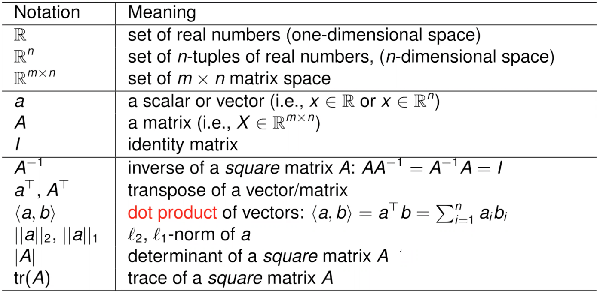

# Notation

      

# Eigenvalue and Eigenvectors

Let $A$ be a $n \times n$ square matrix, if we can find a **scalar** $\lambda$ and a **unit vector** $v$, such that

$$
Av = \lambda v
$$

then, $\lambda$ is the Eigenvalue of $A$ and $v$ is its corresponding eigenvector.

## Properties:
- For n dimensional space, $A$ could have up to $n$ pair of eigenvalues and eigenvectors.

- $A =V\Delta V^{-1}$, such that:

$$
\begin{aligned}
Av_1 &= \lambda_1v_1\\
&\vdots\\
Av_n &= \lambda_nv_n\\
\Delta = \begin{bmatrix}
\lambda_1 & 0 & \cdots & 0\\
0 & \lambda_2 & \cdots & 0\\
\vdots & \vdots & \ddots & \vdots\\
0 & 0 & \cdots & \lambda_n 
\end{bmatrix}&, 

V =  \begin{bmatrix}
v_1 & v_2 &\cdots & v_n
\end{bmatrix}, \\

    
\end{aligned}
$$

- If $A$ is positive definite, then all of the eigen value are positive. (A positive definite matrix is a matrix $A$ s.t. $\forall \ x \ x^TAx > 0$)
- If $A$ is symmetric, then $V$ is an orthogonal matrix: $V^{-1} = V^T$ ($A$ is an orthogonal matrix if $A^T = A^{-1}$)