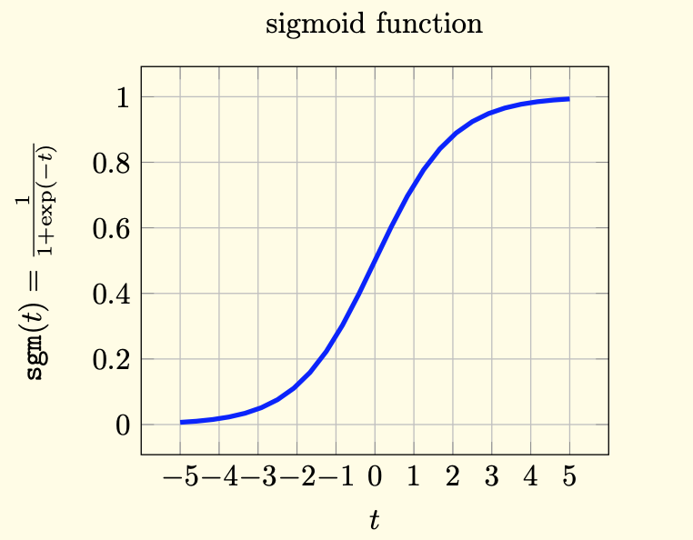
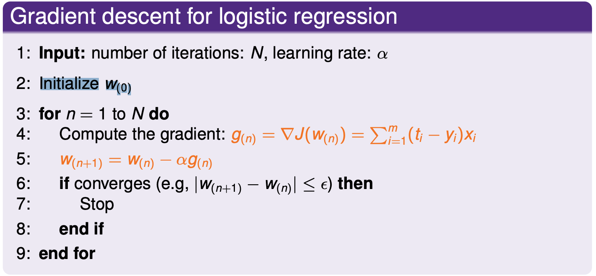
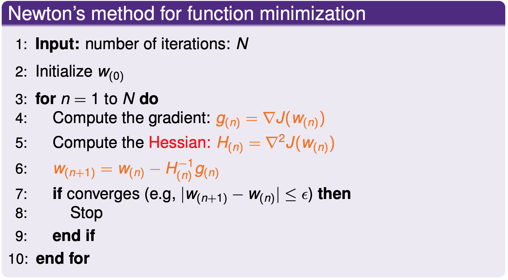
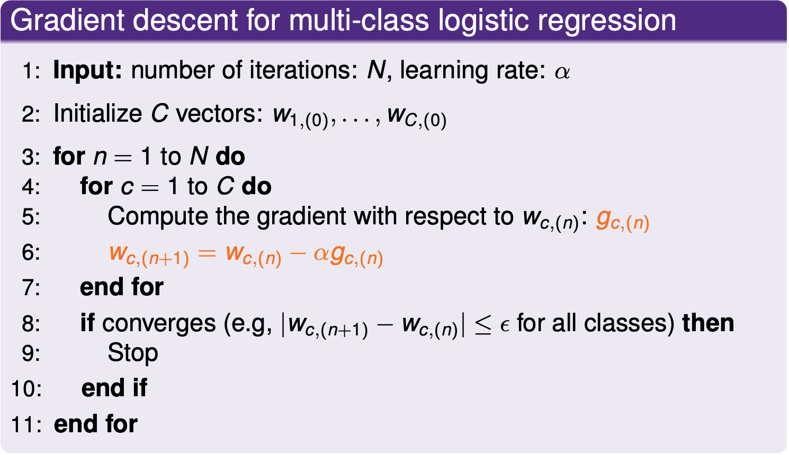

# Logistic Regression

# Bernoulli model
Bernoulli distribution is the discrete probability distribution of a random variable which takes the value 1 with probability $p$ and the value 0 with probability $q=1-p$.

If X is a random variable with this distribution, then:

$$
Pr(X= 1) = p = 1 - Pr(X = 0) = 1 - q
$$

The probability mass function $f$ of this distribution, over possible outcomes k, is

$$
f(x;p) = 

\left \{
\begin{aligned}
    &p & \text{if } x = 1\\
    &1 - p& \text{if } x = 0
\end{aligned}
\right.
$$

This can also be expressed as:

$$
f(x;p) = p^k(1-p)^{1 - k}
$$

Let us consider the binary classification problem with labels $y\in \{\pm 1\}$. With the parameterization:

$$
Pr(Y = 1| X= x) =:p(x;w)
$$

where p is a function that maps x and w into $[0,1]$, we then have the Bernoulli model for generating the label $y \in \{\pm 1\}$:

$$
Pr(Y = y| X= x) = p(x; w)^{y}(1 - p(x; w))^{1 - y}
$$

This can also be expressed as:

$$
Pr(Y = y| X= x) =

\left \{
\begin{aligned}
    &p(x; w) & \text{if } Y = 1\\
    &1 - p(x; w)& \text{if } Y = 0
\end{aligned}
\right.
$$

Then if we consider $\mathcal{D} = \{(x_i, y_i): i = 1, \cdots, n\}$ as an i.i.d sample, we can write the condition liklihood:

$$
\begin{aligned}
&Pr(Y_1 = y_1, \cdots, Y_n = y_n | X_1 = x_1, \cdots, X_n = x_n) \\
&= \prod_{i = 1}^n Pr(Y_i = y_i| X_i = x_i)\\
&= \prod_{i = 1}^n p(x_i; w)^{y_i}(1 - p(x_i; w))^{1- y_i}
\end{aligned}
$$

# Sigmod Function

We define the sigmod function $\sigma(x)$ as:

$$
\sigma(x) = \frac{1}{1 + e^{-x}} = \frac{e^x}{e^x + 1}
$$

Which has the following shape:

      

## Why sigmod?

We want to calcuate the probability p(y|x) for any datapoint x is given, one natural chioce is:

$$
p(x;w) = w^Tx + b
$$

However, this choice has the disadvantage in the sense that the left-hand side takes value in $[0, 1]$ while the right-hand side takes value in $\mathbb{R}$, so we first take a logit transformation of $p$ and then equate it to an affine function:

$$
\begin{aligned}
\log \frac{p(x;w)}{1 - p(x;w)} &= w^Tx +b\\
p(x; w) &= \frac{1}{1 - e^{-(w^Tx + b)}}\\
p(x; w) &= \sigma(w^Tx +b)
\end{aligned}
$$

And if we plug this into the likelihood function we get:

$$
\begin{aligned}
    L(w) &= \prod_{i = 1}^n p(x_i; w)^{ y_i}(1 - p(x_i; w))^{1 - y_i}\\
    &= \prod_{i = 1}^n \sigma(\textbf{w}^Tx)^{ y_i}(1 - \sigma(\textbf{w}^Tx))^{1- y_i} \quad \text{where } \textbf{w} = (w, b)
\end{aligned}
$$

Take log we get:
$$
\begin{aligned}
\log(L(\textbf{w}))&= \log \prod_{i = 1}^n \sigma(\textbf{w}^Tx)^{y_i}(1 - \sigma(\textbf{w}^Tx))^{1- y_i}\\
&= \sum_{i = 1}^n y_i \log(\sigma(\textbf{w}^Tx)) + (1 - y_i)\log(1 - \sigma(\textbf{w}^Tx))

\end{aligned}
$$

## Distanvage of sigmod:
It is tempting to prefer logistic regression over other classification algorithms since the former spits out not only label predictions but also probability confidences. However, one should keep in mind that in logistic regression, we make the assumption

$$
Pr(Y = 1| X= x) = \sigma(w^Tx)
$$
which may or may not hold on your particular dataset. So the probability estimates we get from logistic regression can be totally off. Is it really better to have a probability estimate that is potentially very wrong than not to have anything at all?

# Loss function for logistic regression

First, we have the sigmod function:

$$
\sigma(w^Tx) = \frac{1}{1 + e^{-w^Tx}}
$$

Then we take the derivate with respect to w, we have:

$$

\begin{aligned}
\frac{\partial \sigma(w^Tx)}{\partial  w} &= \frac{e^{-w^Tx}}{( 1+ e^{-w^Tx})^2}x\\
\frac{ \partial (1 - \sigma(w^Tx))} {\partial w} &= - \frac{e^{-w^Tx}}{( 1+ e^{-w^Tx})^2}x

\end{aligned}
$$

Next we consider the derivate of $\log(L(w))$ with respect to w, we have:

$$
\begin{aligned}
    \frac{\partial \log(L(w))}{\partial w} &= \sum_{i=1}^n \frac{\partial y_i \log(\sigma(w^Tx))}{\partial w} + \frac{\partial (1 - y_i) \log(1 - \sigma(w^Tx))}{\partial w}\\

    &= \sum_{i=1}^n y_i 
    \frac{ \partial \log(\sigma(w^Tx))}{\partial \sigma(w^Tx)} \frac{\partial \sigma(w^Tx)}{\partial w} +
    (1 - y_i)  \frac{ \partial \log(1 - \sigma(w^Tx))} {\partial (1 - \sigma(w^Tx))}\frac{ \partial (1 - \sigma(w^Tx))} {\partial w}
    
    \\

    &=  \sum_{i=1}^n y_i (1 + e^{-w^Tx})\frac{e^{-w^Tx}}{( 1+ e^{-w^Tx})^2}x
    -
     (1 - y_i)\frac{1 + e^{-w^Tx}}{e^{-w^Tx}} \frac{e^{-w^Tx}}{( 1+ e^{-w^Tx})^2}x 
    \\
    &= \sum_{i=1}^n y_i \frac{e^{-w^Tx}}{ 1+ e^{-w^Tx}}x - (1 - y_i)\frac{1}{1 + e^{-w^T}}x\\

    &= \sum_{i=1}^n y_i \frac{e^{-w^Tx}}{ 1+ e^{-w^Tx}}x+ y_i\frac{1}{1 + e^{-w^T}}x - \frac{1}{1 + e^{-w^T}}x\\

    & = \sum_{i=1}^n ( y_i \frac{e^{-w^Tx}}{ 1+ e^{-w^Tx}} +  y_i\frac{1}{1 + e^{-w^T}} - \frac{1}{1 + e^{-w^T}}) x\\

    &= \sum_{i=1}^n (y_i - \frac{1}{1 + e^{-w^T}})x\\
    
    &= \sum_{i=1}^n (y_i - \sigma(w^Tx))x
\end{aligned}
$$

And we let the loss function be $J(w)$, where

$$
\begin{aligned}
J(w) &= - \log(L(w))\\
\nabla J(w) &= \sum_{i=1}^n ( \sigma(w^Tx_i) - y_i)x_i

\end{aligned}
$$

# Gradient Descent of Logistic Regression

Objective: : minimize the cross-entropy loss function $(-\log(L(w)))$

      

# Newton's method 
Newton's method can be used to calculate the zero point of a funciton by:

$$
x_{n + 1} = x_n - \frac{f^{\prime} (x_n)}{f^{\prime \prime} (x_n)}
$$

      

 Newton’s algorithm is generally much faster than gradient descent. The downside, however, is that computing and storing the Hessian can be expensive.

# Regularized logistic regression

- $l_2$ regularized logistic regression

$$
J(w) = -\log(L(w)) + \frac{\lambda}{2} \|w\|_2^2
$$

- $l_1$ regularized logistic regression

$$
J(w) = -\log(L(w)) + \lambda \|w\|_1
$$

# Muti-class logistic regression

$$
p(y = c| x; w_1, \cdots, w_c) = \frac{e^{w_c^Tx}}{\sum_{c = 1}^C e^{w_c^Tx}}
$$

      

