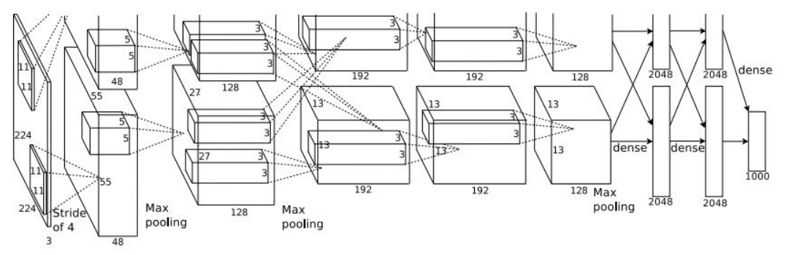
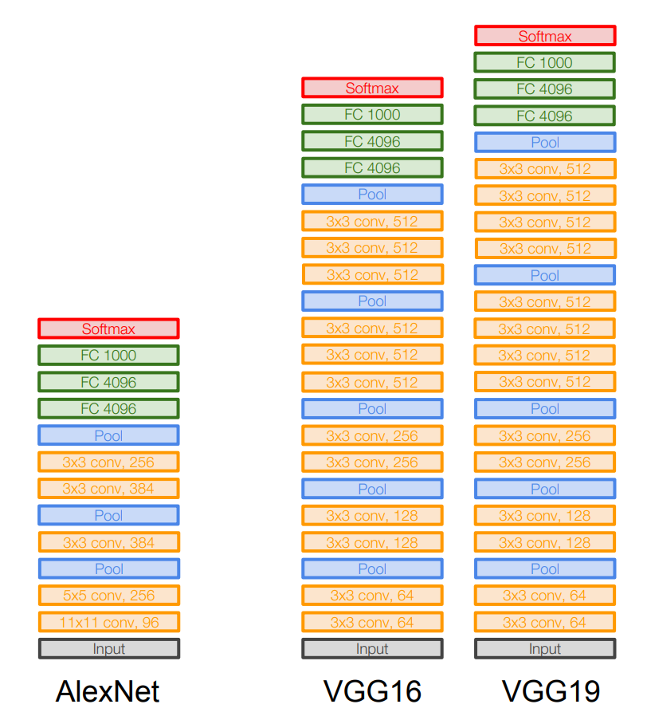
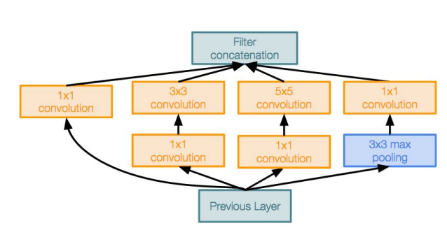
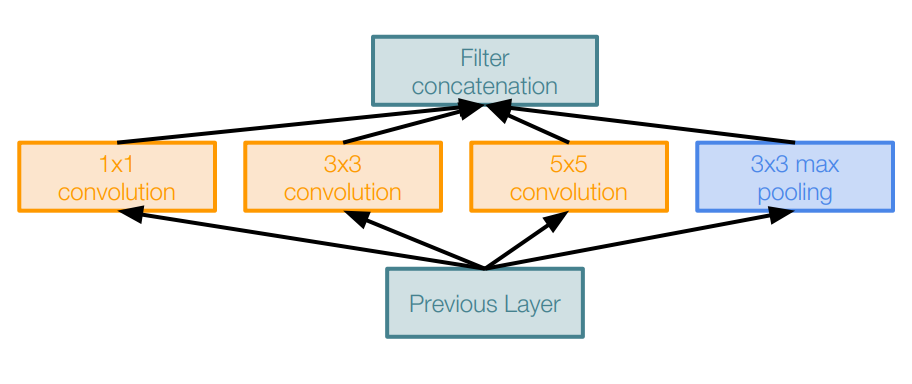
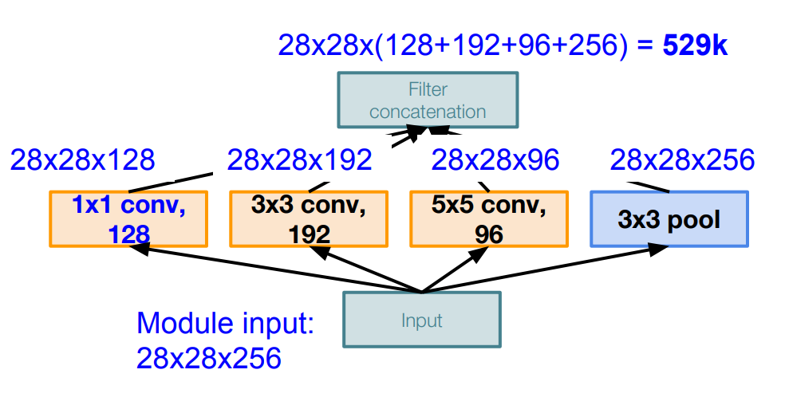
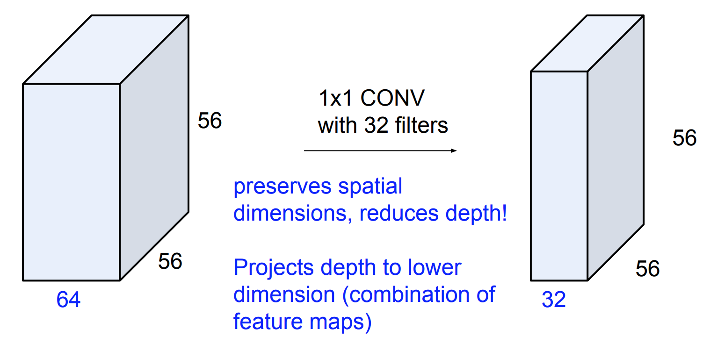
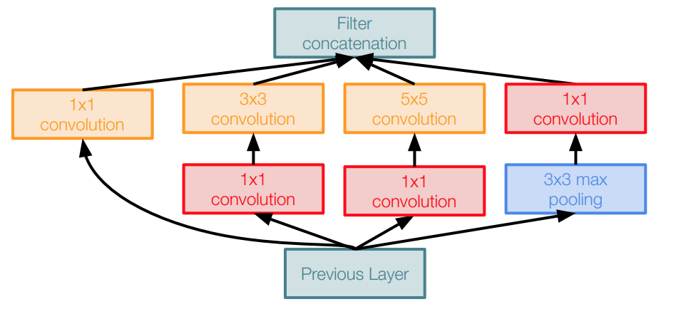

# CNN Architectures
* [AlexNet](#AlexNet)
* [VGGNet](#VGGNet)
* [GoogLeNet](#GoogLeNet)

# AlexNet

      

## Full (simplified) AlexNet architecture:

|Layer Type   |Size        | Details|
|---          |---         |---|
|INPUT |[227x227x3]|  | 
|CONV1 |[55x55x96]|96 11x11 filters at stride 4, pad 0|
|MAX POOL1|[27x27x96]|3x3 filters at stride 2|
|NORM1|[27x27x96]|Normalization layer|
|CONV2|[27x27x256]|256 5x5 filters at stride 1, pad 2|
|MAX POOL2|[13x13x256]|3x3 filters at stride 2|
|NORM2|[13x13x256]|Normalization layer
|CONV3|[13x13x384]|384 3x3 filters at stride 1, pad 1|
|CONV3|[13x13x384]|384 3x3 filters at stride 1, pad 1|
|CONV3|[13x13x256]|256 3x3 filters at stride 1, pad 1|
|MAX POOL3|[6x6x256]|3x3 filters at stride 2|
|FC6|[4096]|4096 neurons|
|FC7|[4096]|4096 neurons|
|FC8|[1000]|1000 neurons|

## Features:
- First use of ReLU
- Used Norm layers (not common anymore)
- Heavy data augmentation
- Dropout 0.5
- Batch size 128
- SGD Momentum 0.9
- Learning rate 1e-2, reduced by 10 manually when val accuracy plateaus
- L2 weight decay 5e-4
- 7 CNN ensemble: 18.2% -> 15.4%

## Calcualtions:

Input: 227x227x3 images
First layer (CONV1): 96 11x11 filters applied at stride 4
1. What is the output volume size?
    $$\frac{(227 - 11)}{4} + 1 = 55$$
    So the output volume is [55x55x96]
2. What is the total number of parameters in this layer?
   $$(11 \times 11 \times 3) \times 96 = 35K$$

# VGGNet

      

## VGGNet architecture:

|Layer Type   |   |  Memory |   Params|
|---|---|---|---|
|Input     | [224x224x3]   | 224x224x3=150K   | 0 |
|CONV3-64  | [224x224x64]  | 224x224x64=3.2M  | (3x3x3)x64 = 1,728|
|CONV3-64  | [224x224x64]  | 224x224x64=3.2M  | (3x3x64)x64 = 36,864|
|POOL2     | [112x112x64]  | 112x112x64=800K  | 0 |
|CONV3-128 | [112x112x128] | 112x112x128=1.6M | (3x3x64)x128 = 73,728|
|CONV3-128 | [112x112x128] | 112x112x128=1.6M | (3x3x128)x128 = 147,456|
|POOL2     | [56x56x128]   | 56x56x128=400K   | 0 |
|CONV3-64  | [56x56x256]   | 56x56x256=800K   | (3x3x128)x256 = 294,912|
|CONV3-64  | [56x56x256]   | 56x56x256=800K   | (3x3x256)x256 = 589,824|
|CONV3-64  | [56x56x256]   | 56x56x256=800K   | (3x3x256)x256 = 589,824|
|POOL2     | [28x28x256]   | 28x28x256=200K   | 0 |
|CONV3-64  | [28x28x512]   | 28x28x512=400K   | (3x3x256)x512 = 1,179,648|
|CONV3-64  | [28x28x512]   | 28x28x512=400K   | (3x3x512)x512 = 2,359,296|
|CONV3-64  | [28x28x512]   | 28x28x512=400K   | (3x3x512)x512 = 2,359,296|
|POOL2     | [14x14x512]   | 14x14x512=100K   | 0 |
|CONV3-512 | [14x14x512]   | 14x14x512=100K   | (3x3x512)x512 = 2,359,296|
|CONV3-512 | [14x14x512]   | 14x14x512=100K   | (3x3x512)x512 = 2,359,296|
|CONV3-512 | [14x14x512]   | 14x14x512=100K   | (3x3x512)x512 = 2,359,296|
|POOL2     | [7x7x512]     | 14x14x512=25K    | 0 |
|FC        | [1x1x4096]    | 4096             | 7x7x512x4096 = 102,760,448|
|FC        | [1x1x4096]    | 4096             | 4096x4096 = 16,777,216|
|FC        | [1x1x1000]    | 1000             | 4096x1000 = 4,096,000|

## Features:
- What is the effective receptive field of three 3x3 conv (stride 1) layers?
  - Consider a 7x7 receptive field, we apply one 3x3 conv with stride 1, then the output size is 5x5. Next we apply another 3x3 conv, the output size will be 3x3. Hence, stack of three 3x3 conv (stride 1) layers has same effective receptive field as one 7x7 conv layer
- Why use smaller filters? (3x3 conv) 
  - This the same receptive field but it is deeper, more non-linearities. And this has less parameters: 

# GoogLeNet

## Inception module:

      

### Native Inception module:

      

Apply parallel filter operations on the input from previous layer:
- Multiple receptive field sizes from convolution (1x1, 3x3, 5x5)
- Pooling operation (3x3)

Question:
- Q: What is the output size after filter concatenation?
 

      

- Q: How are we get 28x28 for every convolution layer?
- A: We are doing all the zero padding to maintain the spatial dimensions.

- Q: What is the problem of this?
- A: The conv operation cost too much. Total: 854M ops.
    1.  [1x1 conv, 128]: 28 x 28 x 128 x 1 x 1 x 256
    2. [3x3 conv, 192]: 28 x 28 x 192 x 3 x 3 x 256
    3. [5x5 conv, 96]: 28 x 28 x 96 x 5 x 5 x 256
### Inception module:
"Solution" to Native Inception module, use "bottleneck" layers that use 1x1 convs to reduce feature depth.

- 1x1 convolutions:
   

      

- Inception module with dimension reduction

      

# ResNet