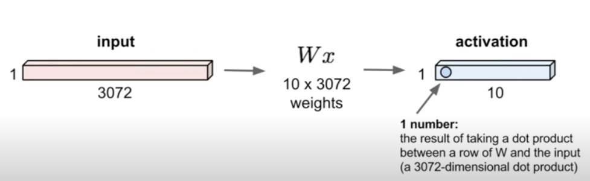
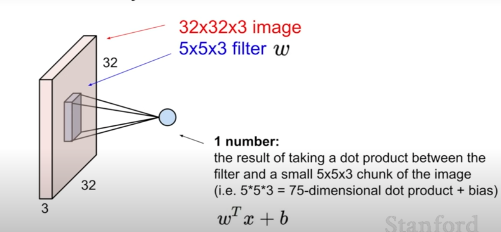
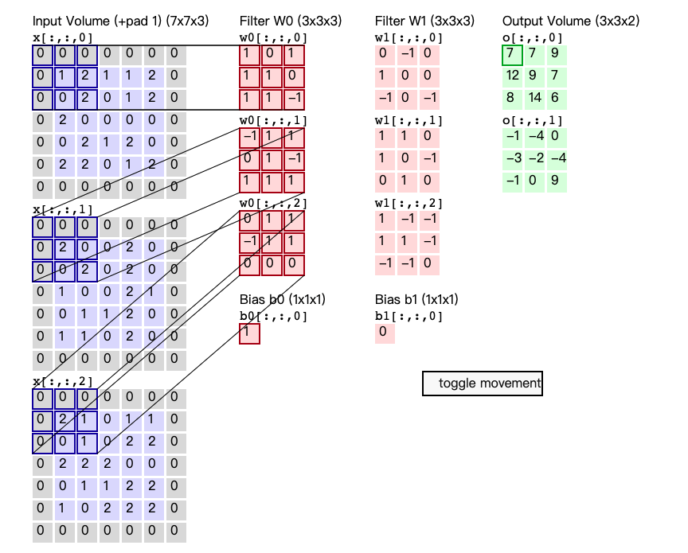
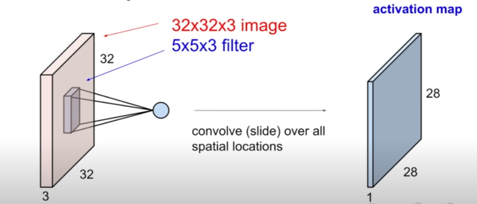
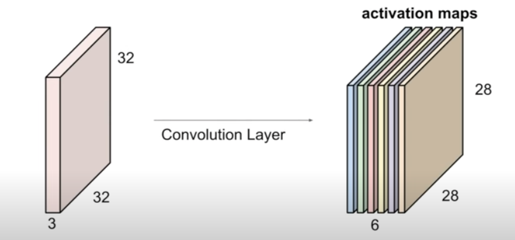
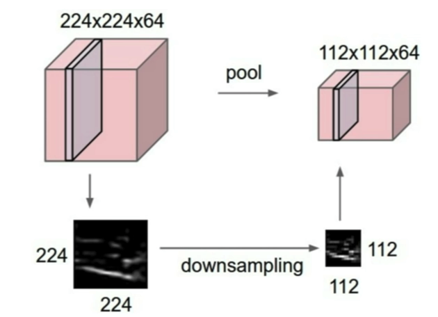
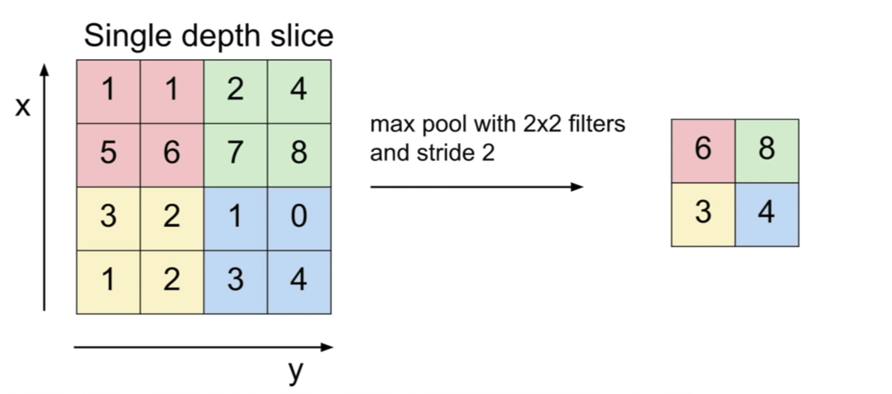

# Convolutional Neural Network
* [Fully Connected Layer](#fully-connected-layer)
* [Convolution Layer](#convolution-layer)
* [Pooling Layer](#pooling-layer)

# Fully Connected Layer

$$
W = 
\begin{bmatrix}
w_{1,1} & \cdots & w_{1, 3072}\\
w_{2,1}& \cdots & w_{2, 3072} \\
\vdots & \ddots & \vdots \\
w_{10, 1} & \cdots & w_{10, 3072}
\end{bmatrix}
\qquad
x = 
\begin{bmatrix}
x_1 & \cdots & x_{3072}
\end{bmatrix}
$$
Then we get an output matrix $S$, where $s_i$ indicates the score for each category.
$$
S = Wx = 
\begin{bmatrix}
s_1 & \cdots & s_{10}
\end{bmatrix}
$$

# Convolution Layer
## Filter

## Padding
Common to see CONV layers with stride 1, filter of size $F\times F$, and zero padding with $\frac{F - 1 }{2}$.
### Example:

$$
F = 3 \rightarrow \text{zero pad with } 1\\
F = 5 \rightarrow \text{zero pad with } 2\\
F = 7 \rightarrow \text{zero pad with } 3
$$

## The output size of a convolution layer:
Consider a convolution layer accept a input of size $W_1 \times H_1 \times D_1$, and the filter size is $F_1 \times F_2$, stride is $S$ , the amount of padding is $P$ and the number of filter is $N$. Then the output size is:

$$
    (\frac{W_1 + 2P - F_1}{S} + 1 )\times (\frac{H_1 + 2P - F_2}{S} + 1) \times N
$$

## Number of Parameter of a convolution layer:
$$
 N\times (\underbrace{F_1 \times F_2 \times D_1}_{w} + \underbrace{1}_{b})
$$

### Example:
Input volume: $32 \times 32 \times 3$, 10 $5\times 5$ filters with stride 1, pad 2. What's the number of parameter in this layer?

Each filer has $5\times 5 \times 3 + 1$ parameters, hence $76 * 10 = 760$ in total.

## Example of Convolution Layer:
$$
\begin{aligned}
&
\begin{bmatrix}
0 & 0 & 0\\
0 & 1 & 2\\
0 & 0 & 2\\
\end{bmatrix}
\cdot
\begin{bmatrix}
1 & 0 & 1\\
1 & 1 & 0\\
1 & 1 & -1\\
\end{bmatrix}
+ 
\begin{bmatrix}
0 & 0 & 0\\
0 & 2 & 0\\
0 & 0 & 2\\
\end{bmatrix}
\cdot
\begin{bmatrix}
1 & 0 & 1\\
1 & 1 & 0\\
1 & 1 & -1\\
\end{bmatrix}
+ 
\begin{bmatrix}
0 & 0 & 0\\
0 & 2 & 1\\
0 & 0 & 1\\
\end{bmatrix}
\cdot
\begin{bmatrix}
1 & 0 & 1\\
1 & 1 & 0\\
1 & 1 & -1\\
\end{bmatrix} + 1
\\
& = 1 + 4 + 1 + 1\\
& = 7
\end{aligned}
$$

## Activation map

### If we had six $5\times5$ filters. we'll get six separate activation maps:

## Common settings of Convolution Layer:

* Number of filters: powers of 2 (32, 64, 128, 512).
* F = 3, S = 1, P = 1
* F = 5, S = 1, P = 2
* F = 5, S = 2, P = ? (whatever fits)
* F = 1, S = 1, P = 0

# Pooling Layer
### - Makes the representations smaller and more manageable
### - Operates over each activation map independently:

## Common settings of Pooling Layer:

* F = 2, S = 2
* F = 3, S = 2
