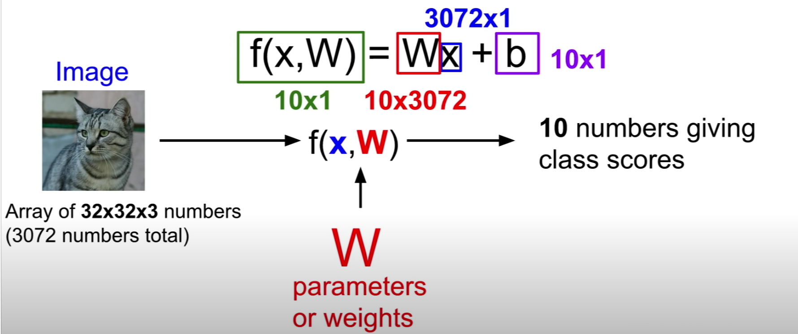

# Image Classificstion:

* [Data-Driven Approach](#data-driven-approach)
* [Nearest Neighbor Classifier](#nearest-neighbor-classifier)
* [K-Nearest Neighbors Classifier](#k-nearest-neighbors-classifier)
* [Linear Classifier](#linear-classifier)
* [Regression](#regression)

# Data-Driven Approach:
1. Collect a dataset of image and labels
2. Use Machine Learning to train a classifier
3. Evaluate the classifier on new images

<div align=center>
      
</div>
(Example data set: CIFAR10)

# Nearest Neighbor Classifier:
## Main idea:

- For each test image: find closest train image (L1 distnace) and copy the predict label of nearest image.

## Disadavntages:

- With N examples, train the model require O(1) and predict require O(n). This is bad because we want classifiers that are fast at prediction. Slow for training is ok.

# K-Nearest Neighbors Classifier:

Instead of copying label from nearest neighbor, take the majority vote from K closest points.
<div align=center>
      
</div>

### Consider: 

- Q: What if we using L2 distance instead of using L1 distance?

- A: L1 distance depends on your choice of coordinates system. If you were to rotate the coordinate frame, that will actually change the L1 distance. whereas changing the coordinate frame in the L2 distance doesn't matter.
- Note: if we let $I_1^1 = 2$, $I_1^2 = 3$, $I_2^1 = 4$ and $I_2^2 = 2$. 

* Then for L1:

$$
d_1(I_1,I_2) =\underbrace{|2 - 4|}_{x} + \underbrace{|3 - 2|}_{y} = 5
$$

* For L2:
$$
d_2(I_1,I_2) = \sqrt{{\underbrace{(2 - 4)}_{x}}^2 + {\underbrace{(3 - 2)}_{y}}^2 }
$$
<div align=center>
      
</div>


## Disadavntages
1. KNN is very problem dependent (i.e. what is the best k to use and what is the best distance to choose).
2. KNN on image is very bad, L1 and L2 distance are really not a good way to measure distance between images.
3. If we expect KNN has a good proformance, then we need our training examples to cover the space densely. Which means the number of training example grows exponential in the dimension.
<div align=center>
      
</div>

# Linear Classifier:

The Linear Classifier is like a parametric model, which has two different parameters. It will take the cat image on the left as x, and a w called weights.
<div align=center>
      
</div>

## What is the function actually doing?

- The wright matrix will be 4 by 3 since the image is 4 pixels and there are 3 classes.
- The weight matrix is like a template, compute the dot product is like compare the similarity between the template and this image.
- The bias is like b in y = kx + b, which will give us some data independent preferences for some class over another. Image if your data set is unbalanced and has many more cats than dogs, then the bias term corresponding to cat will be higher than other ones. 

<div align=center>
      
</div>

## Limitation of Linear Classifier：
<div align=center>
      
</div>

# Regression

## Preceptron

### Algorithm presocode
<p align="center">
	
	<p align="center">
</p>

### Output

<p align="center">
	
</p>

## Linear Regression

### Classical Linear Regression

$$
\left \{
\begin{aligned}
L(w, b) &= \sum_i (y_i - (w^{T}x_i + b))^2\\
\frac{\partial L}{\partial w} &= -2 \sum_i (y_i - (w^{T}x_i + b)) x_i\\
\frac{\partial L}{\partial b} &= -2 \sum_i (y_i - (w^{T}x_i + b))
\end{aligned}
\right.
$$

```Python
for n in range (len (x_data)):
  b_grad = b_grad - 2.0 * (y[n] - b - w * x[n])
  w_grad = w_grad - 2.0 * (y[n] - b - w * x[n]) * x[n]
            
b = b - step_size * b_grad
w = w - step_size* w_grad
```
### Lasso

<p align="center">
	
</p>

## Logistic Regression

### Algorithm presocode:
<p align="center">
	
</p>

### Explaniation:
<p align="center">
	
</p>

### Note:
<p align="center">
	
	
</p>


