# Introduction to Neural Networks
* [Computauional Graphs](#computauional-graphs)
* [Backpropagation](#backpropagation)

# Computauional Graphs
### We can use this graph to represent any function, where the nodes of the graph are strps of computation.
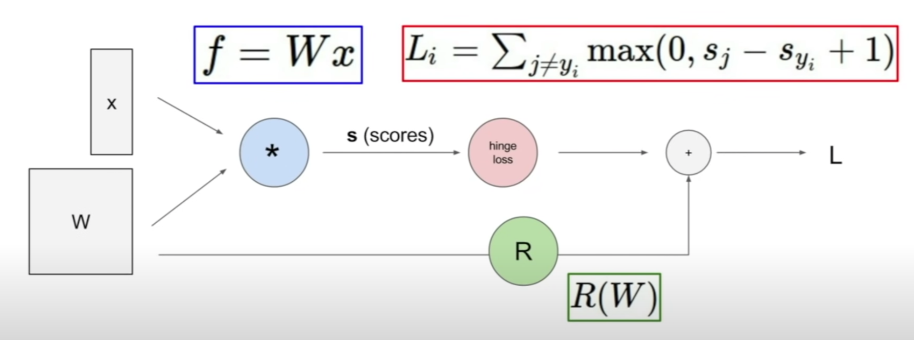

# Backpropagation
### Recursively use the chain rule to calculate the gradient with respect to every variable in the computauional graph.
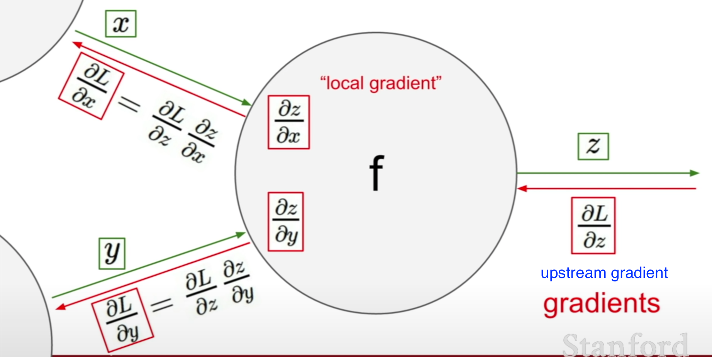

## Chain Rule: 
### Let $f(x, y , z) = (x +y)z$, compute $\frac{\partial f}{\partial x}$, $\frac{\partial f}{\partial y}$, $\frac{\partial f}{\partial z}$?
### A: 
$$
\left \{
\begin{aligned}
    \frac{\partial f}{\partial x} &= \frac{\partial f}{\partial q}\frac{\partial q}{\partial x} = -4\\

    \frac{\partial f}{\partial y} &= \frac{\partial f}{\partial q}\frac{\partial q}{\partial y} = z = -4\\

    \frac{\partial f}{\partial z} &= x + y = 3
\end{aligned}
\right.
$$

## Example: What is $\frac{\partial L}{\partial x}$?

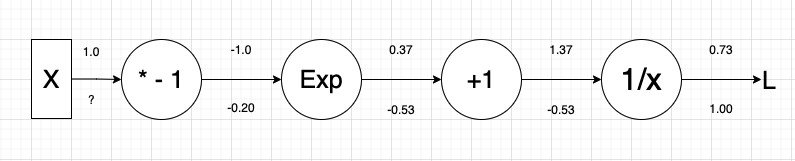

$\text{Let } M = -x, Q = e ^{M}, P = Q + 1,  L = \frac{1}{P}$, then
$$
\begin{aligned}

    \frac{\partial L}{\partial P} &= \frac{\partial L}{\partial L} \frac{\partial L}{\partial P} 
    = 1 \cdot \frac{\partial L}{\partial P}
    = 1 \cdot (- \frac{1}{1.37^2})
    = - 0.53\\

    \frac{\partial L}{\partial Q} &=  \frac{\partial L}{\partial P}\frac{\partial P}{\partial Q} 
    = (-0.53) \cdot \frac{\partial P}{\partial Q} 
    = (-0.53) \cdot 1
    = -0.53\\

    \frac{\partial L}{\partial M} &= \frac{\partial L}{\partial Q}\frac{\partial Q}{\partial M} 
    = (-0.53) \cdot \frac{\partial Q}{\partial M}  
    = (-0.53) \cdot e^{-1} 
    = - 0.20\\

    \frac{\partial L}{\partial x} & =  \frac{\partial L}{\partial M}\frac{\partial M}{\partial x} 
    = (- 0.20) \cdot \frac{\partial M}{\partial x} 
    = (- 0.20) \cdot -1 = 0.20 

\end{aligned}
$$

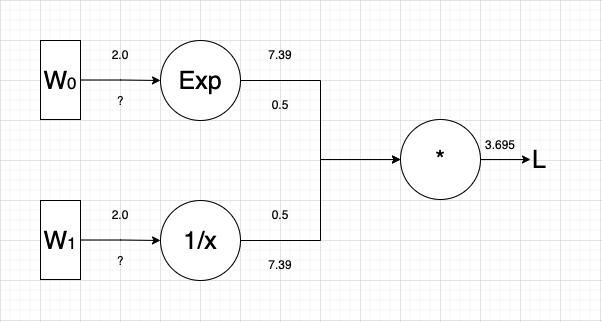
$\text{Let } P = e ^{W_0}, Q = \frac{1}{W_1},  L = PQ$, then:

$$
\left \{
\begin{aligned}
\frac{\partial L}{\partial P} &= \frac{\partial L}{\partial L} \frac{\partial L}{\partial P}
= 1 \cdot \frac{\partial L}{\partial P}
= 1 \cdot Q
= 0.5\\

\frac{\partial L}{\partial W_1} &= \frac{\partial L}{\partial P} \frac{\partial P}{\partial W_1}
= (0.5) \cdot  \frac{\partial P}{\partial W_1}
= (0.5) \cdot (e^2)
= 3.69

\end{aligned}
\right.

\left \{
\begin{aligned}
\frac{\partial L}{\partial Q} &= \frac{\partial L}{\partial L} \frac{\partial L}{\partial Q}
= 1 \cdot \frac{\partial L}{\partial Q}
= 1 \cdot P
= 7.39\\

\frac{\partial L}{\partial W_2} &= \frac{\partial L}{\partial Q} \frac{\partial Q}{\partial W_2}
= (7.39) \cdot  \frac{\partial Q}{\partial W_2}
= (7.39) \cdot -\frac{1}{4}
= -1.85
\end{aligned}
\right.
$$

## Gates:

### Add Gate: gradient distributor
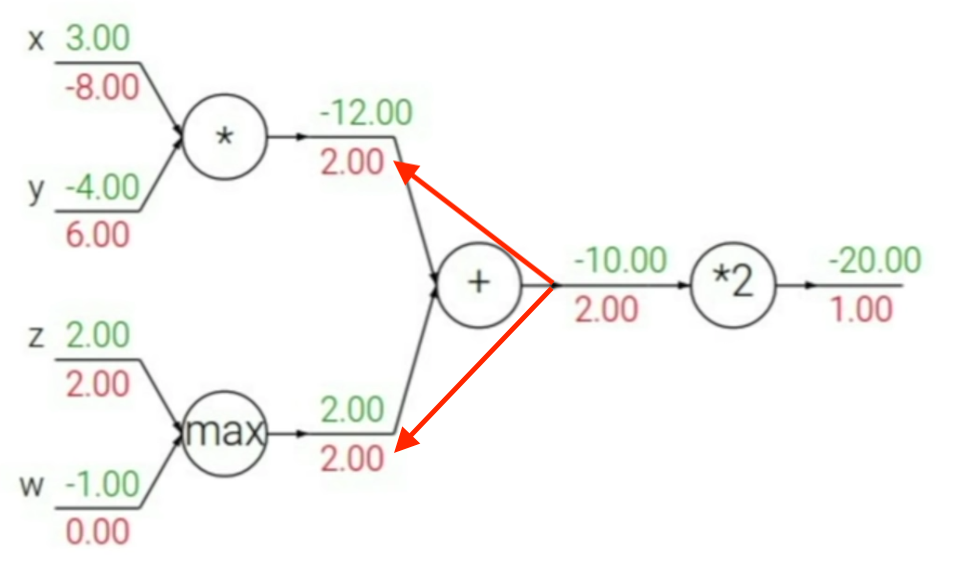
When we pass through the addition gate, it took the upstream gradient and just distributed it (pass the exact same thing to both of the branches that were connected).

### Mult Gate: gradient switcher
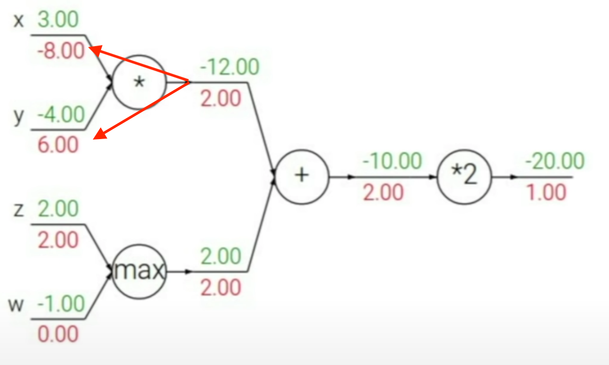
We take the upstream gradient and we scale it by the value of the other branch.

### Max Gate: gradient router
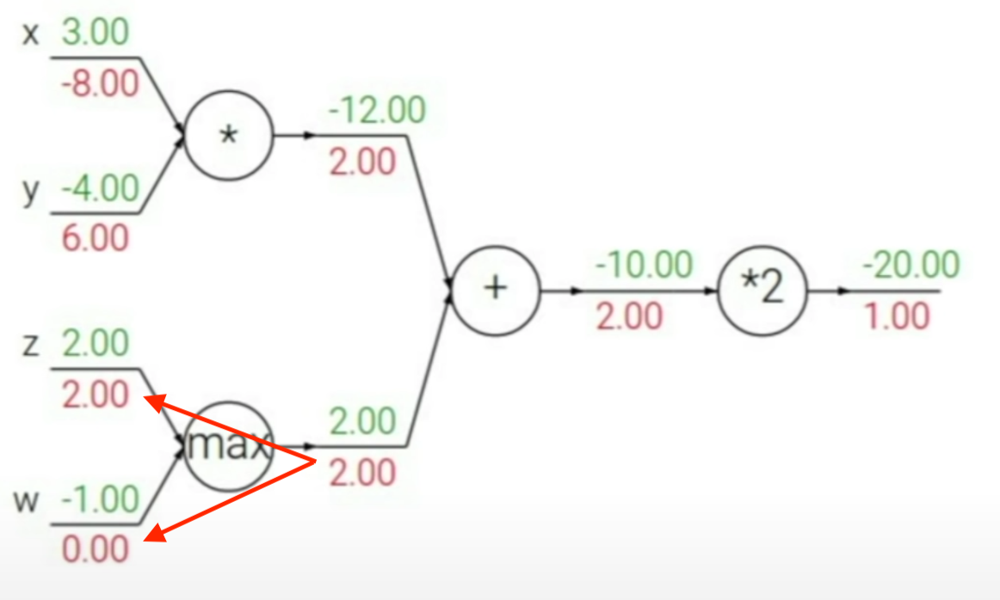
The max gate will take the gradient and route it to one of the branches. (If we look at our forward pass, only the value that was the maximum got passed down to the rest of the computational graph).

### Sigmoid Gate:
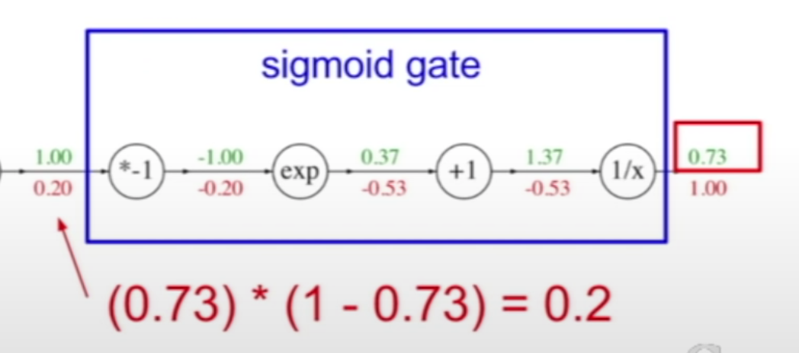
### Sigmoid Function:

$$
\left \{
\begin{aligned}
\sigma(x) &= \frac{1}{1 + e^{-x}}\\

\frac{d \sigma(x)}{dx} &= \frac{e^{-x}}{(1 + e^{-x})^2} = (\frac{1 + e^{-x} - 1}{1 + e^{-x}})(\frac{1}{1 + e^{-x}}) = (1 - \sigma(x))\sigma(x)
\end{aligned}
\right.
$$

## Example: 
### $f(x, W) = \|W\cdot x\|^2$ , where:
$$
W = 
\begin{bmatrix}
0.1 & 0.5\\
-0.3 & 0.8 
\end{bmatrix}
\qquad
x = 
\begin{bmatrix}
0.2 \\
0.4
\end{bmatrix}
$$
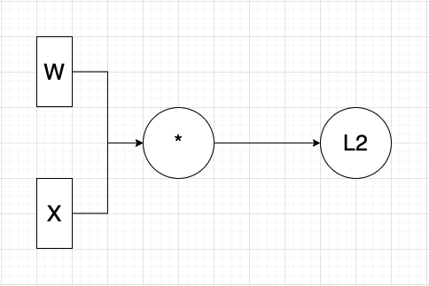

### Forward pass:
$$
\begin{aligned}
P &= W \cdot x \\
& = 
\begin{bmatrix}
w_{11} x_1 + w_{12} x_2 \\
w_{21} x_1 + w_{22} x_2
\end{bmatrix}
\\

&=
\begin{bmatrix}
0.2 * 0.1 + 0.5 * 0.4\\
0.2 * (-0.3) + 0.8 * 0.4
\end{bmatrix}
= \begin{bmatrix}
0.22 \\
0.26
\end{bmatrix}
\\

\| P\|^2 &= 0.22 ^2 + 0.26^2 = 0.116
\end{aligned}
$$
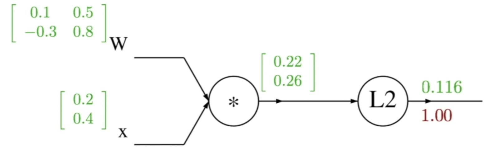

### Backward pass:
$$
\begin{aligned}
    \frac{\partial f}{\partial P} = \frac{\partial f}{\partial f}\frac{\partial f}{\partial P} = (1.0) \cdot 2
    \begin{bmatrix}
    0.22 \\
    0.26
    \end{bmatrix}
    = 
    \begin{bmatrix}
    0.44 \\
    0.52
    \end{bmatrix}

\end{aligned}
$$

$$
\begin{aligned}
\frac{\partial P}{\partial W}  = \frac{\partial W x}{\partial W} &= 
\begin{bmatrix}
    \frac{P}{w_{11}} & \frac{P}{w_{21}}\\
    \frac{P}{w_{12}} & \frac{P}{w_{22}}
\end{bmatrix}

\end{aligned}
$$
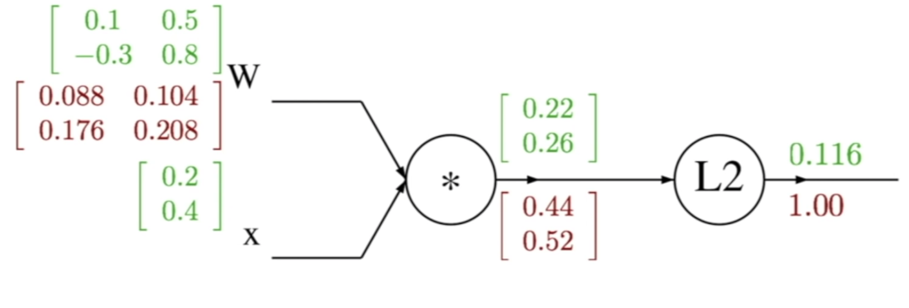
# Neural Network
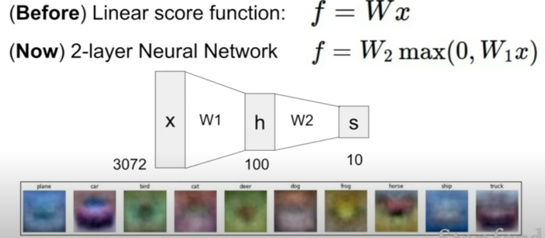
## Activation functions:
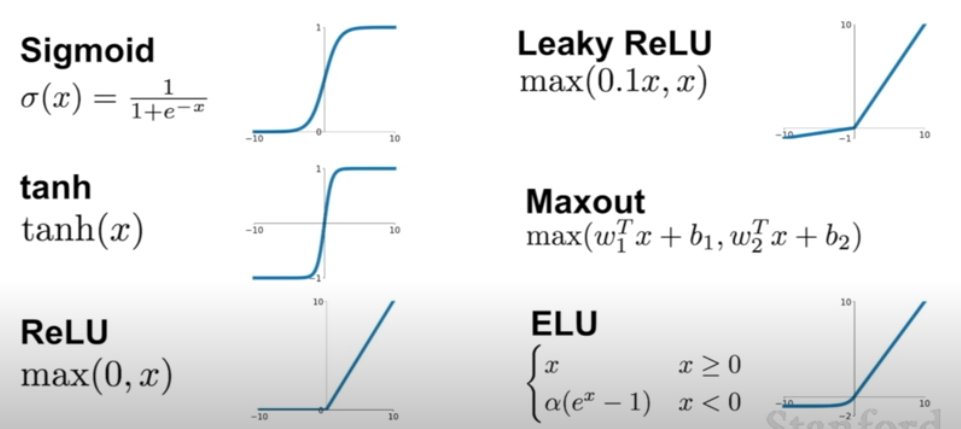
## Architectures:
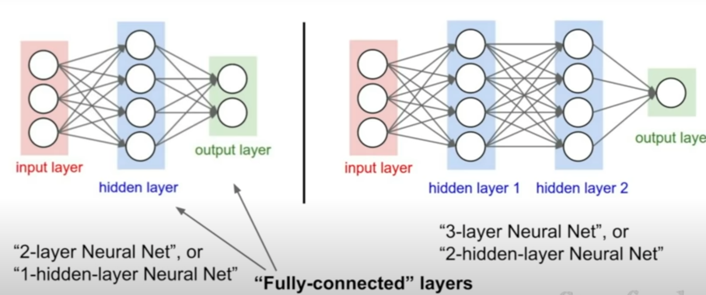
# Matrix Derivative

## Vector and scalar
$$
 y = \begin{bmatrix}
    y_1 \\
    y_2 \\
    \vdots\\
    y_n
    \end{bmatrix},

\frac{\partial y}{\partial x} = 
\begin{bmatrix}
    \frac{\partial y_1}{\partial x}  \\
    \frac{\partial y_2}{\partial x}  \\
    \vdots\\
    \frac{\partial y_n}{\partial x} 
    \end{bmatrix}
$$

## Matrix and scalar
$$
Y = \begin{bmatrix}
    y_{11} & y_{12} & \cdots & y_{1n}\\
    y_{21} & y_{22} & \cdots & y_{2n}\\
    \vdots & \vdots& \ddots & \vdots\\
     y_{n1} & y_{n2} & \cdots & y_{nn}\\
    \end{bmatrix},

\frac{\partial Y}{\partial x} = 
    \begin{bmatrix}
    \frac{\partial y_{11}}{\partial x}  & \frac{\partial y_{12}}{\partial x} & \cdots & \frac{\partial y_{1n}}{\partial x}\\
    \frac{\partial y_{21}}{\partial x}  & \frac{\partial y_{22}}{\partial x} & \cdots & \frac{\partial y_{2n}}{\partial x}\\
    \vdots & \vdots& \ddots & \vdots\\
    \frac{\partial y_{n1}}{\partial x}  & \frac{\partial y_{n2}}{\partial x} & \cdots & \frac{\partial y_{nn}}{\partial x}\\
    \end{bmatrix}
$$

## Vector and vector
$$
 y = \begin{bmatrix}
    y_1 \\
    y_2 \\
    \vdots\\
    y_n
    \end{bmatrix},

x = \begin{bmatrix}
    x_1 \\
    x_2 \\
    \vdots\\
    yx_n
    \end{bmatrix}\\
\frac{\partial y}{\partial x} =  \begin{bmatrix}
    \frac{\partial y_{1}}{\partial x_1}  & \frac{\partial y_{1}}{\partial x_2} & \cdots & \frac{\partial y_{1}}{\partial x_n}\\
    \frac{\partial y_{2}}{\partial x_1}  & \frac{\partial y_{2}}{\partial x_2} & \cdots & \frac{\partial y_{2}}{\partial x_n}\\
    \vdots & \vdots& \ddots & \vdots\\
    \frac{\partial y_{n}}{\partial x_1}  & \frac{\partial y_{n}}{\partial x_2} & \cdots & \frac{\partial y_{n}}{\partial x_n} 
\end{bmatrix}\text{(Jacobian Matrix)}
$$
## Matrix and vector
$$
Y = \begin{bmatrix}
    y_{11} & y_{12} & \cdots & y_{1n}\\
    y_{21} & y_{22} & \cdots & y_{2n}\\
    \vdots & \vdots& \ddots & \vdots\\
     y_{n1} & y_{n2} & \cdots & y_{nn}\\
    \end{bmatrix},

x = \begin{bmatrix}
    x_1 \\
    x_2 \\
    \vdots\\
    yx_n
    \end{bmatrix}\\

\frac{\partial Y}{\partial x} = 
    \begin{bmatrix}
    \frac{\partial y_{11}}{\partial x_1}  & \frac{\partial y_{12}}{\partial x_2} & \cdots & \frac{\partial y_{1n}}{\partial x_n}\\
    \frac{\partial y_{21}}{\partial x_1}  & \frac{\partial y_{22}}{\partial x_2} & \cdots & \frac{\partial y_{2n}}{\partial x_n}\\
    \vdots & \vdots& \ddots & \vdots\\
    \frac{\partial y_{n1}}{\partial x_1}  & \frac{\partial y_{n2}}{\partial x_2} & \cdots & \frac{\partial y_{nn}}{\partial x_n}\\
\end{bmatrix}
$$

## Scalar and Matrix
$$
\frac{\partial y}{\partial X} = 
    \begin{bmatrix}
    \frac{\partial y}{\partial x_{11}}  & \frac{\partial y}{\partial x_{21}} & \cdots & \frac{\partial y}{\partial x_{n1}}\\
    \frac{\partial y}{\partial x_{12}}  & \frac{\partial y}{\partial x_{22}} & \cdots & \frac{\partial y}{\partial x_{n2}}\\
    \vdots & \vdots& \ddots & \vdots\\
    \frac{\partial y}{\partial x_{1n}}  & \frac{\partial y}{\partial x_{2n}} & \cdots & \frac{\partial y}{\partial x_{nn}}\\
\end{bmatrix}
$$
## Common Matrix Derivative in Machine Learning

$\beta, X$ are vectors and A is a matrix
$$
\left \{
\begin{aligned}
\frac{\partial \beta^T X}{\partial X} &= \beta\\
\frac{\partial X^T X}{\partial X} &= 2X\\
\frac{\partial X^T AX}{\partial X} &= (A + A^T)X
\end{aligned}
\right.
$$
