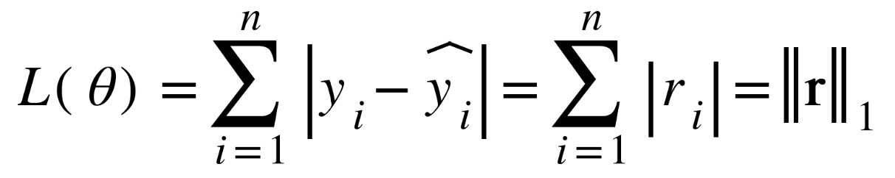

## Training loss

- Option 1: Minimize the sum of magnitudes (absolute values) of residuals: The L1-norm (also called LAD or Least Absolute Deviation)

      

- Option 2: Minimize the sum of squared residuals: The squared L2-norm (also called OLS or Ordinary Least Squares)

      

