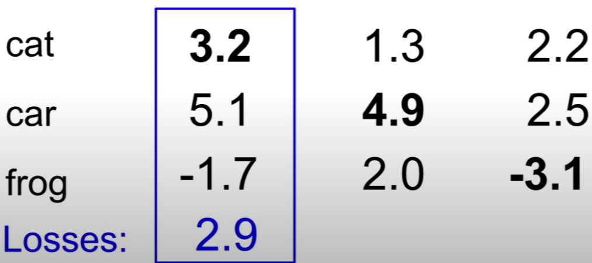
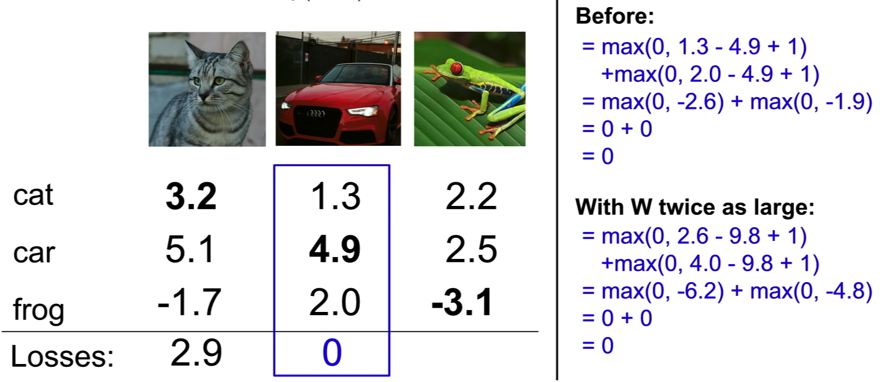
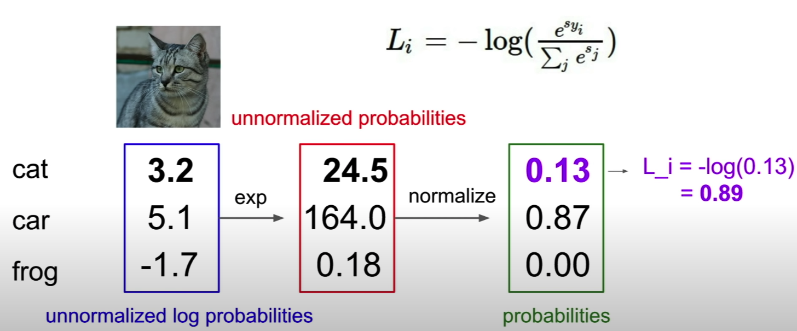
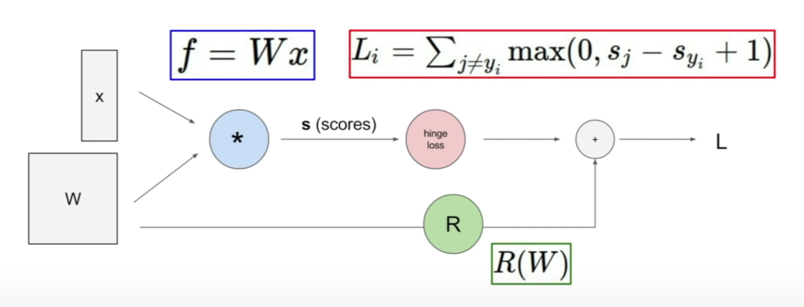
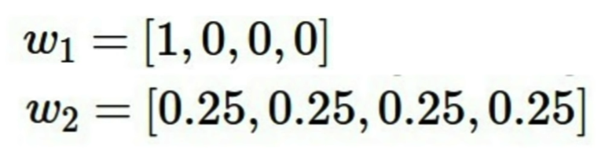
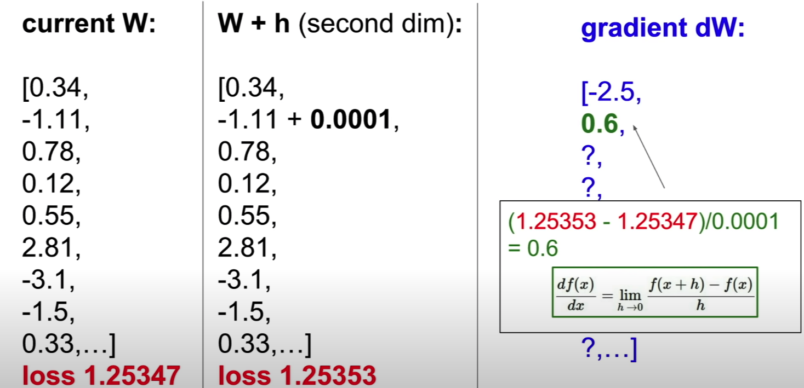

# Loss Functions and Optimization
* [Loss Functions](#loss-functions)
* [SVM Loss](#svm-loss)
* [Softmax Loss](#softmax-loss)
* [Regularization](#regularization)
# Loss Functions:

A loss function tells how good the current w is. Given a dataste of examples:

$$
\{(x_i. y_i)\}_{i=1}^N
$$
where $x_i$ is image and $y_i$ is label, then the sum of loss over examples is:

$$
\frac{1}{N}\sum_iL_i(f(x_i, w),y_i)
$$

# SVM Loss:
$$
L_i = \sum_{j\neq y_i}max(0, s_j-s_{y_i} + 1)
$$

## Main idea:
- Sum over all the score of incorrect caregories
- Compare the score of the correct category and the sum of score of the incorrect category
- If the score of correct category is greater than the score of the incorrect category by some safety margin (1), then we will get a loss of zero

## Example:

$$
\begin{aligned}
L_{cat} &= max(0, 5.1-3.2+1) + max(0, -1.7-3.2+1)\\
&= max(0, 2.9) + max(0, -3.9)\\
&= 2.9
\end{aligned}
$$
<div align=center>
  
</div>


## Feature:
1. We do not care about the absloute value of the scores or the true value of the loss, we only care about the relative differnces between the scores.
2. The choice of one actually doesn't matter. (This free parameter of one can be washed out by scaling).
3. If we init w as some small random values, as the result, your scores will be some small values (approximately 0). Then the expected loss is:
   $$ exp(L_{svm})= \text{Num of class}-1$$
4. $min(L_{svm}) = 0$ and $max(L_{svm}) = \infty$.


## Consider:
$Q$: What if we chage SVM Loss to:
$$
L_i = mean(max(0, s_j-s_{y_i} + 1))
$$
$A$: This is a same problem as before.

 We does not care the true value of the scores, using mean instead of sum is like doing scaling.
$Q$: What if we chage SVM Loss to:
$$
L_i = \sum_{j\neq y_i}max(0, s_j-s_{y_i} + 1)^2
$$
$A$: This is a different problem as before. 

Different loss function tells your algorithm to make trade off between different mistakes. Using the square loss do more punishments on things that are very bad and do less punishments on things that are not so bad.

$Q$: Suppose we found a $W$ such that $L = 0$, is this $W$ unique?

$A$: No, $2W$ also has $L = 0$. 



$Q$: How is the classifier to choose between these different version of W all achieve zero loss?


# Softmax Loss:

Scores = unnormalized log probabilities of the Class
$$
P(Y = k | X = x_i) = \frac{e^{s_k}}{\sum_j e^{s_j}}, \qquad \text{where} \qquad s = f(x_i; W)
$$

Want to encorage the true class is hign and close to one, we minimize the noegative log likelihood of the correct class:

$$
\begin{aligned}
L_i &= - \log P(Y = y_i|X=x_i)\\
&= - \log (\frac{e^{s_k}}{\sum_j e^{s_j}})
\end{aligned}
$$

## Example:


## Feature:
1. Softmax encorage the classifier to pile more probability mass on the correct class and push the score on the correct class to infity and the score of the incorrect class down towards negative infity.
2. $min(L_{softmax}) = 0$ and $max(L_{softmax}) = \infty$.
3. If we init w as some small random values. Then the expected loss is: 
   $$ exp(L_{softmax})= \log C  \qquad \text{where C is the number of classes} $$

  

# Regularization

$$
L(W) = \underbrace{\frac{1}{N}\sum_iL_i(f(x_i, w),y_i)}_{Data Loss} + \underbrace{\lambda R(W)}_{Regilarization}
$$


## Meaning of Regularization:
Adding the Regularization trem allow the model still has access to more complex models(W), but we add this soft constraint saying that if we want to use this complex models, we need to overcome this penalty. The $\lambda$ is the penalty strength.

## Types of Regularization:

* L1 Regularization:
$$
R(w) = \sum_k \sum_l |W_{k,l}|
$$
* L2 Regularization:
$$
R(w) = \sum_k \sum_l W_{k,l}^2
$$

* Elastic net
$$
R(w) = \sum_k \sum_l \beta W_{k,l}^2 + |W_{k,l}|
$$
* Dropout
* Batch normalization

## Example:
<div align=center>
      
</div>

* L2 Regularization prefer $w2$, L2 Regularization prefer to spread the influence across all the different values in x, rather on depending on certain elements.
* L1 Regularization measure the model complexity by the number of zeros, it prefer a W has more zero.


# Optimization

## Gradient:

In one dimension, the derivative of a function:
$$
\frac{df(x)}{dx} = \lim_{h \rightarrow 0} \frac{f(x+h) - f(x)}{h}
$$

In multiple dimensions, the gradient is the vector along each dimension.

- Numerical Gradient:

- Analytic Gradient:
$$
\left \{
\begin{aligned}
L(W) &= \frac{1}{N}\sum_i^NL_i(f(x_i, w),y_i) + \lambda R(W)\\
\nabla_W L(W) &= \frac{1}{N}\sum_i^N \nabla_W L_i(f(x_i, w),y_i) + \lambda\nabla_W  R(W)
\end{aligned}
\right.
$$

## Gradient Descent:

```Python
while True:
    weights_grad = evaluate_gradient(loss_fun, data, weights)
    weights += - step_size * weights_grad
```

## Stochastic Gradient Descent:
In practice, the N could be very large, therefore, computing the loss could be very expensive.

Therefore we sample some small set of data examples as minibatch and use the minibatch to estimate the true gradient.

```Python
while True:
    mini_batch = sample_training_data(data, 256)
    weights_grad = evaluate_gradient(loss_fun, mini_batch, weights)
    weights += - step_size * weights_grad
```
