# Training Neural Networks
* [Activation Functions](#activation-functions)
* [Data Preprocessing](#data-preprocessing) 
* [Weight Initialization](#weight-initialization)
* [Optimization](#optimization)
# Activation Functions

For any particular layer, we have the data coming in, we multiply by weight and then we will pass this through an activation function or nonlinearity.
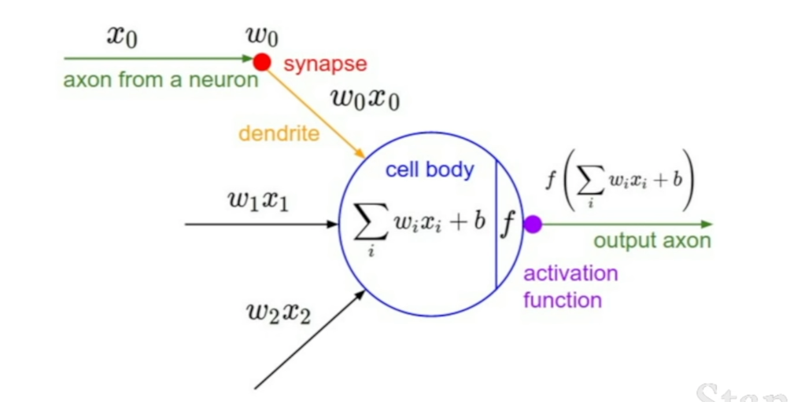

## Sigmoid:

$$
\left \{
\begin{aligned}
\sigma(x) &= \frac{1}{1 + e^{-x}}\\

\frac{d \sigma(x)}{dx} &= \frac{e^{-x}}{(1 + e^{-x})^2} = (\frac{1 + e^{-x} - 1}{1 + e^{-x}})(\frac{1}{1 + e^{-x}}) = (1 - \sigma(x))\sigma(x)
\end{aligned}
\right.
$$
<div align=center>
    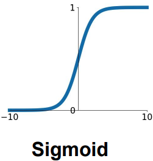  
</div>

### Features:
* If we get very high values as input, then the output is going to something near one. If we get very negative values , then the output wil be near zero.
* Historically popular since it has nice interpretation as a saturating "firing rate" of a neuron.

### Problems:
* Saturate neurons "kill" the gradients
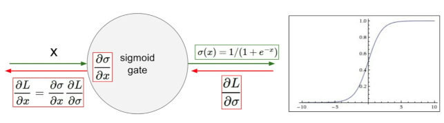
    - Consider when x = 10, then $\frac{d \sigma(x)}{dx} = (\frac{1}{1 + e ^{-10}})(1 - \frac{1}{1 + e ^{-10}}) = 4.5\times 10 ^{-5}$. We chain any upstream gradient comming down, it will multiply something near zero. Then we will get a very small gradient flowing back downwards.
* Sigmoid output are not zero-centered

    - Consider what happens when the input to a neuron is always positive, what can we say about the gradients on $\textbf{w}$?
    - Always all positive or all negative. (same sign as the gradient coming down)
    - This gives very ineffiecient gradient updates.
    - Using zero-mean data will kind of solve this problem.
    - If we let $\sigma(x) = \frac{1}{1 + e^{-x}}$, $f(x) = w_ix_i + b$ and  $L = \sigma(f)$. The loacl graident will always be the same sign as $x_i$ since $\sigma(x)(1 - \sigma(x)) > 0$./]/
    $$
    \begin{aligned}
    \frac{dL}{dw_i} &= \frac{dL}{d \sigma}\frac{d \sigma}{d f} \frac{d f}{d w_i}\\
    & = \underbrace{\frac{dL}{d \sigma}}_{\text{gradient coming down}} \underbrace{\sigma(f)(1 - \sigma(f))x_i}_{\text{local gradient}}
    \end{aligned}
    $$

* exp() is a bit compute expensive

## tanh(x):

$$
\left \{
\begin{aligned}
\sigma(x) &= \frac{e^x - e^{-x}}{e^x + e^{-x}}\\

\frac{d \sigma(x)}{dx} &= 1 - \sigma(x)^2
\end{aligned}
\right.
$$
<div align=center>
    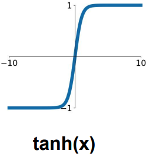
</div>

### Features:
* Squashes numbers to range $[-1, 1]$
* Zero centered
### Problems:
* Still kills gradient when saturated

## ReLu (Rectified Linear Unit)
$$
\left \{
\begin{aligned}
\sigma(x) &= max(0, x)\\

\frac{d \sigma(x)}{dx} &= 1, (x > 0)\\
\frac{d \sigma(x)}{dx} &= 0, \ \text{otherwise}
\end{aligned}
\right.
$$

<div align=center>
    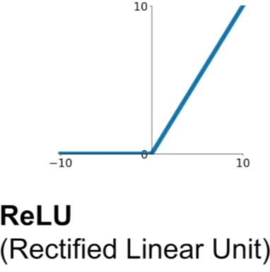
</div>

### Features:
* Does not saturate (in + region)
* Very computation efficient
* Converges much faster than sigmoid/tanh in prartice (6X)
* More biologically plausible than sigmoid

###  Problems:
* Not zero-centered output
* ReLu kill the gradient when $x < 0$
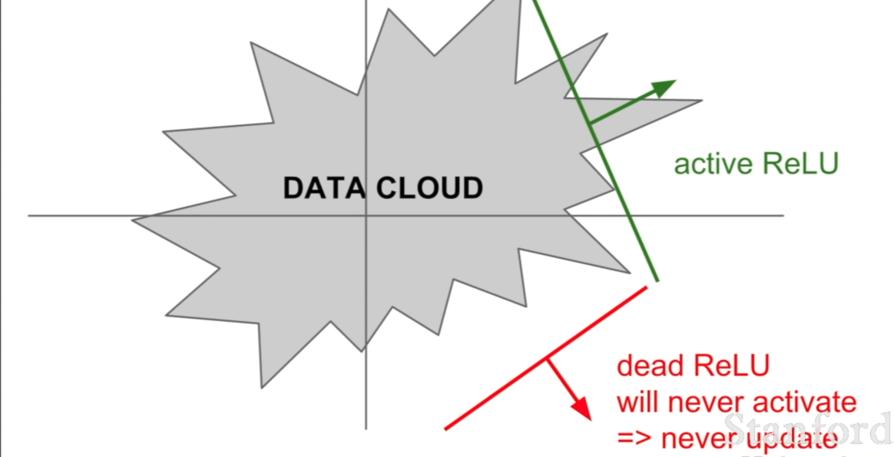


## Leaky ReLu
$$
\sigma(x) = max(0.01x, x)
$$

<div align=center>
    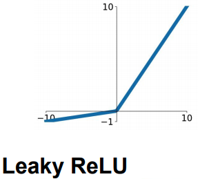
</div>

### Features:
* Does not saturate
* Very computation efficient
* Converges much faster than sigmoid/tanh in prartice (6X)
* Will not "die"

## Parametric Rectifier (PReLu)
$$
\sigma(x) = max(\alpha x, x)
$$

# Data Preprocessing

Some standard types of preprocessing is, you take the orginal data, and you want to zero mean them, or you will want to normalized them.
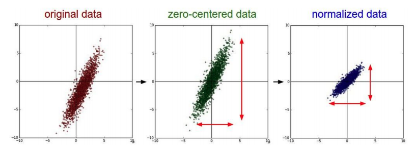

## In practice for images: center only
We don't normalize the pixel value so much, because for images, at each location, you already have relatively comparable scale and distribution.
### Subtract the mean image (Alexnet)
We find the mean image and ubtract the mean channel to each image.
### Subtract per-channel mean (VGGnet)
We find the mean image for each R, G, B channel and subtract the mean channel for each channel.

# Weight Initialization

## First Idea: small random values

$$
W = 0.01 \times np.random.randn(D,H)
$$

This works okay for small networks, but has problems with deeper networks.

### Example:
10 layer net with 500 neurons on each layer, using tanh non-linearities, and initializing as described above.

The distribution of the activations we have:

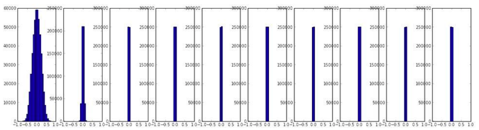

For the first layer, we still have a gaussian looking thing, but the problem is as we multiply by this w (random small numbers at each layer), at the end all activations become zero.

For the backward pass, the upstrean gradient will be very small and our weight is bascally not updating.

## Second Idea: 
$fan_{in}$ denote the input size of each layer and $fan_{out}$ denote the output size of each layer.
$$
W = 1.0 \times np.random.randn(fan_{in},fan_{out})
$$
The distribution of the activations we have:
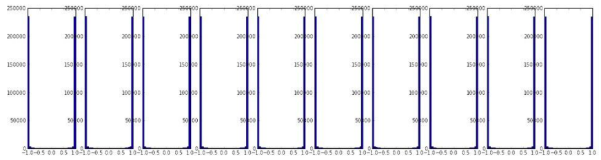

Almost all neurons completely saturated, either 1 or -1. Gradients will be all zero.

## Third Idea:
$$
W = \frac{np.random.randn(fan_{in},fan_{out})}{np.sqrt(fan_{in})}
$$
If you have small number of inputs, then we will get larger weights (to get the larger variance at output). If we have larger inputs, then we want smaller weights inorder to get the same spread at the output.

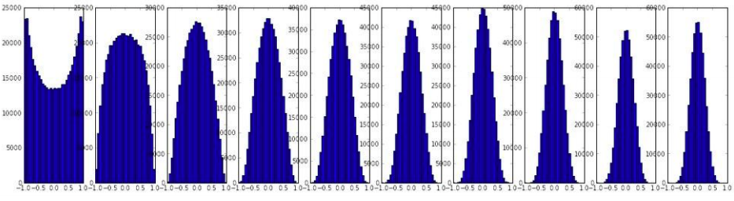

However, when using ReLu nonlinearity, it breaks. Because ReLu is killing half of your units, so the spread of varience will not be excepted.


## Batch Normalization
<div align=center>
    
</div>

### Why use Batch Normalization?

If the value of the weight W is small, then in the back propagation process, the gradient decays exponentially, and the Vanishing gradient problem occurs; on the contrary, if the weight W is larger , Then the exploding gradient problem will occur accordingly. 

### How to use Batch Normalization?

BN is usually inserted after Fully Connected or Convolutional layers, and before nonlinearity.
<div align=center>
    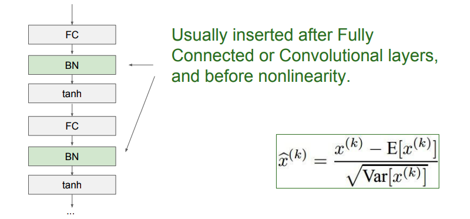
</div>


# Optimization

## Stochastic Gradient Descent (SGD):
```Python
while True:
    mini_batch = sample_training_data(data, 256)
    weights_grad = evaluate_gradient(loss_fun, mini_batch, weights)
    weights -= learning_rate * weights_grad
```

### Problems with SGD:
* If the loss changes quickly in one direction and slowly in another direction, what does gradient descent do?
    - Suppose if we are plotting two values $W_1$ and $W_2$. As we change the horizaontal values, our loss function changes very slowly, as we go up and down in this landscape, our loss is very sensitive to change. Then SGD will preform zig-zag behavior, it will perform very slow progress along shallow dimension, jitter along steep direction.
    - This problem is very common in high dimension, if the ration between the largest one and the smallest one is large, then SGD will not perform nicely.
    <div align=center>
        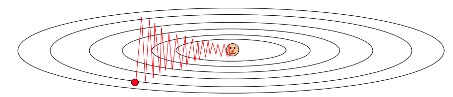
    </div>
* Whay if the loss function has a local minima or saddle point?
  - The gradient will be zero, and the function will stuck in these points.
  - In high dimensional space, the saddle point happens more frequently than local minima.
  <div align=center>
        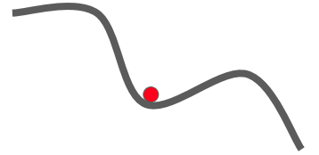
        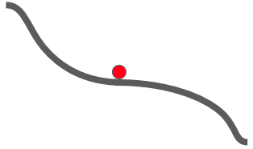
    </div>
* Our gradients come from minibatches so they can be noisy
  
## Momentum:
```Python
vx = 0
rho = 0.9

while True:
    mini_batch = sample_training_data(data, 256)

    dx = evaluate_gradient(loss_fun, mini_batch, weights)
    vx = rho * vx + dx

    weights += learning_rate * vx
```
* The idea is we maintain a velocity over time and we add our gradient estimate to the velocity. The hyperparameter $\rho$ corresponds to friction.
<div align=center>
        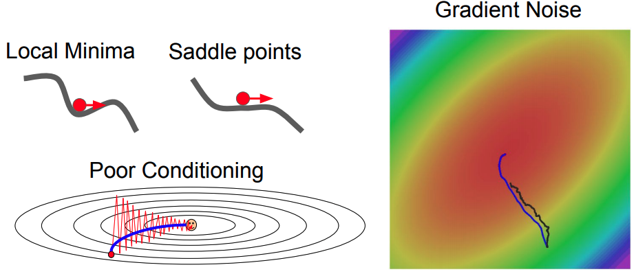
</div>

* For the below graph, the red here is our current point, and when we do the Momentum update, we are actually stepping according to a weighted average of these two. 
<div align=center>
        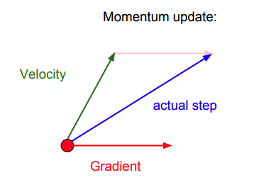
</div>


## AdaGrad:
```Python
grad_squared = 0

while True:
    mini_batch = sample_training_data(data, 256)

    dx = evaluate_gradient(loss_fun, mini_batch, weights)
    grad_squared += dx * dx

    weights -= learning_rate * dx / (np.sqrt(grad_squared) + 1e-7)
```
* Added element-wise scaling of the gradient based on the historical sum of squares in each dimension.
* What happens with AdaGrad?
  - If we have two coordinates, one that we always has a very high gradient and one that always has a very small gradient, then as we add the sum of the squares of the small gradient, we are going to divide by a small number, so we will accelerate movment with the dimension has small gradient.
* What happens to the step size over long time?
  - The squared gradient gets larger and larger, hence our step size get smaller and smaller. This is actually really good in convex cases.
  - However, if in a non-convex case, as you come towards a saddle point, you might get stuck with AdaGrad.
## RMSProp:
```Python
grad_squared = 0

while True:
    mini_batch = sample_training_data(data, 256)

    dx = evaluate_gradient(loss_fun, mini_batch, weights)
    grad_squared += decay_rate * grad_squared + (1 - decay_rate)* dx * dx

    weights -= learning_rate * dx / (np.sqrt(grad_squared) + 1e-7)
```
* RMSProp looking kind of like a momentum update, except we looking for momentum over square gradient rather than momentum over its actual gradient.
* RMSProp still hold the propety that accelerate movment with the dimension has small gradient.

## Adam:
```Python
beta1 = 0.9
beta2 = 0.999
first_moment = 0
second_moment = 0

while True:
    mini_batch = sample_training_data(data, 256)

    dx = evaluate_gradient(loss_fun, mini_batch, weights)

    first_moment = beta1 * first_moment + (1 - beta1) * dx
    second_moment = beta2 * second_moment + (1 - beta2) * dx * dx

    first_unbias = first_moment / (1 - beta1 ** t)
    second_unbias = second_moment / (1 - beta2 ** t)

    weights -= learning_rate * first_moment / (np.sqrt(second_moment) + 1e-7)
```

* Adam is sort like RMSProp with momentum.
* Adam with $\beta_1 = 0.9$, $\beta_2 = 0.999$, and learning rate = $10^{-7}$ or $5 * 10^{-4}$ os a a great starting point for many models.
* Bias correction for the fact that first and second moment estimates starts at zero.


# Regularization
## A common pattern of regularization:
### Training: Add some kind of randomness
$$
y = f_{W}(x, z)
$$
### Testing: Average out randomness (sometime approximate)
$$
y = f(x) = E_{z}[f(x, z)] =\int p(z)f(x, z)dz
$$

Example: Batch Normalization:

- Training: Normalize using stats from random minibatches
- Testing: Use fixed stats to normalize

## Dropout:
In each forward pass, randomly set some neurons to zero. Probability of dropping is a hyperparameter. (0.5 is common)
<div align=center>
        
</div>

```Python
p = 0.5 

def train_step(X):

    # forwardpass for example 3-layer network
    H1 = np.maximum(0, np.dot(W1. X) + b1)
    U1 = np.random.rand(*H1.shape) < p

    H1 *= U1

    H2 = np.maximum(0, np.dot(W2. H1) + b2)
    U1 = np.random.rand(*H2.shape) < p

    H2 *= U2

    out = np.dot(W3, H2) + b3

def predict(X):
    H1 = np.maximum(0, np.dot(W1, X) + b1) * p
    H2 = np.maximum(0, np.dot(W2, H1) + b2) * p

    out = np.dot(W3, H2) + b3
```

- How can this possibly be a good idea?
    - Dropout is training a large ensemble of models. Each binary mask is one model
    - Forces the network to have a reduntant represtantion; Prevents co-adapation if features.
    <div align=center>
        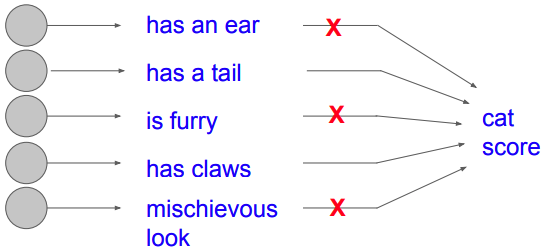
    </div>
- Test Time:
    - Dropout makes our output random. If we consider a single neuron, at test time we have $E[a] = w_1 x + w_2y$, at training time we have $E[a] = \frac{1}{2}( w_1 x + w_2y)$. So one cheap thing we can do is: at test time, we multiply by dropout probability.
    <div align=center>
        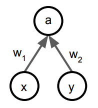
    </div>

## Data Augmentation

### Random crops and scales
<div align=center>
        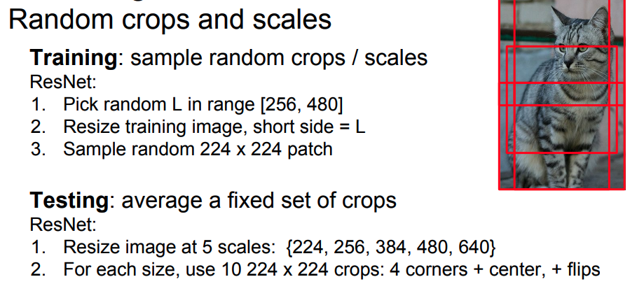
</div>

### Color Jitter

* Simple: Randomize contrast and brightness
<div align=center>
        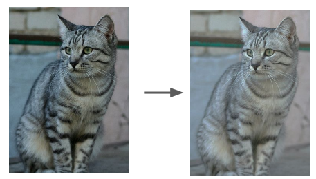
</div>

* More complex:
  1. Apply PCA to all [R, G, B] pixels in training set.
  2. Sample a "color offset" along principal component directions
  3. Add offset to all pixels of training image.