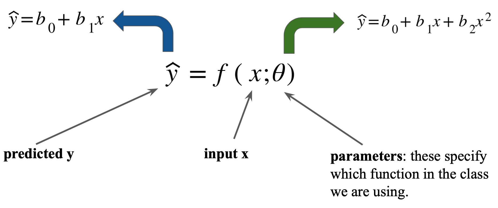
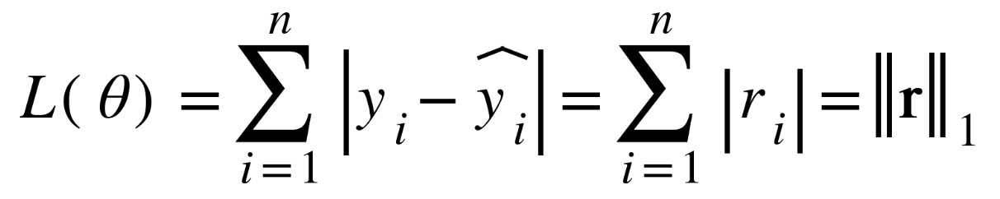
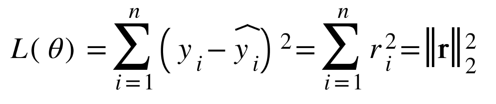
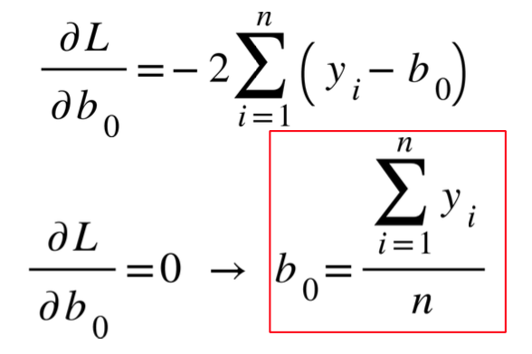
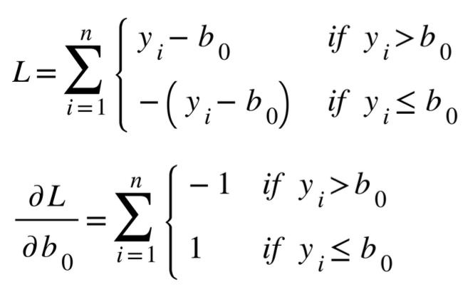

# Supervised Learning

## 1. Choose a form for the function which relates inputs (x) to output (y)
<div align=center>
      
</div>

## 2. Define training loss

- Option 1: Minimize the sum of magnitudes (absolute values) of residuals: The L1-norm (also called LAD or Least Absolute Deviation)
<div align=center>
      
</div>

- Option 2: Minimize the sum of squared residuals: The squared L2-norm (also called OLS or Ordinary Least Squares)
<div align=center>
      
</div>

## 3. Find function in a form which gives the smallest training loss

This is equivalent to finding the best parameters. We want to minimize the training loss by trying different parameter values.
$$
L2 = \sum_{i = 1}^n (y_i - b_0 - b_1x_i)^2\\
L1 = \sum_{i = 1}^n |y_i - b_0 - b_1x_i |
$$
- Derivative of L1 Loss
$$
\begin{aligned}
\frac{\partial L}{\partial b_0} &= -\sum_{i = 1}^n sgn(y_i - b_0 - b_1x_i)\\
\frac{\partial L}{\partial b_1} &= -\sum_{i = 1}^n sgn(y_i - b_0 - b_1x_i)x_i
    
\end{aligned}
$$
- Derivative of L2 Loss

$$
\begin{aligned}
\frac{\partial L}{\partial b_0} &= -2 \sum_{i = 1}^n(y_i - b_0 - b_1x_i)\\
\frac{\partial L}{\partial b_1} &= -2 \sum_{i = 1}^n(y_i - b_0 - b_1x_i)x_i
    
\end{aligned}
$$

- In Matrix form (Jacobian Matrix)
$$
\begin{aligned}

\nabla_b L = 
    \begin{bmatrix}
        \frac{\partial L}{\partial b_0} \\
        \frac{\partial L}{\partial b_1} \\
    \end{bmatrix}
    = 
    \begin{bmatrix}
        -2 \sum_i^n(y_i - b_0 - b_1x_i) \\
        - 2\sum_i^n (y_i - b_0 - b_1x_i)x_i \\
    \end{bmatrix}
\end{aligned}
$$

## Measure the fit
For linear regression we often use R2: the coefficient of determination. RSS -> Residual Sum of Squares, TSS -> Total Sum of Squares

$$
R^2 = 1 - \frac{RSS}{TSS} = 1- \frac{\sum_{i = 1} ^n (y - \hat{y})^2}{\sum_{i = 1} ^n (y - \overline{y})^2}
$$

$R^2 \to 0$, no fit, $R^2 \to 1$, perfect fit.
Note: OLS will always have the highest possible $R^2$ value.

## Robust Regression

Robust statistics: provides methods which are not affected by (less sensitive to) outliers.

If we only consider a sample $Y = \{y_1, y_2, \cdots, y_n\}$, Then the mean of the sample is the solution to:


$$
\underset{\mu}{\min}\  f = \sum_i^n (y_i - \mu)^2
$$

<div align=center>
      
</div>

Similarly, the median of the sample is the solution to:

$$
\underset{\mu}{\min}\  f = \sum_i^n |y_i - \mu|
$$

<div align=center>
      
</div>

- Least squares is very sensitive to outliers.
- Absolute error is more robust to outliers


## Code

### Data prepareation
```python
df = pd.read_csv('iris.csv')

y = df.loc[:,"sepal.length"].values
x = df.loc[:,"petal.width"].values
X = np.transpose(np.concatenate([[np.ones(len(df))], [x]]))

x_grid = np.linspace(x.min(), x.max(), 10)
Xnew = np.c_[np.ones(x_grid.size), x_grid]
```

### Make a prediction of a linear model
Given $\mathbf{X}$ and $\mathbf{b}$, where $\mathbf{X}$ has a column of ones and a column of inputs $x_i$, and $\mathbf{b}$ contains parameters $b_0$ and $b_1$. 

```python
def linearModelPredict(b, X):
    yp = np.dot(X, b)
    return yp
```

### Calculate L2 Loss
Compute the L2 loss value (rss) and the gradient (provided) given arguments b (1d-array), X (2d-array), and y (observed output, a 1d-array).

```python
<<<<<<< HEAD:Introduction_to_ML/Supervised Learning/Readme.md
def linearModelLossRSS(b, X, y):
    yp = linearModelPredict(b, X)
    res = y - yp
    rss = sum(res ** 2)
    gradient= -2 * np.dot(res, X)
=======
def linearModelLossRSS(b,X,y):
    yp = linearModelPredict(b,X)

    res = y - yp
    # RSS = Residual Sum of Squares
    rss = sum(res**2)

    gradient= -2*np.dot(res,X)
>>>>>>> 08c7007fb6cc06546c68ef08fef19697c2c50775:Introduction_to_ML/1. Supervised Learning/Readme.md
    return (rss, gradient)
```

### Calculate L1 Loss
Compute the L1 loss value (sad) and the gradient (provided) given arguments b (1d-array), X (2d-array), and y (observed output, a 1d-array).

```python
<<<<<<< HEAD:Introduction_to_ML/Supervised Learning/Readme.md
def linearModelLossLAD(b, X, y):
    yp = linearModelPredict(b, X)
    res = y - yp
    sad = sum(abs(res))
    grad = - (np.dot(np.sign(res), X))
    return (sad, grad)
=======
# LAD = Least Absolute Deviation
def linearModelLossLAD(b,X,y):
    yp = linearModelPredict(b,X)

    res = y - yp
    sad = sum(abs(res))

    grad = - (np.dot(np.sign(res),X))
    return (sad,grad)
>>>>>>> 08c7007fb6cc06546c68ef08fef19697c2c50775:Introduction_to_ML/1. Supervised Learning/Readme.md
```

### Train the Model
Returns a 2-tuple containing a prediction for b (`bpr`, a 1d-array) and the $R^2$ value (`R2`) of your fit, given arguments X (2d-array), y (1d-array), and lossf (the loss function for your fit). For now, set lossf as the L2 loss function that you defined previously. Call linearModelFit with the provided values and print the result.

```python
def linearModelFit(X, y, lossf = linearModelLossRSS):
    nrows,ncols = X.shape
    bpr=np.zeros((ncols, 1))
    
    RES = so.minimize(lossf, bpr, args=(X, y), jac=True)
    bpr= RES.x
    
    res = y - np.mean(y)
<<<<<<< HEAD:Introduction_to_ML/Supervised Learning/Readme.md
    TSS = sum(res ** 2)
    RSS,deriv = linearModelLossRSS(bpr, X, y)
    R2 = 1-(RSS / TSS)
    return (bpr, R2)
=======
    TSS = sum(res**2)
    RSS, deriv = linearModelLossRSS(bpr, X, y)
    R2 = 1-(RSS/TSS)
    return (bpr,R2)
>>>>>>> 08c7007fb6cc06546c68ef08fef19697c2c50775:Introduction_to_ML/1. Supervised Learning/Readme.md
```

### Plot

```
plt.scatter(df["petal.width"], df["sepal.length"])
plt.plot(Xnew[:,1], yp, color='red', linestyle='--')
plt.xlabel("petal.width")
plt.ylabel("sepal.length")
```


