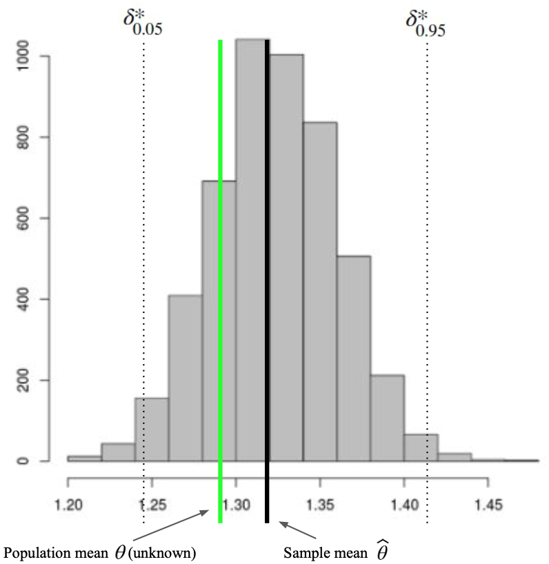
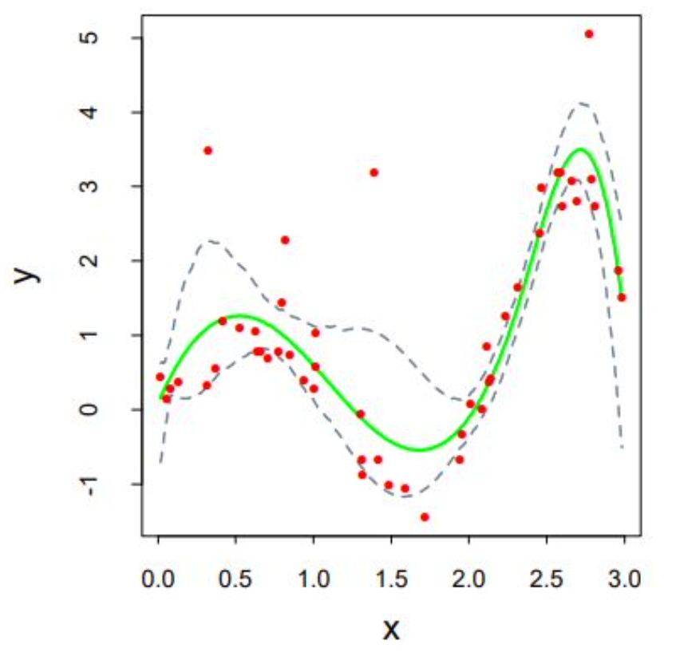
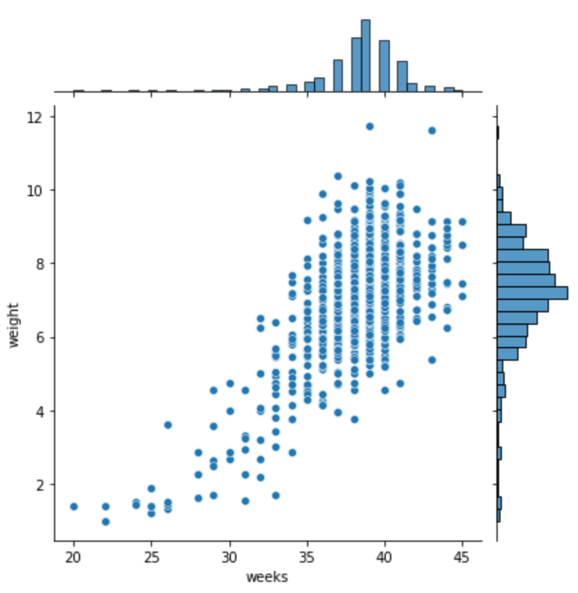
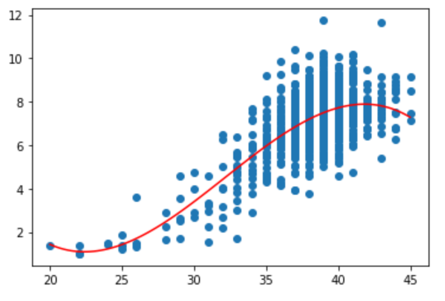
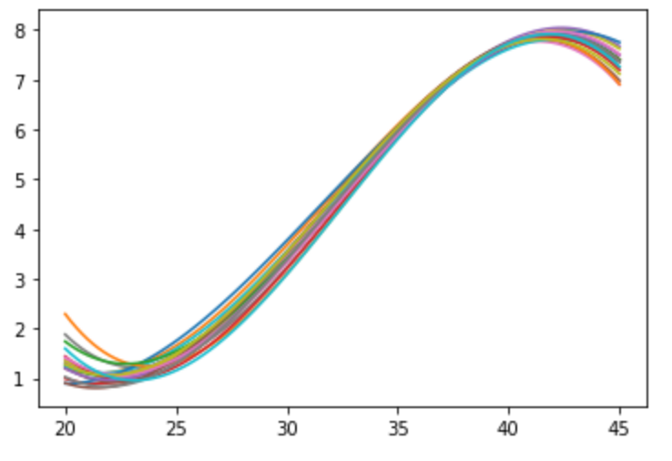
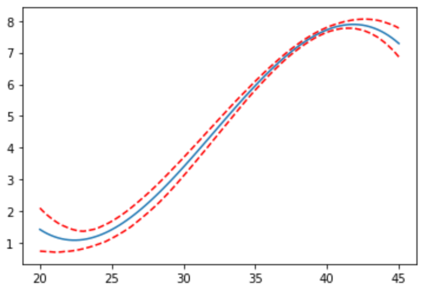

# Uncertainty and bootstrapping

## Parameter Uncertainty

- Parameter = value which summarizes data for a population; these can be expectations (mean) or values which describe an input-output relationship (slope of a linear model).
  - Example of a Parameter:
    - Consider a model which predicts the mean. i.e. $\hat{y} = \theta$
    - Given a dataset $\{x_1, x_2, ..., x_n\}$, the estimate for this parameter is the sample mean:

$$
\hat{\theta} = \frac{\sum_{i = 1}^n x_i}{n}
$$

<div align=center>
      
</div>

- Statistic = value which summarizes data from a particular sample (i.e. sample mean).

- Estimation = use a statistic to estimate a parameter of the distribution of a random variable, where
  - Estimator ($\hat{\theta}$): function used to compute estimate
  - Estimator ($\theta$): parameter of interest

## Bias and Variance

- Bias = expected difference between estimator ($\hat{\theta}$) and parameter ($\theta$)
$$
\begin{aligned}
&\text{In general : } &Bias(\hat{\theta}) = E[\hat{\theta} - \theta]\\
&\text{For example : } &E[\bar{X_n} - \mu_X]

\end{aligned}
$$
- Variance = expected squared difference between estimator ($\hat{\theta}$) and $E[\text{estimator}]$ (mean)
$$
\begin{aligned}
&\text{In general : } &E[(\hat{\theta} - E[\hat{\theta}])^2]\\
&\text{For example : } & E[(\bar{X}_n - E[{\bar{X}_n}])^2]

\end{aligned}
$$

## Central Limit Theorem

- For Large n, the sampling distribution of $\hat{X_n}$ is approximately normal
- Formally, we can write:

<div align=center>
      
</div>

- We can use CLT to construct Confidence Intervals
    - Question: What is a $95\%$ confidence interval?
    - Answer: An interval which includes $95\%$ of the sample means.<div align=center>  </div>
    - We can also say that $95\%$ of the sample means are between $\mu - 1.96 \sigma$ and $\mu + 1.96 \sigma$
    - Example:
      - Mean = $3.49$, Stdev = $1.14$, SE = $0.07$
      - CI is therefore $3.49 +/- 1.96*(0.07) = 3.49 +/- 0.14$


## The Bootstrap
    
Bootstrap = a powerful technique to construct confidence intervals using artificially drawn samples in addition to an originally-drawn sample
 
<div align=center>  </div>

Now that we have a distribution of bootstrap statistics, we can construct a CI

For example, a 90$\%$ confidence interval
centred at the sample mean would be

$$
CI = [\hat{\theta} - \delta_{0.95}^*, \hat{\theta^*} - \delta_{0.05}^*], \text{where }  \delta^* =  \hat{\theta^*} - \hat{\theta}
$$

<div align=center>  </div>

###  Prediction Uncertainty (Bootstrap)

Example: say we want to fit a cubic spline to this data. We can use a linear expansion of B-spline basis functions $h_i(x)$.
<div align=center>  </div>

We store the B coefficients of these basis functions into a vector, and fit $\hat{y} = f(x) = X\theta$
<div align=center>  </div>

Here is our fit $\hat{y} = f(x) = X\theta$, but how confident can we be of this?
<div align=center>  </div>

- From our original sample, generate a new sample (with replacement)
- For this new sample, get a new parameter estimate $\hat{\theta}_b^*$
- Do this as many times as you can

<div align=center>  </div>

And since we now have a distribution of samples for each x, we can compute a 95$\%$ Confidence Interval (CI)

<div align=center>  </div>

Note that we could have also used CLT to get the CIs

<div align=center>  </div>

**Warning:** our Confidence Interval (via bootstrap [up] or CLT [down]) is for the true value of $f(x)$, not for new observations $(x_{new}, y_{new})$

**Why?** A CI for new data would need to also consider random variability $(\sigma^2)$ between $f(x_n)$ and $y_n$.

## Code:

```python
tdf = pd.read_csv("tpr.csv")

# Using Central Limit Theorem (CLT), compute Confidence Intervals (CI) (use ddof=1 to indicate we're using the sample mean)
std_err = np.std(tdf.C, ddof=1)/np.sqrt(len(tdf))
ci = [tdf.C.mean() - 1.96*std_err, tdf.C.mean() + 1.96 * std_err]
```

### Show the joint distribution
```python
bdf = pd.read_csv("ncb.csv")

# Important trick: Let's exclude observations with missing week or weight data (NaN values). 

bdf = bdf.dropna(subset=["weeks","weight"])
sns.jointplot(data=bdf, x='weeks', y='weight')
```

<div align=center>
      
</div>


### Build a linear model on the data and plot the fit 
```python
reg = sklearn.linear_model.LinearRegression()
reg.fit(X, bdf.weight)

x_new = np.linspace(min(bdf.weeks), max(bdf.weeks),100)
X_new = np.c_[x_new, x_new**2, x_new**3]
ypr = reg.predict(X_new)

# plot the dat and the curve of best fit
plt.scatter(bdf.weeks, bdf.weight)
plt.plot(x_new, ypr, color="red")
```

<div align=center>
      
</div>

```python
print(reg.coef_)
# [-5.21866875e+00  1.78832738e-01 -1.85596626e-03]
# The linear model has the form of b0x + b1x^2 + b2x^3, so it has 3 coef
```

### Bootstrap the model parameters
```python
# Let's bootstrap the model parameters b1,b2,b3 with 10000 bootstrap samples, given a sample S (dataframe)
def bootstrap_param(S):
    num_iterations = 1000
    sample_size = len(S)
    
    #initialize empty array of bootstrap parameter estimates
    boot_thetas = np.zeros((1000,3))
    
    for i in range(num_iterations):
        # create bootstrap sample
        S_star = S.sample(sample_size, replace=True)
        
        # create design matrix from bootstrap sample
        X = np.c_[S_star.weeks, S_star.weeks**2, S_star.weeks**3]
        reg.fit(X,S_star.weight)
        boot_thetas[i,:] = reg.coef_ 
    return boot_thetas

# Finally, let's bootstrap the model prediction with 10000 bootstrap samples, given a sample S (dataframe) and x values
def bootstrap_pred(S):
    num_iterations = 1000
    sample_size = len(S)

    # Let's create our x data using linspace to get a smooth plot for each bootstrap-predicted set of y values
    x_new = np.linspace(min(S.weeks),max(S.weeks),100)
    X_new = np.c_[x_new,x_new**2,x_new**3]
    
    # Let's also initialize our ypred to an array of 0's
    ypred = np.zeros((1000,X_new.shape[0]))
    
    for i in range(num_iterations):
        #Here we want to store predictions for y from bootstrapped samples. Within the loop, let's get each sample S_star.
        S_star = S.sample(num_iterations,replace=True)
        
        #create design matrix from bootstrapped sample, fit to data
        X = np.c_[S_star.weeks, S_star.weeks**2, S_star.weeks**3]
        reg.fit(X,S_star.weight)
        
        #store predictions for y in ypred array
        ypred[i,:] = reg.predict(X_new)
    return ypred

ypr_boot = bootstrap_pred(bdf)

for i in range(20):
    plt.plot(x_new, ypr_boot[i,:])
```

<div align=center>
      
</div>

### Compute upper and lower bounds of our confidence interval for the predictions
```python
lower = np.quantile(ypr_boot - ypr, 0.025, axis=0) #axis=0 refers to rows
upper = np.quantile(ypr_boot - ypr, 0.975, axis=0)

#plot prediction
plt.plot(x_new, ypr)
#plot confidence interval (from bootstrap)
plt.plot(x_new, ypr - upper, 'r--')
plt.plot(x_new, ypr - lower, 'r--')
```

<div align=center>
      
</div>
