# Test Error, Cross-Validation, Model Selection


## Test Error

**Test error**: Given a dataset (collection of realizations) $\{(x_1,y_1),(x_2,y_2),...,(x_n,y_n)\}$ of $(X,Y)$ which were not used to train the model, we define the test error as the following:
$$
\frac{1}{n} \sum_{i = 1}^n L(y_i, f(x_i, \hat{\theta}))
$$

**Generalization error** (Conditional test error) = the expectation of test error over different test sets, given a particular training set.

$$
E_{\mathcal{T}}(L(y_i, f(x_i,\hat{\theta} )) | \mathcal{D})
$$


**Prediction error** (Expected test error) = the expectation of test error over different training and test sets.

 $$
E_{\mathcal{D, T}}(L(y_i, f(x_i,\hat{\theta} )))
$$

##  Bias-Variance Decomposition

There are 3 factors influences our expected test error

### Bias
Systematic difference of the best fitted model from the true relationship
$$
E(\hat{f}(x_i)) - f(x_i)
$$

**As model complexity increases, the bias decreases**. How can we minimize bias? Is minimizing bias the goal?

<div align=center>
    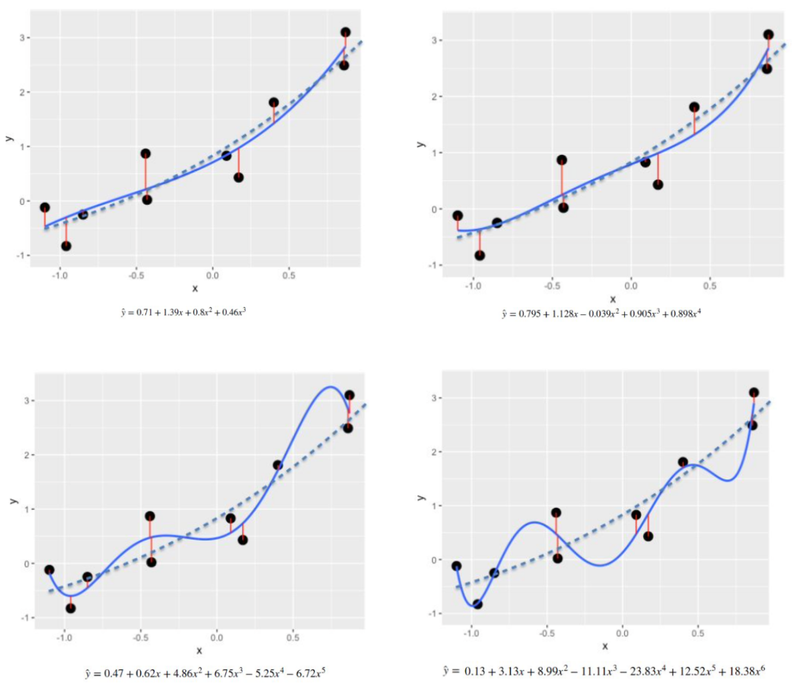  
</div>


### Variance 
Variance of the fit around the average fit.
$$
E(\hat{f}(x_i)) - E(\hat{f}(x_i))^2
$$

<div align=center>
    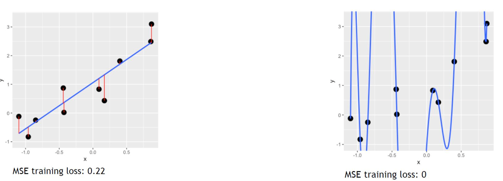  
</div>

Model Complexity:
- Larger model spaces lead to lower training loss
- Consider $H_1$ as the set of all linear functions; consider $H_2$ as the set of all quadratic
functions. We note that $H_1\subset H_2$
<div align=center>
    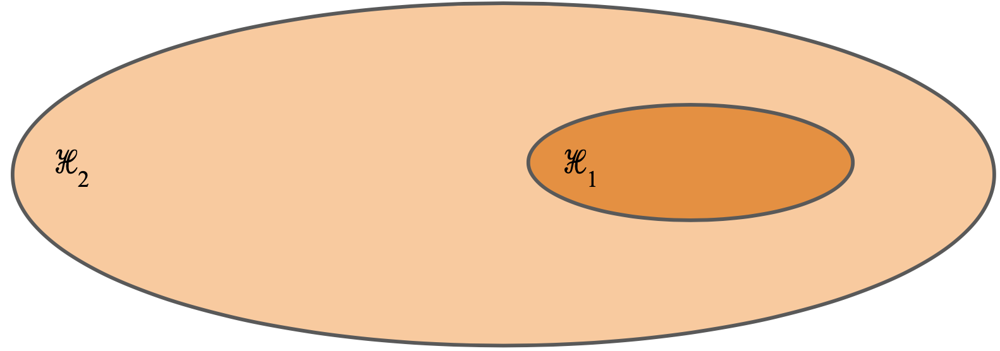  
</div>

Bias-Variance Decomposition:
<div align=center>
    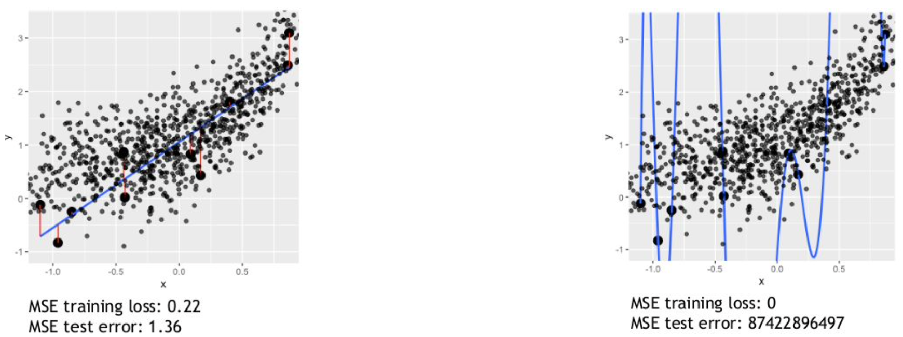  
</div>

Bias-Variance Tradeoff:
<div align=center>
    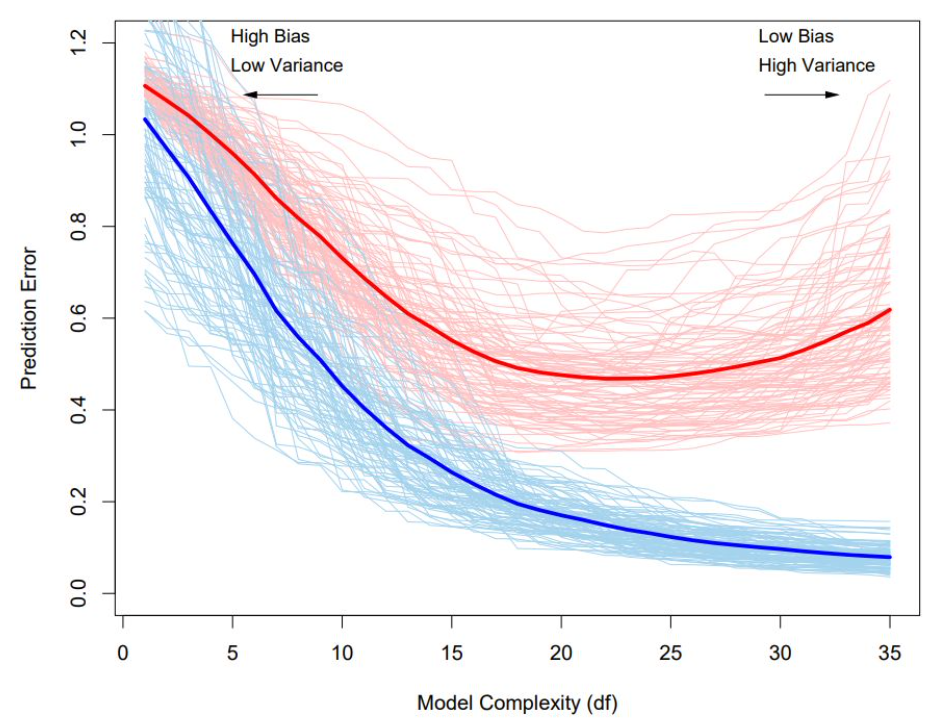  
</div>


### Irreducible error
Variability in data around the true relationship between x and y.

$$
y_i = f(x_i) + \epsilon \leftarrow \sigma^2_{\epsilon}
$$

- Assume that we have the correct model class (i.e. say that it is a linear model)
- Then we can correctly predict outputs from inputs.. right?
- Actually, there are variables outside of $X$ which can have some effect on $Y$ (i.e. noise). In other words, there will be a part of $Y$ which is determined by unobserved phenomena. Even if we had infinite $(X,Y)$ data, we still could not completely determine $Y$ from $X$.
- Often when we overfit, we are actually fitting our model to noise.

## How big should the test set be?

- The test set should be large enough to detect differences in test errors.
- The test set should be small enough such that data is left for training (model fitting).

<div align=center>
    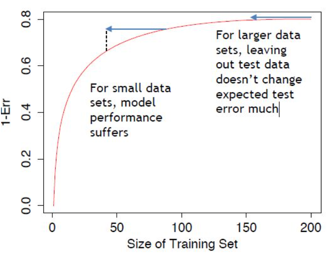  
</div>

## Hold-out Approach
<div align=center>
      
</div>

- Why it is good?
    - It’s simple
    - It measures what we want (performance of learned model)
- Why it is bad?
    - Smaller training sets can lead to variable performance and performance estimates; they can also lead to favoring simpler models
    - Smaller test sets can give poor estimates of performance

## k-fold Cross-Validation

<div align=center>
    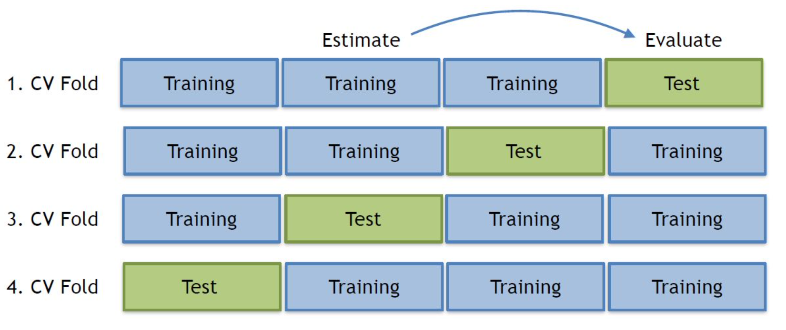  
</div>

- The idea:
    - Split the data into $k$ disjoint partitions (or “folds” of size $n/k$)
    - For $i$ in range$(1,k)$, train/test with partition $i$ as the test set and with the remaining data as the training set
    - Compute the average test error across all test results = Cross-validation error. This error has lower variance than error on one partition.

## Common Regression Errors

<div align=center>
    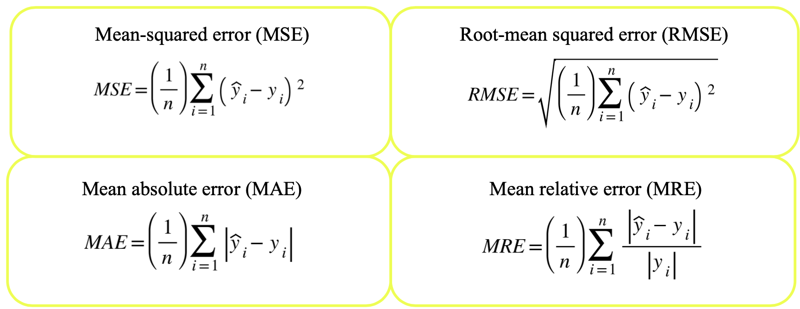  
</div>

## How many CV folds?
<div align=center>
    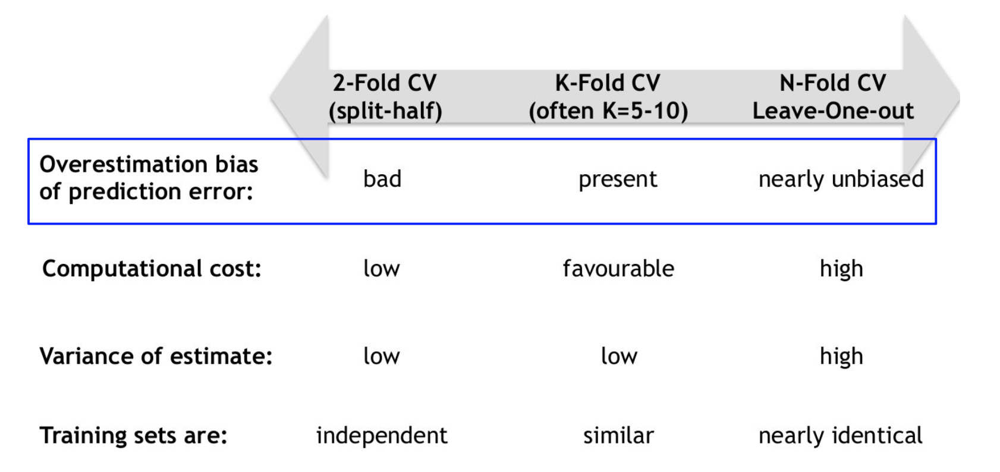  
</div>


## Choose the Best model:

### Strategy 1: Choose the model which fits best to the training data.

- When there is limited data, this method may also be preferable.
- For simple models, if we adjust the training error upwards we can get a less-biased generalization error estimate: AIC, BIC, etc.
- Q: Can you think of an issue with this strategy?
- A:  If we pick the model which best fits to training data only, we will select the most complex model (recall bias-variance tradeoff)... this will lead to overfitting.

## Strategy 2: Choose the model which has the lowest test error.

Let’s say that we generate a dataset, split it into train and test sets $+$ compute test performance OR use cross-validation. We then select the “best” model which has the lowest expected test error.

## Strategy 3: Choose the model which has the lowest validation error.
<div align=center>
    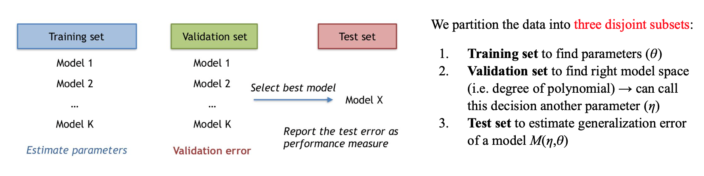  
</div>

## Code:

### Read the data to dataframe
```python
df = pd.read_csv('ffd.csv')
display(df.head())
```
<div align=center>
    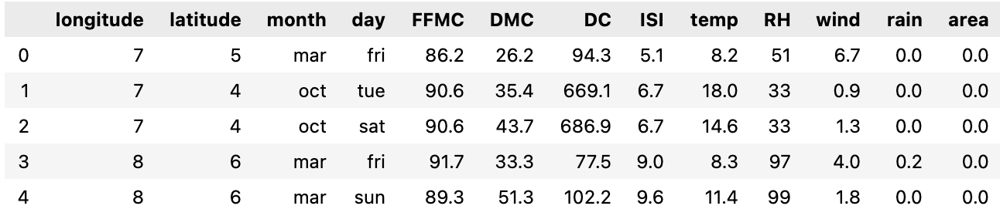  
</div>

### Convert all categorical data into numerical data. Before that, specify this data as *Categorical*
```python
df['month'] = pd.Categorical(df.month, categories=['jan','feb', 'mar', 'apr','may','jun','jul','aug','sep','oct','nov','dec'])

# Set non-numerical data as Categorical
df['day'] = pd.Categorical(df.month, categories=['mon','tue', 'wed', 'thu', 'fir','sat', 'sun'])

# Use "get_dummies" to convert categorical data to numerical data (you can set "drop_first=True")
df = pd.get_dummies(df, drop_first=True)
```

### Create pipline for each model
```python
M1 = Pipeline([
    ('lr1', LinearRegression())
])

M2 = Pipeline([
    ('poly', PolynomialFeatures(degree=2, include_bias=False)),
    ('lr3', LinearRegression())
])

class KeyFeatures(BaseEstimator, TransformerMixin):
    def fit(self, X, y=None):
        return self

    def transform(self, X, y=None):
        X = X.assign(temp2= X.temp**2)
        X = X.assign(RH2= X.RH**3)
        return X

# Create a pipeline for model 3 (M3) [ /6 marks]
M3 = Pipeline([
    ('temp_sqr_RH_cubic', KeyFeatures()),
    ('lr2', LinearRegression())
])
```

### For models 1-3, use 4-fold Cross-validation (CV) on the training set.
```python
kf = KFold(n_splits=4)
sc = make_scorer(mse) #tell CV scorer how we want to eval test data

print(f"CV loss (M1): {cross_val_score(M1, Xtrain, ytrain, cv=kf, scoring=sc).mean()}")
print(f"CV loss (M2): {cross_val_score(M2, Xtrain, ytrain, cv=kf, scoring=sc).mean()}")
print(f"CV loss (M3): {cross_val_score(M3, Xtrain, ytrain, cv=kf, scoring=sc).mean()}")
```


