# Feature Selection

## 1. Feature Construction

### Construct Features

Sometime it may be useful to give combinations of features to our models.

**Example:** Construct a model to predict house price

Construct a feature called “LotArea”

<div align=center>
    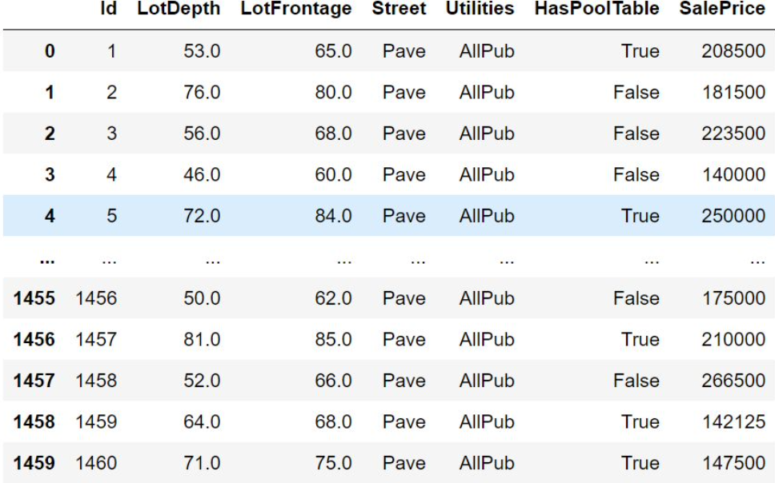  
</div>

<div align=center>
    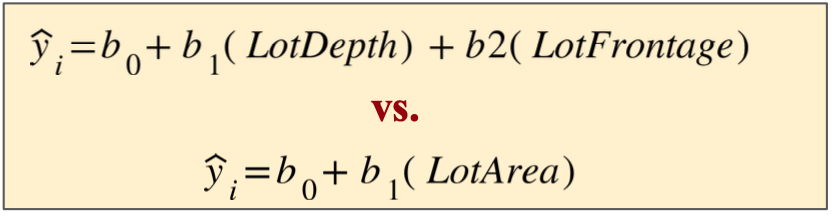  
</div>

### Beyond Linearity

We can extend this by adding further augmentations to features with basis functions (also called “feature functions”). With these we are defining new features.
<div align=center>
    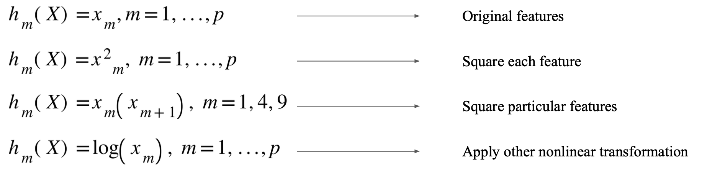  
</div>

**Example:** Fourier Basis:
- This is useful for various temporal/periodic and signal processing tasks (ECG, audio)
- Allows us to extract features from time domain and construct them for frequency domain.
<div align=center>
    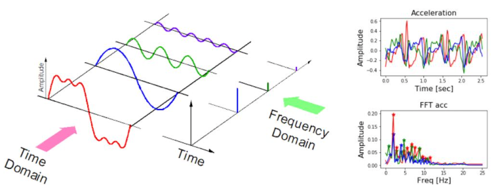  
</div>


## 2. Feature Selection
<div align=center>
    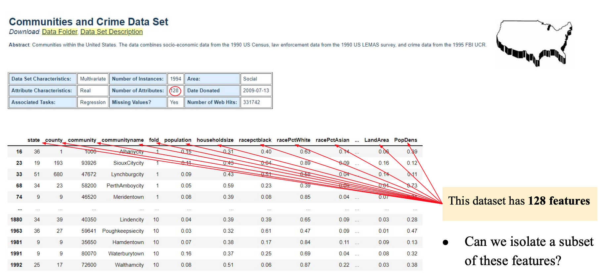  
</div>

Why should we perfer Feature Selection?

- Some of the features are not associated with the target/output variable y
- If we have many irrelevant features $\rightarrow$ unnecessary complexity in model
- Why is that a problem?
    - Computation costs/time; 
    - Variance $\rightarrow$ Overfitting

### Common Approaches to deal with Feature Selection

- **Subset Selection:** Identify a subset of k features (predictors) which we believe are related to the output (response/target).
- **Regularization:** Keep all k features, but shrink some number of these features towards zero ~ eliminating influence of the features
- **Dimensionality reduction:** Project the k features into a lower-dimensional subspace

### Approach 1.1: Best Subset Selection:
Search over all features and combinations of features $\rightarrow$ get all model performances
<div align=center>
    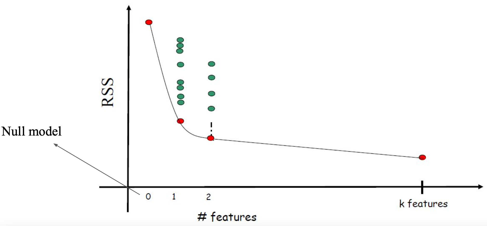  
</div>
<div align=left>
    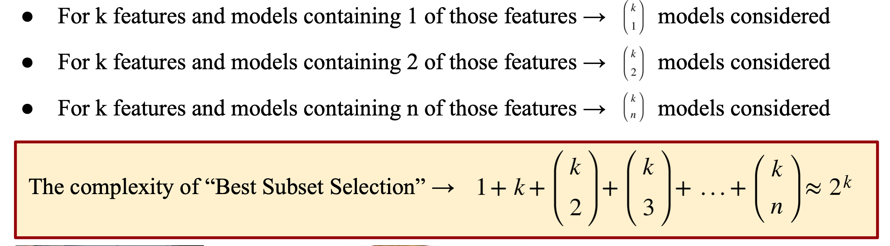  
</div>

### Approach 1.2: Stepwise Selection

Forward Stepwise Selection:
<div align=center>
    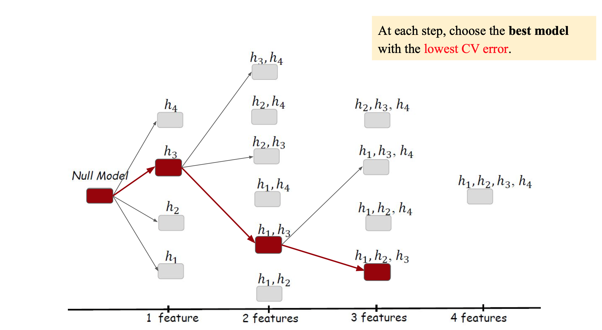  
</div>

The complexity of “Forward Stepwise Selection”: 

$$
1 + k + (k - 1) + \cdots + 1 = 1 + \frac{k(k + 1)}{2}
$$

Backward Stepwise Selection:

<div align=center>
    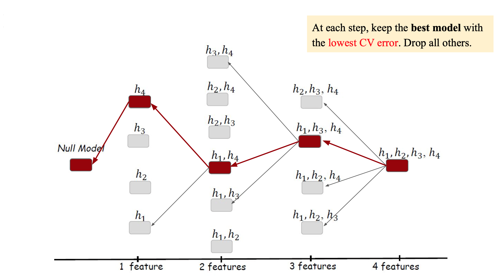  
</div>

### Regularization
Unlike with subset selection and stepwise selection, here we keep all features

How do we select? The coefficients of particular features shrink towards 0

### Approach 2.1: Ridge Regression (L2)
$$
J_{ridge} = \sum_{i = 1}^{n}(y_i - (\beta_0 + \sum_{j = 1}^k \beta_jx_{i, j}))^2 + \lambda\sum_{j = 1}^k {\beta_j}^2
$$

In un-regularized regression, scaling inputs by constant C results in scaling of corresponding coefficient by 1/C; we can therefore say it’s scale-invariant.

In regularized regression, scaling inputs by constant can dramatically affect the objective function

To ensure that features are scaled uniformly, we can standardize them (i.e. z-standardize)

$$\tilde{x} = \frac{x - \mu}{\delta}$$

Alternatively, we can use different $\lambda$ for different features (Tikhonov regularization)

### Approach 2.2: Lasso (L1)
$$
J_{lasso} = \sum_{i = 1}^{n}(y_i - (\beta_0 + \sum_{j = 1}^k \beta_jx_{i, j}))^2 + \lambda\sum_{j = 1}^k |\beta_j|
$$

### Ridge vs Lasso:
Lasso performs feature selection, whereas Ridge doesn’t set features to 0
Lasso works better when few predictors, Ridge better when many predictors
Lasso lends to better interpretability $\rightarrow$ selects variables instead of small coefficients

### Hyperparameter $\lambda$

How to select $\lambda$?
Cross-validation: Pick a range of values for λ, then get CV error for each


## Code:


### Part 1: Construct features, Ridge

```python
df = pd.read_csv("L6.csv")
 
plt.scatter(df.x,df.y)
```

```python
# M1 is a linear regression model with Polynomial.
M1 = Pipeline([
    ('poly1', PolynomialFeatures(degree=6, include_bias=False)),
    ('lin1', LinearRegression(fit_intercept=True))
])

# Define the x values and x_new values here
x = df.x.values.reshape(-1,1)
x_new = np.linspace(-1,1,len(x)).reshape(-1,1)

# Plot the points, also plot prediction
plt.scatter(x, df.y)
ypred = M1.fit(x,df.y).predict(x_new)
plt.plot(x_new, ypred)
```
<div align=center>
    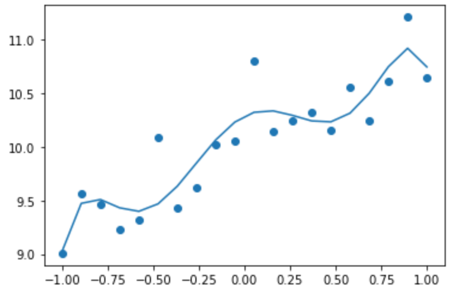  
</div>


```python
# This seems wiggly. What if we use Ridge regression? 
# Side note: In practice, we don't shrink the bias term
M2 = Pipeline([
    ('poly2', PolynomialFeatures(degree=6,include_bias=False)),
    ('scal2', StandardScaler()),
    ('ridge2', Ridge(alpha=5.0, fit_intercept=True))
])

plt.scatter(x, df.y)
ypred = M2.fit(x,df.y).predict(x_new)
plt.plot(x_new, ypred)

print(f"M1 coefficients: {M1.named_steps['lin1'].coef_} | intercept: {M1.named_steps['lin1'].intercept_}")
print(f"M2 coefficients: {M2.named_steps['ridge2'].coef_} | intercept: {M2.named_steps['ridge2'].intercept_}")

'''
(array([ 0.26264477, -0.03604224,  0.12595432,  0.01336734,  0.06098453,
        -0.0009332 ]),
 array([ 0.47117248, -0.06577208,  0.        ,  0.0393283 ,  0.02196659,
         0.        ]))
'''


```
<div align=center>
    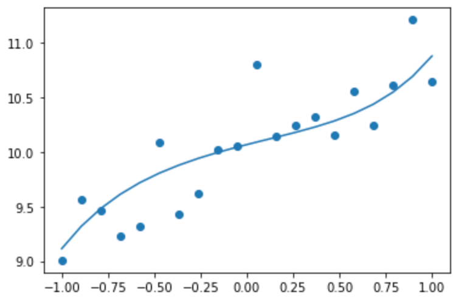  
</div>


### Part 2: Finding a better $\lambda$ (Hyperparam tuning)


```python
lam = np.exp(np.linspace(-4,4,100))
mses = np.zeros(len(lam))
for i in range(len(lam)):
    M3 = Pipeline([
        ('poly3', PolynomialFeatures(degree=6,include_bias=False)),
        ('scal3', StandardScaler()),
        ('ridge3', Ridge(alpha=lam[i], fit_intercept=True))
    ])

    #M3.set_params(**{'ridge3':Ridge(alpha=lam[i],fit_intercept=True)})
    cvsc = cross_val_score(M3, x, df.y,cv=5,scoring = 'neg_mean_squared_error')
    mses[i] = -cvsc.mean()
    print(f"lam: {lam[i]} | MSE: {mses[i]}")

plt.plot(np.log(lam),mses)
```

<div align=center>
    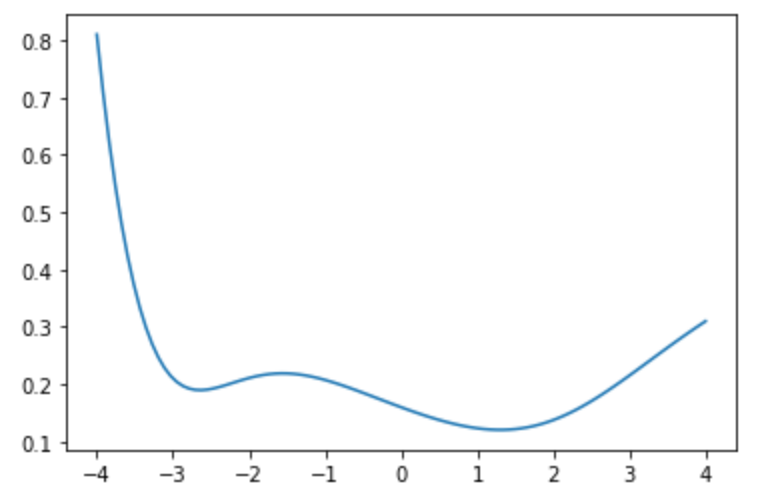  
</div>

### Part 3: Lasso Regularization

```python
# Finally, let's consider the same dataset and perform Lasso Regularization
M4 = Pipeline([
    ('poly4',PolynomialFeatures(degree=6,include_bias=False)),
    ('scal4', StandardScaler()),
    ('lasso4', Lasso(alpha=0.005, fit_intercept=True))
])

ypred4 = M4.fit(x,df.y).predict(x_new)
plt.scatter(x,df.y)
plt.plot(x,ypred,'r-',x,ypred4,'b-')

(M2.named_steps['ridge2'].coef_, M4.named_steps['lasso4'].coef_)


'''
(array([ 0.26264477, -0.03604224,  0.12595432,  0.01336734,  0.06098453,
        -0.0009332 ]),
 array([ 0.47117248, -0.06577208,  0.        ,  0.0393283 ,  0.02196659,
         0.        ]))
'''
```

<div align=center>
    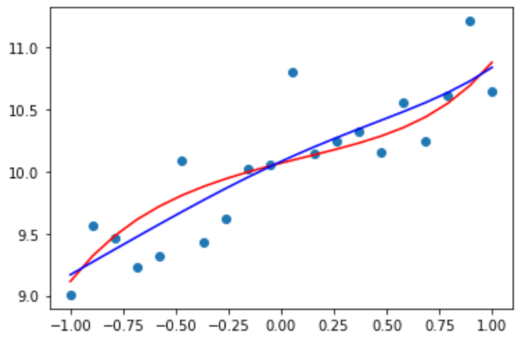  
</div>