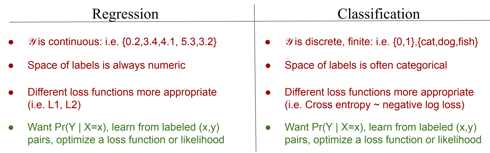
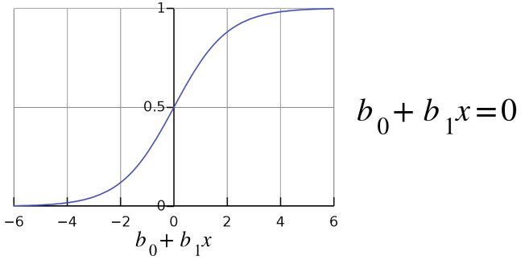
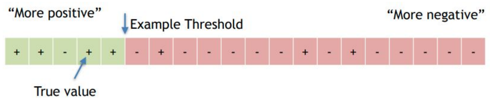
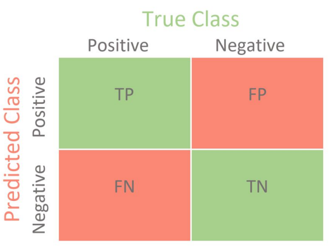
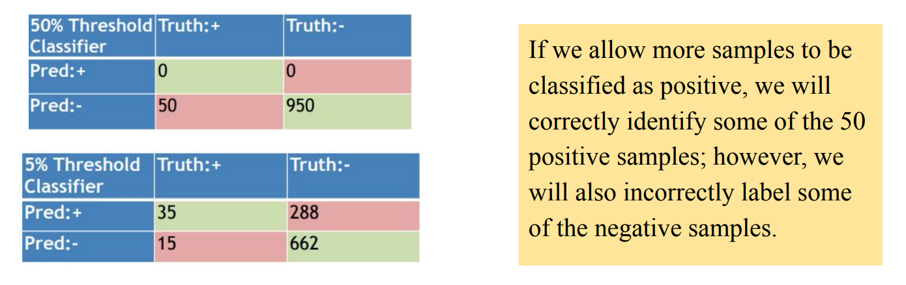
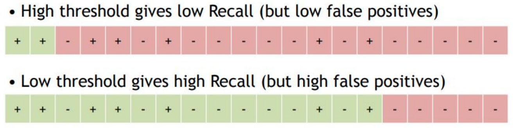
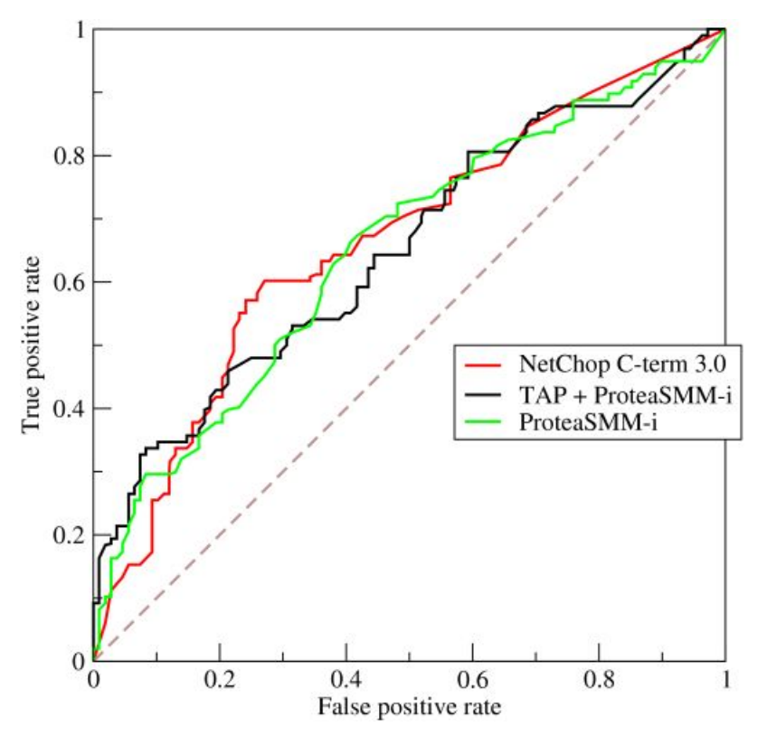
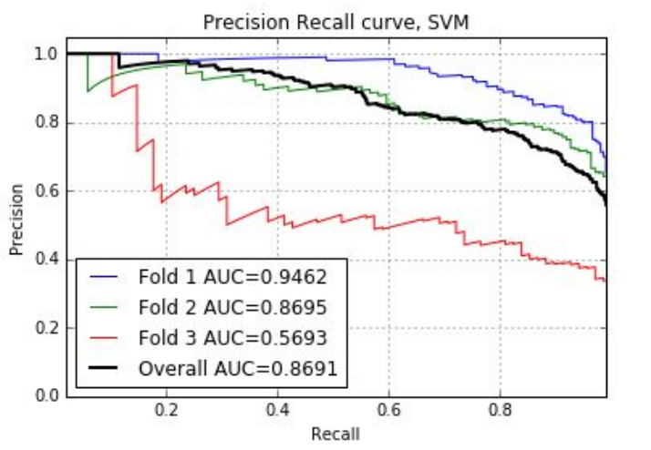
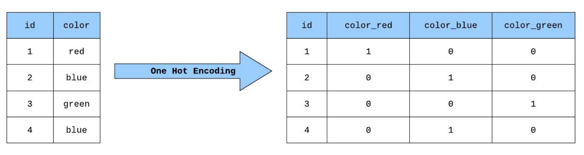

# Classification

## Difference between Regression and Classification

      

## Logistic Regression
A probabilistic classifier which estimates $Pr(Y=1|X=x)$, i.e. $p(x)$ or $p(x;b)$

$$
p(x;b) = \frac{1}{1 + e^{-b_0+b_1x}}
$$

## Log Likelihood

Data = $\{(x_1, y_1), (x_2, y_2), \cdots, (x_n, y_n)\}$

$$
\begin{aligned}
l(b,data) &= \sum_i \log(Pr(Y=y_i|X=x_i; b))\\
l(b,data) &=
\left\{
\begin{aligned}
p(x_i; b) & ,y_i =1 \\
1 - p(x_i; b) &  , y_i = 0
\end{aligned}
\right.\\
l(b,data) &=  \sum_i \log[y_ip(x_i;b) + (1 - y_i)(1 - p(x_i; b))]
    
\end{aligned}
$$

## Evaluation:

### Decision Boundary
- Likelihood good for training, but difficult for evaluating a classifier
- Instead we usually focus on “how many predictions were right vs. wrong”
- How do we know right vs wrong? We need to threshold and create a decision boundary
- Example:
$$
\hat{y} =
\left\{
\begin{aligned}
1 & , Pr(Y = 1 | X = x) \geq 0.5 \\
0 & , Pr(Y = 1 | X = x) < 0.5
\end{aligned}
\right.
$$

      

### Ranking
- In some cases we can rank data samples from “most positive” to “most negative”

      

### Probabilities
- In logistic regression our classifier produces probabilities. What if it mis-classifies
with high confidence?
- One solution: penalize misclassifications with high confidence more than
misclassifications with lower confidence

## Confusion Matrix (2 Class)

      

- TP = “True Positive”. i.e. your classifier predicted 1; it was correct.
- FP = “False Positive”. i.e. your classifier predicted 1; it was incorrect (Type I error). 
- FN = “False Negative”. i.e. your classifier predicted 0; it was incorrect (Type II error). 
- TN = “True Negative”. i.e. your classifier predicted 0; it was correct.

## Accuracy
- Say we have a dataset of 950 negative-class samples, 50 positive-class samples
- If we lower our positive class threshold, our logistic regression accuracy changes

      

## Measurement:

- Precision: What percentage of all positive predictions were correct?
$$
Precision = \frac{\# \ \text{True Positive}}{\#\ \text{Predicted Positive}}
$$
- Recall: What percentage of all positive samples were recalled?

$$
Recall = \frac{\# \ \text{True Positive}}{\# \ \text{Class Positive}}
$$
- F-Measure: A combined metric which accounts for precision and recall in a single measure. 

$$
F-Measure = 2 * (\frac{\text{Precision} * \text{Recall}}{\text{Precision} + {Recall}})
$$

## ROC Curves:
- ROC(Receiver Operating Characteristic) shows the performance of a classifier at all classification thresholds

      

- An ROC Curve plots True Positive Rate or TPR  vs. False Positive Rate or FPR. TPR=TP/P, FPR=FP/N  

      

- If Area Under Receiver Operating
Characteristic Curve (AUROC) is
1, classifier is perfect
- If AUROC is 0.5, classifier is no
better than random chance.
- If AUROC is 0, classifier is
worst possible (TPR=0, FPR=1)

## PRC
- PRC=Precision-Recall Curve. Plot Precision on y-axis, Recall on x-axis for all possible thresholds

      

- If Area Under PRC (AUPRC) is 1,
classifier is perfect

## Multiclass Classifiers
Define $K$ classes numbered $1,\cdots,K$. Also define random variables $Y_1,\cdots,Y_K$ where $y_k=1$
for a class k observation (realization is $y$) $\rightarrow$ we call this one-hot encoding (ohe).

      

