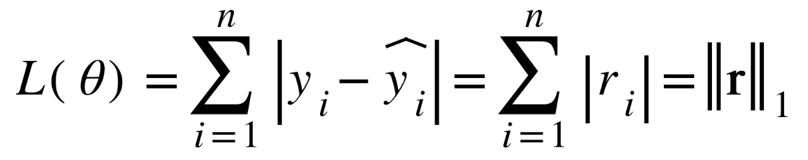

## Training loss

- Option 1: Minimize the sum of magnitudes (absolute values) of residuals: The L1-norm (also called LAD or Least Absolute Deviation)

      

- Option 2: Minimize the sum of squared residuals: The squared L2-norm (also called OLS or Ordinary Least Squares)

      

## Minimizing the cost

$$
L2 = \sum_{i = 1}^n (y_i - b_0 - b_1x_i)^2\\
L1 = \sum_{i = 1}^n |y_i - b_0 - b_1x_i |
$$
- Derivative of L1 Loss
$$
\begin{aligned}
\frac{\partial L}{\partial b_0} &= -\sum_{i = 1}^n sgn(y_i - b_0 - b_1x_i)\\
\frac{\partial L}{\partial b_1} &= -\sum_{i = 1}^n sgn(y_i - b_0 - b_1x_i)x_i
    
\end{aligned}
$$
- Derivative of L2 Loss

$$
\begin{aligned}
\frac{\partial L}{\partial b_0} &= -2 \sum_{i = 1}^n(y_i - b_0 - b_1x_i)\\
\frac{\partial L}{\partial b_1} &= -2 \sum_{i = 1}^n(y_i - b_0 - b_1x_i)x_i
    
\end{aligned}
$$

## Measure the fit
For linear regression we often use R2: the coefficient of determination

$$
R^2 = 1 - \frac{RSS}{TSS} = 1- \frac{\sum_{i = 1} ^n (y - \hat{y})^2}{\sum_{i = 1} ^n (y - \overline{y})^2}
$$

$R^2 \to 0$, no fit, $R^2 \to 1$, perfect fit.
Note: OLS will always have the highest possible $R^2$ value.

## Robust Regression

- Least squares is very sensitive to outliers.
- Absolute error is more robust to outliers
