# Probabilistic Foundations
## Basic definitions:
- Sample space: $\mathcal{S}$ is set of all observable possible events. E.g. Coin flips: $\mathcal{S} = \{1, 1\}$

- Event: 
An event is a subset of the sample space.

- Random varibales: A mapping from the event space to a number or vector. (Notation: X, Y, Z, etc.)

- Discrete Random Variable: Discrete random variables take values from countable set. E.g. coin flip X, $\mathcal{X} = \{0 , 1\}$ 

- Probability mass function (PMF): for a discrete $X$, $p_x(x)$ gives $Pr(X=x)$.
$$
\sum_{x \in \mathcal{X}}P_X(x) = 1
$$

    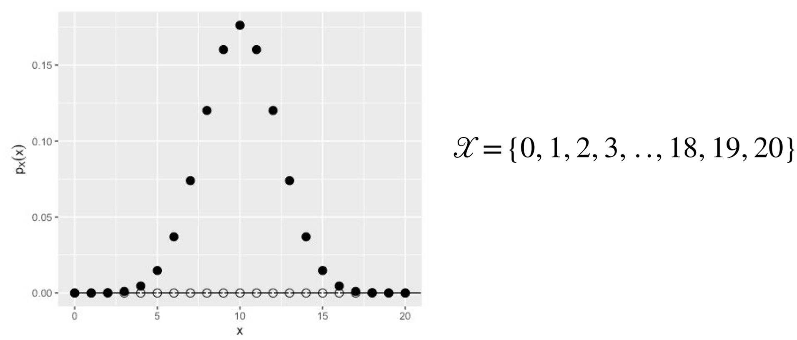  

- Cumulative distribution function (CDF): for discrete X, $P_X(x)$ gives $Pr(X \leq x)$:
$$
P_X(b) = \sum_{x \leq b} p_X(x)
$$

    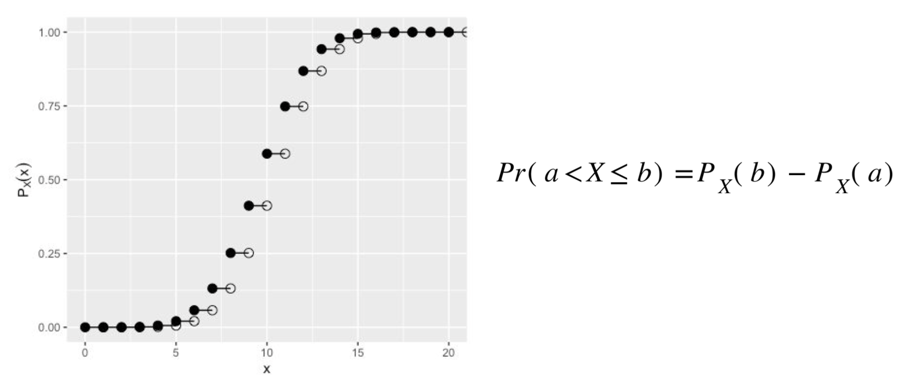  

- Continuous Random Variables: Continuous random variables take values in intervals of $\mathbb{R}$. $Pr(X=x)= 0$ for all $x$. Thus there is no probability mass function.

- Probability Density Function (PDF): for a continuous X, we define $f_X$ such that:

$$

\left\{
\begin{aligned}
Pr(a \leq X \leq b) &= \int_a^b f_X(x) dx\\
\forall x, f_X(x) &> 0\\
\int_{-\infty}^{\infty} f_X(x) dx &= 1
\end{aligned}
\right.
$$

    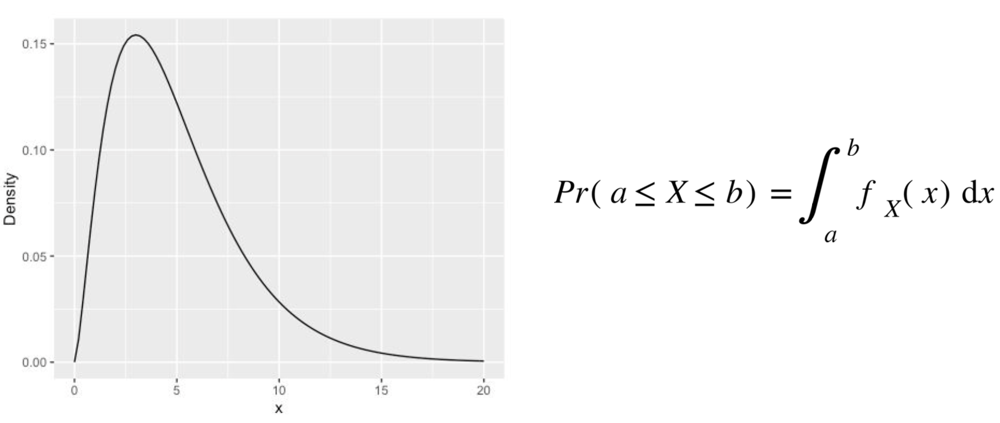  

- Cumulative Distribution Function (CDF): for a continuous X, we define $F_X$ such that:

$$

\left\{
\begin{aligned}
F_X(x) &= \int_{-\infty}^x f_X(x) dx\\
Pr(X\leq x) &= Pr(X\in(-\infty , x))
\end{aligned}
\right.
$$

    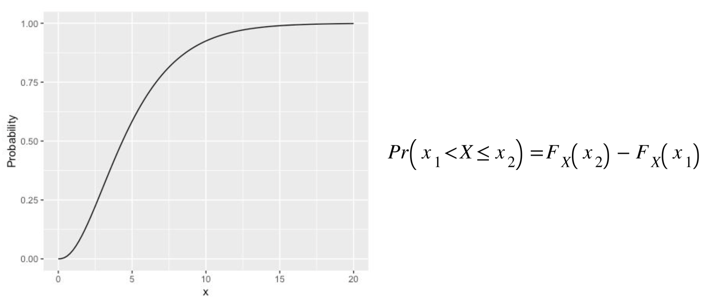  

##  Joint Distributions
Random variables $X$ and $Y$ have a joint distribution if their realizations come together as a pair. $(X,Y)$ is a random vector. Realizations are $(x1,y1),(x2,y2)$,...

- Joint CDF:

    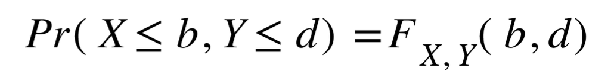  

- Joint PDF:

    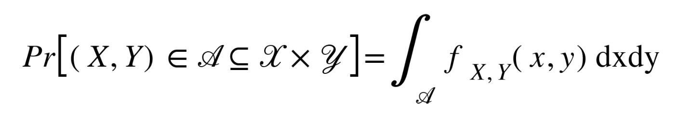  

## Marginal Distribution
Given that $(X,Y)$ is random vector, what is the distribution of $Y$?

    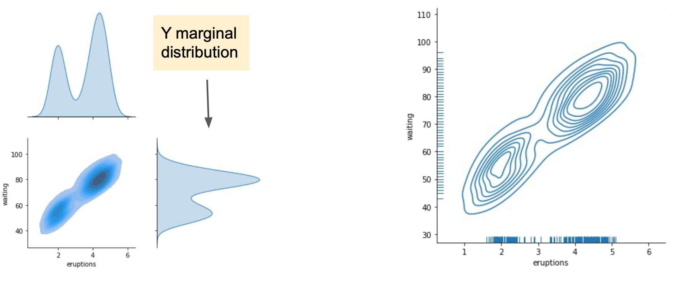  

## Conditional Distributions
- Given that $(X,Y)$ is a random vector, let’s say that we only look at $Y$ values where $X\in[2,2.1]$. We would write this new random variable as $Y | X\in[2,2.1]$.
- The distribution describing this random variable is called the conditional distribution of $Y$ given $X\in[2,2.1]$.

    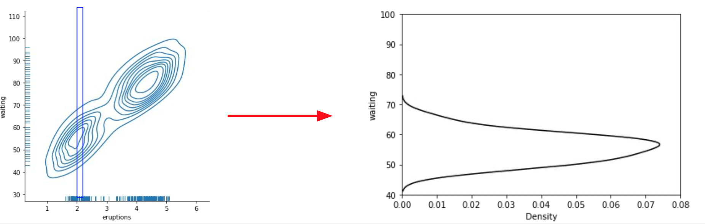  

## Expected Value:
We denote the expected value of a discrete random variable X as:

    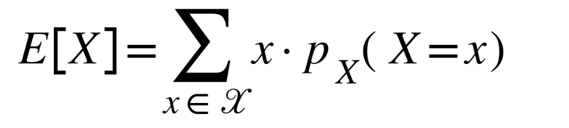  

We denote the expected value of a continuous random variable X as:

    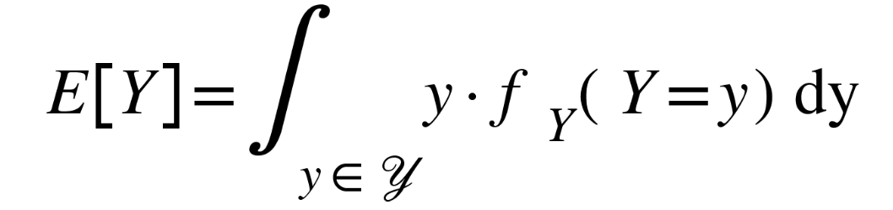  

## Probabilistic Model Estimation:
- If we can find a reasonable description of the distribution of some data, we can use that description to infer structure from the data and also make predictions.
- Let’s consider, as an example, a Gaussian (normal) distribution, which is defined by two parameters: $\mu$ (location/mean of distribution) and $\sigma^2$ (variance of distribution)

$$
f_Y(y) = \frac{1}{\sqrt{2\pi \sigma_Y^2}}e^{-\frac{(y - \mu)^2}{2 \sigma_Y^2}}
$$

## Likelihood function:

If we have independent and identically distributed (i.i.d) data, the probability of seeing all realizations is the product of the probability of each realization

$$
\begin{aligned}
\mathcal{L}(\theta; y_1, y_2, \cdots , y_n) &= \prod_i P_Y(\theta, y_i) \text{ (discrete)} \\
\mathcal{L}(\theta; y_1, y_2, \cdots , y_n) &= \prod_i f_Y(\theta, y_i) \text{ (continuous)}
\end{aligned}
$$

- Log Likelihood:

$$
\begin{aligned}
\mathcal{l}(\theta; y_1, y_2, \cdots , y_n) &= \sum_i \log(P_Y(\theta, y_i)) \text{ (discrete)} \\
\mathcal{l}(\theta; y_1, y_2, \cdots , y_n) &= \sum_i \log(f_Y(\theta, y_i)) \text{ (continuous)}
\end{aligned}
$$

- Normal Log Likelihood:
$$
\begin{aligned}
f_Y(\theta, y) &= \frac{1}{\sqrt{2\pi \sigma_Y^2}}e^{-\frac{(y - \mu)^2}{2 \sigma_Y^2}}\\
\log(f_Y(\theta, y)) &= -\frac{1}{2}\log(2\pi)-\frac{1}{2}\log(\sigma_Y^2) - \frac{(y - \mu_Y)^2}{2\sigma_Y^2}\\
\mathcal{l}(\theta; y_1, y_2, \cdots , y_n) &= -\frac{n}{2}\log(2\pi)-\frac{n}{2}\log(\sigma_Y^2) - \frac{\sum_{i = 1}^n(y - \mu_Y)^2}{2\sigma_Y^2}
\end{aligned}
$$

- Maximum Likelihood Estimation

    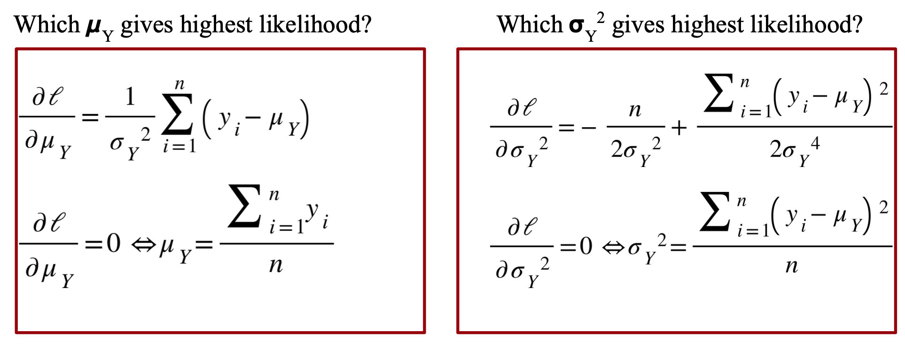  

