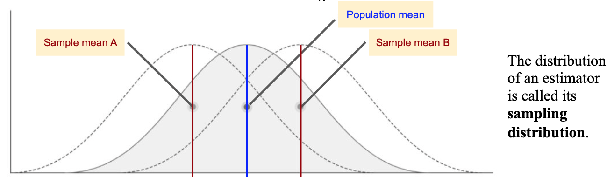
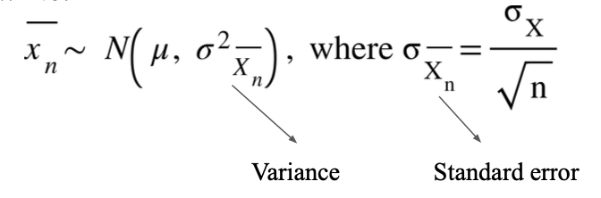
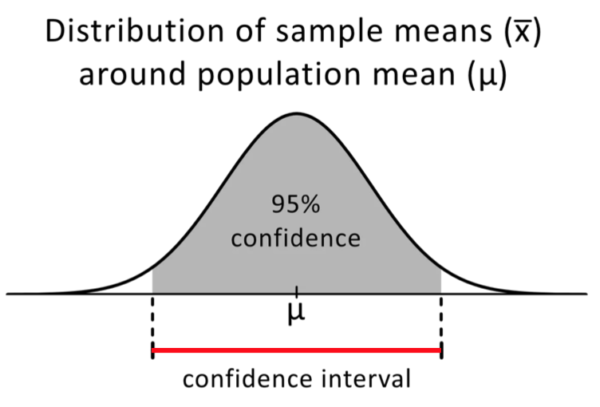

# Uncertainty and bootstrapping

## Parameter Uncertainty

- Parameter = value which summarizes data for a population; these can be expectations (mean) or values which describe an input-output relationship (slope of a linear model).
  - Example of a Parameter:
    - Consider a model which predicts the mean. i.e. $\hat{y} = \theta$
    - Given a dataset $\{x_1, x_2, ..., x_n\}$, the estimate for this parameter is the sample mean:

$$
\hat{\theta} = \frac{\sum_{i = 1}^n x_i}{n}
$$

      

- Statistic = value which summarizes data from a particular sample (i.e. sample mean).

- Estimation = use a statistic to estimate a parameter of the distribution of a random variable, where
  - Estimator ($\hat{\theta}$): function used to compute estimate
  - Estimator ($\theta$): parameter of interest

## Bias and Variance

- Bias = expected difference between estimator ($\hat{\theta}$) and parameter ($\theta$)
$$
\begin{aligned}
&\text{In general : } &Bias(\hat{\theta}) = E[\hat{\theta} - \theta]\\
&\text{For example : } &E[\bar{X_n} - \mu_X]

\end{aligned}
$$
- Variance = expected squared difference between estimator ($\hat{\theta}$) and $E[\text{estimator}]$ (mean)
$$
\begin{aligned}
&\text{In general : } &E[(\hat{\theta} - E[\hat{\theta}])^2]\\
&\text{For example : } & E[(\bar{X}_n - E[{\bar{X}_n}])^2]

\end{aligned}
$$

## Central Limit Theorem

- For Large n, the sampling distribution of $\hat{X_n}$ is approximately normal
- Formally, we can write:

      

- We can use CLT to construct Confidence Intervals
    - Question: What is a $95\%$ confidence interval?
    - Answer: An interval which includes $95\%$ of the sample means.
  

    - We can also say that $95\%$ of the sample means are between $\mu - 1.96 \sigma$ and $\mu + 1.96 \sigma$
    - Example:
      - Mean = $3.49$, Stdev = $1.14$, SE = $0.07$
      - CI is therefore $3.49 +/- 1.96*(0.07) = 3.49 +/- 0.14$

## The Bootstrap
    