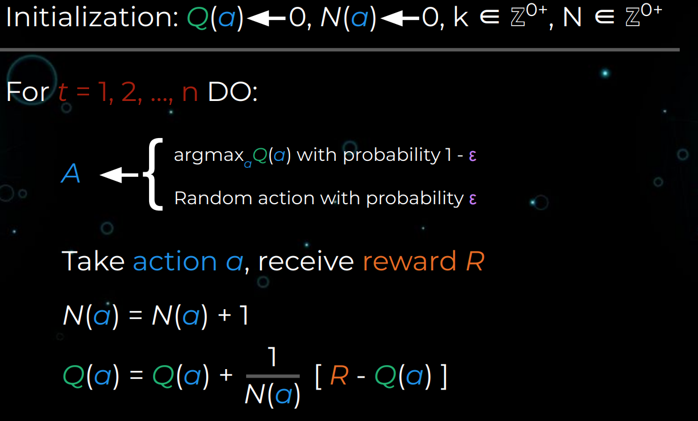
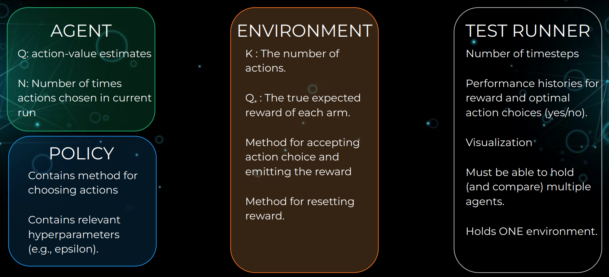
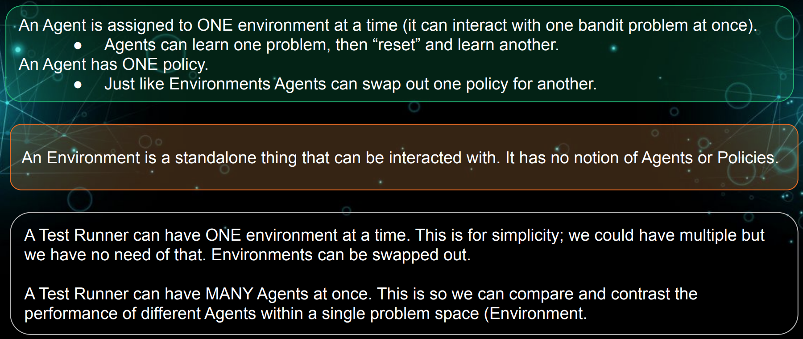
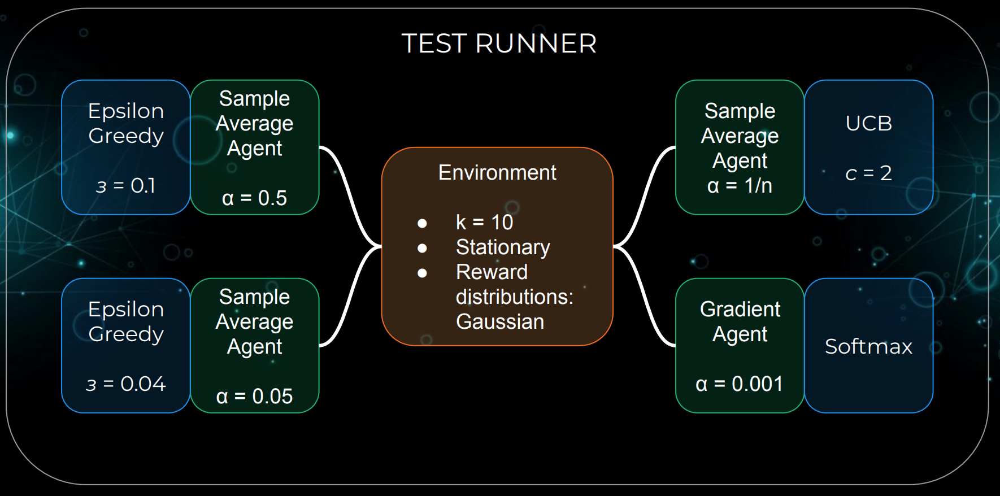

# Action Value

- The value of  arbitrary action $a$
  
  Denoted by $q_*(a)$, is the expected reward $r$ given that $a$ was selected.
$$
q_*(a) = E[R_t | A_t = a]
$$

- The estimated value of action a at timestep $t$
  - $Q_t(a)$: the estimated value of action a at timestep $t$
  - $N(a)$ : The number of times action a was taken prior to timestep $t$.
  - $R_i$: The reward received at prior timestep $i$.
$$
\begin{aligned}
    Q_t(a) &= \frac{\text{sum of rewards when } a \text{ taken prior to current timestep t}}{\text{number of times } a \text{ taken prior to timestep t}}\\
    &= \frac{\sum_{i = 1}^{n - 1}R_i}{N(a)}
\end{aligned}
$$

# Bandit algorithm
## Action value incremental update, simple average
$$
Q_{n+1} = Q_n + \frac{1}{n}[R_n - Q_n]
$$

        

## Exponential Recency-weight average

$$
Q_{n + 1} = \alpha[R_n - Q_n]
$$

## UCB (Upper confidence bound)

$$
A_t = argmax\  Q_t(a) + c[\sqrt{\frac{\log(t)}{N_t(a)}}]
$$

The bias term encourage the agent to explore. If the number of an action has been choosen is small, then the bias term got bigger. As the time goes on, it will more likely to encourage the agent to explore.

### Preference Update
- $H(a)$: preference value for action a.
- $\alpha$: learning rate.
- $R_t$: Reward received at time t.
- $\overline{R_t}$: Average reward received up to and including time t.
- $\pi_t(a_t)$: The probability $[0, 1]$ of choosen action a at time t, as obtained by passing our preference values $H$ through a softmax function.

$$
\begin{aligned}
    H_{t + 1} (A_t) &= H_t(A_t) + \alpha(R_t - \overline{R_t}) (1 - \pi_t(A_t))\\
    H_{t + 1} (a) &= H_t(a) - \alpha(R_t - \overline{R_t})\pi_t(a), \forall a\neq A_t
\end{aligned}
$$

# Design Thinking

        

        

        

