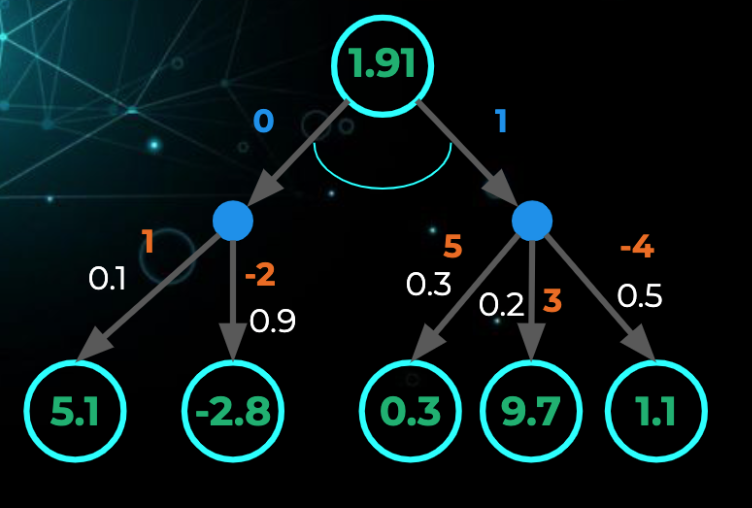

# Optimality and Improvement

# Bellman Expectation Equations

$$
\begin{aligned}
    v(s) &= \mathbb{E}[R_{t+1} + \gamma v(S_{t+1}) | S_t = s]\\

    q(s,a) &= \mathbb{E}[R_{t+1} + \gamma q(S_{t+1}, A_{t+1}) | S_t = s, A_t = a ]
\end{aligned}
$$

$$
\begin{aligned}
v_{\pi}(s) &= \sum \pi(a|s) \cdot q_{\pi}(s,a)\\
q_{\pi}(s, a) &= \sum  p(s^{\prime}, r| s, a) \cdot [r + \gamma v_\pi(s^{\prime})] \\
v_{\pi}(s) &= \sum \pi(a|s) \cdot \sum p(s^{\prime}, r| s, a) \cdot [r + \gamma v_\pi(s^{\prime})] \\
q_{\pi}(s, a) &= \sum p(s^{\prime}| s,a) \cdot [r_{s^{\prime}, a} + \gamma \sum\pi(a^\prime | s^\prime) \cdot q_\pi(s^\prime, a^\prime)]
\end{aligned}
$$

# Optimal Value Functions

$$
\begin{aligned}
v^*(s) &= max_\pi v_\pi (s)\\
q^*(s, a) &= max_\pi q_\pi (s ,a)
\end{aligned}
$$

## Optimal Policies
- There exist an optimal policy $\pi^*$, that is better than or equal to all other policies, $\pi^* > \pi$
$$
    \pi^{\prime} \geq \pi \text{ iff } v_{\pi^\prime} \geq v_\pi(s) \forall s
$$

- There is always a deterministic optimal policy $\pi^(a|s) = \argmax q^*(s, a)$
- There can be more than one optimal policy, but all optimal policies share the same optimal value functions 
  
$$
\begin{aligned}
v_\pi^*(s) &= v^*(s) \\
q_\pi^*(s, a) &= q^*(s, a)
\end{aligned}
$$

## Example:
If we perform Uniform random policy:
<div align=center>
        
</div>

$$
\begin{aligned}
V(s) &= 0.5 * [0.1 * (1 + 0.7 * 5.1) + 0.9 * (-2 + 0.7 * -2.8)]\\
&+ 0.5 * [0.3 * (5 + 0.7 * 0.3) + 0.2 * (3 + 0.7 * 9.7) + 0.5 *(-4 + 0.7 * 1.1)]

\end{aligned}
$$

The optimal policy is:
<div align=center>
        
</div>

$$
V^*(s) = 1 * [0.3 *(5 + 0.7 * 0.3) + 0.2 *(3 + 0.7 * 9.7) + 0.5 *(-4 + 0.5 * 1.1)]
$$

<div align=center>
        
</div>

$$
q_\pi(s, a) = 0.4 * (3 + 0.7 * 1.75) + 0.6 * (1.5 + 0.7 * 0.35)
$$

<div align=center>
        
</div>


$$
q^*_\pi(s, a) = 0.4 * (3 + 0.7 * 7.7) + 0.6 * (1.5 + 0.7 * 0.5)
$$

# Policy evaluation

## Example:
The nonterminal states are $S = \{1, 2, \cdots, 14\}$. There are four actions possible in each state, $A = \{up, down, right, left\}$, which deterministically cause the corresponding state transitions, except that actions that would take the agent off the grid in fact leave the state unchanged. Thus, for instance, $p(6|5, right) = 1$, $p(10|5, right) = 0$, and $p(7|7, right) = 1$. This is an undiscounted, episodic task. The reward is −1 on all transitions until the terminal state is reached. The terminal state is shaded in the figure (although it is shown in two places, it is formally one state). The expected reward function is thus $r(s, a, s0) = −1$ for all states $s$, $s_0$ and actions a. Suppose the agent follows the equiprobable random policy (all actions equally likely)

<div align=center>
        
</div>

## State value function

<div align=center>
        
</div>


```python

'''
Input: pi, {S, P, R, gamma, A}, small positive number theta

Initialize: An array V(s) = 0 for all s, delta = theta + 1
'''

while (delta > theta):
    delta = 0

    for s in S:
        v = V(s)
        V(s) = sum pi(a|s) * sum p(s_prime, r, | s, a) * [r + gamma v_pi(s_prime)]
        delta = max(delta, |v - V(s)|)

return V
```

## Action value function

```python
'''
Input: pi, {S, P, R, gamma, A}, small positive number theta

Initialize: An array Q(s,a) = 0 for all s, delta = theta + 1
'''

while (delta > theta):
    delta = 0

    for s in S and a in A:
        q = Q(s, a)
        Q(s, a) = sum p(s_prime, r, | s, a) * [r + gamma sum pi(a_prime | s_prime) * Q(s_prime, a_prime)]
        delta = max(delta, |q - Q(s, a)|)

return Q
```

# Policy Improvement
## State value function
<div align=center>
        
</div>

```python
for s in S:
    old_action = pi(s)
    pi(s) = argmax sum p(s_prime, r | s, a) * [r + gamma V(s_prime)]

    if (old_action != pi(s))
        policy_stable = False

if (policy_stable):
    return V, pi
else:
    policy_evaluation(pi)
```

Note: 

This algorithm has a subtle bug, in that it may never terminate if the policy continually switches between two or more policies that are equally good. The bug
can be fixed by adding additional flags, but it makes the pseudocode so ugly
that it is not worth it

## Action value function
```python
for s in S:
    old_action = pi(s)
    pi(s) = argmax Q(s, a)

    if (old_action != pi(s))
        policy_stable = False

if (policy_stable):
    return Q, pi
else:
    policy_evaluation(pi)
```

# The algorithm


<div align=center>
        
</div>