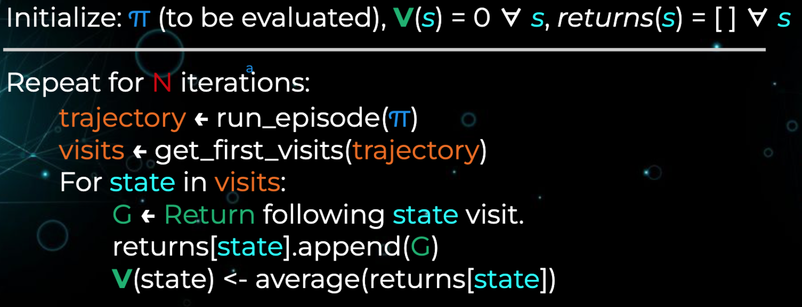

# Monte Carlo In RL

# Model free prediction and control

- Run episode -> calculate returns to each state -> append to list -> average.
- For use when the environment is too complex to compute the value function via dynamic programming, or when the environment is unknown.
- Estimates expected return via sampling and calculating the empirical mean of experienced returns.
- Depends on episodes. Environment must be episodic.

# First visit Monte Carlo

        

