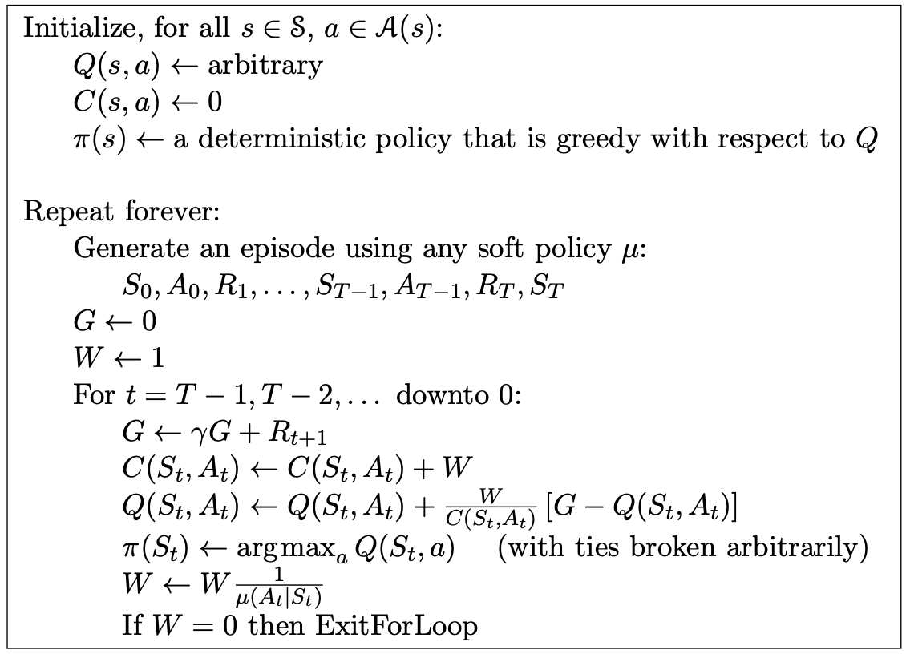

# Monte Carlo In RL

# Monte Carlo methods 
- Monte Carlo methods require only experience—sample sequences of states, actions, and rewards from actual or simulated interaction with an environment.
- Monte Carlo methods can be incremental in an episode-by-episode sense, but not in a step-by-step (online) sense. 
- Monte Carlo methods sample and average returns for each state–action pair.

# Model free prediction and control

- Run episode -> calculate returns to each state -> append to list -> average.
- For use when the environment is too complex to compute the value function via dynamic programming, or when the environment is unknown.
- Estimates expected return via sampling and calculating the empirical mean of experienced returns.
- Depends on episodes. Environment must be episodic.

# First visit Monte Carlo method for estimating $v_\pi$

        

Note: we use a capital letter V for the approximate value function because, after initialization, it soon becomes a random variable.

# Monte Carlo control
It is easy to see that Monte Carlo ES cannot converge to any sub-optimal policy. If it did, then the value function would eventually converge to the value function for that policy, and that in turn would cause the policy to change. Stability is achieved only when both the policy and the value func- tion are optimal. Convergence to this optimal fixed point seems inevitable as the changes to the action-value function decrease over time,

        

# Off policy
Suppose now that all we have are episodes generated from a different policy. That is, suppose we wish to estimate vπ or qπ, but all we have are episodes following another policy μ, where μ ̸= π. We call π the target policy because learning its value function is the target of the learning process, and we call μ the behavior policy because it is the policy controlling the agent and generating behavior. The overall problem is called off-policy learning because it is learning about a policy given only experience “off” (not following) that policy.

        

