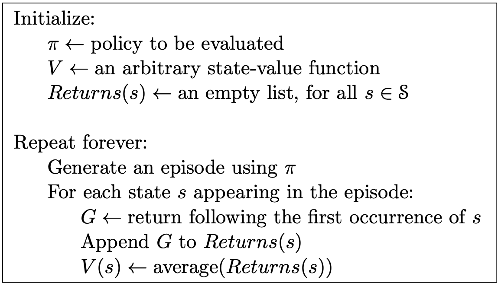
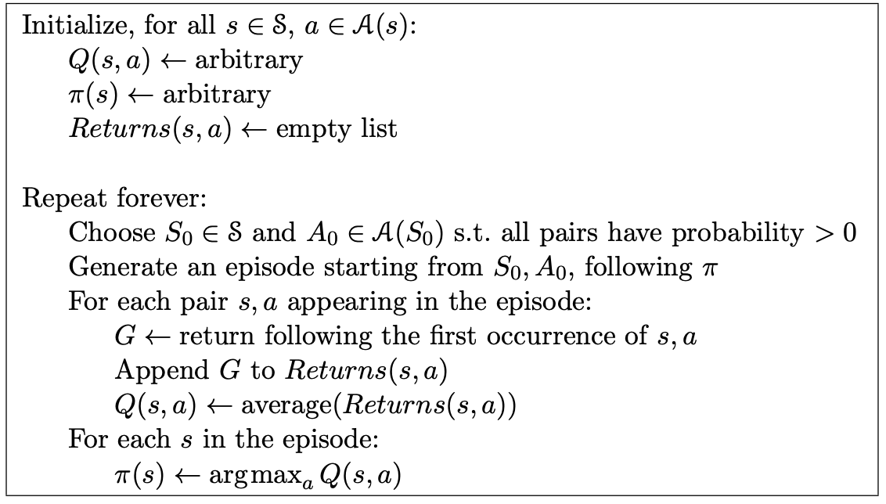

# Monte Carlo In RL

# Monte Carlo methods 
- Monte Carlo methods require only experience—sample sequences of states, actions, and rewards from actual or simulated interaction with an environment.
- Monte Carlo methods can be incremental in an episode-by-episode sense, but not in a step-by-step (online) sense. 
- Monte Carlo methods sample and average returns for each state–action pair.

# Model free prediction and control

- Run episode -> calculate returns to each state -> append to list -> average.
- For use when the environment is too complex to compute the value function via dynamic programming, or when the environment is unknown.
- Estimates expected return via sampling and calculating the empirical mean of experienced returns.
- Depends on episodes. Environment must be episodic.

# First visit Monte Carlo method for estimating $v_\pi$

        

Note: we use a capital letter V for the approximate value function because, after initialization, it soon becomes a random variable.

# Monte Carlo control

        

