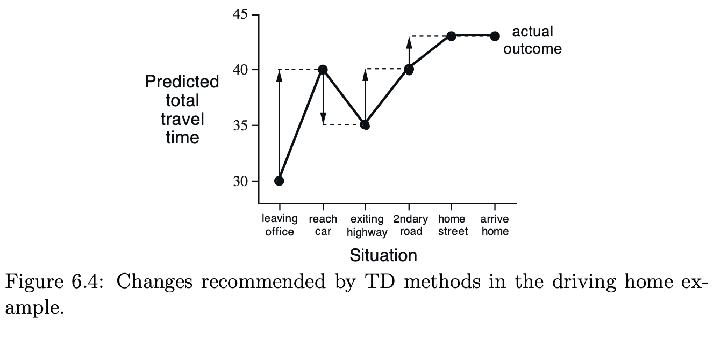

# Temporal-Difference Learning

# Difference between TD and Monte Carlo

Monte Carlo methods wait until the return following the visit is known, then use that return as a target for V (St). A simple every-visit Monte Carlo method suitable for nonstationary environments is

$$
V(S_t) = V(S_t) + \alpha  [G_t - V(S_t)]
$$
where G(t) is the actual return following time t. Whereas Monte Carlo methods must wait until the end of the episode to determine the increment to $V (S_t)$. TD methods need wait only until the next time step. At time $t+1$ they immediately form a target and make a useful update using the observed reward Rt+1 and the estimate $V (S_{t+1})$. The simplest TD method, known as TD(0), is

$$
V(S_t) = V(S_t) + \alpha[R_{t+1} + \gamma V(S_{t+1} - V(S_t))]
$$

# TD(0)

        

# Advantages of TD Prediction Methods

- TD methods have an advantage over DP methods in that they do not require a model of the environment, of its reward and next-state probability distributions.

- TD are naturally implemented in an on-line, fully incremental fashion. With Monte Carlo methods one must wait until the end of an episode, because only then is the return known, whereas with TD methods one need wait only one time step. Surprisingly often this turns out to be a critical consideration. Some applications have very long episodes, so that delaying all learning until an episode’s end is too slow. Other applications are continuing tasks and have no episodes at all. Finally, as we noted in the previous chapter, some Monte Carlo methods must ignore or discount episodes on which experimental actions are taken, which can greatly slow learning. TD meth- ods are much less susceptible to these problems because they learn from each transition regardless of what subsequent actions are taken.

# Sarsa: On-Policy TD Control
It is straightforward to design an on-policy control algorithm based on the Sarsa prediction method. As in all on-policy methods, we continually estimate $q_\pi$ for the behavior policy $\pi$, and at the same time change $\pi$ toward greediness with respect to $q_\pi$.

        

# Q-Learning: Off-Policy TD Control

        

# Expected SARSA

        

# Summary:
**TD(0)**: 
- TD(0) is essentially a policy evaluation algorithm; it is for prediction, rather than control. 
- It updates each V(s) toward $R+\gamma V(s^\prime)$ in order to “chain predictions forward”, which results in V(s)
converging to the true long-term return. 
- Put another way, as more and more episodes are run, each V(s) becomes closer to V(s’) and information propagates backward through every trajectory chain. While TD(0) is better than Monte Carlo in terms of variance and efficiency, it is significantly more biased as the target contains a guess about the long-term return of the successor state.
  
**SARSA**: 
- SARSA is on-policy TD(0) that updates according to the action that was actually selected. 
- It functions similarly, and critically can learn while the episode is still going on. SARSA, being on-policy, requires an exploratory component (e.g., e-soft) to explore enough to ensure convergence. 
- SARSA is a solid “workhorse” algorithm that is **relatively conservative compared to Q-Learning**
- However it only learns a near-optimal policy while exploring; to get directly at the optimal policy we would need to decay exploration over time and choose the decay parameter “correctly”.

**Q-Learning**: 
- In contrast to SARSA, Q-Learning is an off-policy algorithm that uses only the maximal available action in its updates regardless of the action that was actually taken (Q-learning is called off-policy because the updated policy is different from the behavior policy). This gives Q-Learning the advantage of “not getting discouraged”, or “walking the razor’s edge”. 
- **Because Q-Learning focuses on the optimal action only, it will be willing to take risks and learn potentially more dangerous paths to success.** 
- Similar to SARSA, it requires an exploratory component to ensure convergence, yet due to the off-policy nature of Q-Learning it directly learns the optimal policy.

**Expected SARSA**:
- Expected SARSA updates each Q-estimates not according to the max, but to the policy-weighted average of
the available actions.
- It trains more quickly than SARSA (using all available actions in proportion to
their likelihood of being selected), and is significantly less risky than Q-Learning (if one or more actions are
heavily negative, that information is always included in the update in proportion to the likelihood of the negative
events coming to pass). 
- Similar to SARSA, we would need to decay exploration over time to learn the optimal policy rather than a near-optimal policy.

        

        

# Example: Driving Home

Each day as you drive home from work, you try to predict how long it will take to get home. When you leave your office, you note the time, the day of week, and anything else that might be relevant. Say on this Friday you are leaving at exactly 6 o’clock, and you estimate that it will take 30 minutes to get home. As you reach your car it is 6:05, and you notice it is starting to rain. Traffic is often slower in the rain, so you reestimate that it will take 35 minutes from then, or a total of 40 minutes. Fifteen minutes later you have completed the highway portion of your journey in good time. As you exit onto a secondary road you cut your estimate of total travel time to 35 minutes. Unfortunately, at this point you get stuck behind a slow truck, and the road is too narrow to pass. You end up having to follow the truck until you turn onto the side street where you live at 6:40. Three minutes later you are home. The sequence of states, times, and predictions is thus as follows:

        

        

        

# Exercise
1. From Figure below, it appears that the first episode results in a change in only V (A). What does this tell you about what happened on the first episode? Why was only the estimate for this one state changed? By exactly how much was it changed? Note that $\alpha = 0.1, \gamma = 1$ and the approximate value function was initialized to the intermediate value $V (s) = 0.5$, for all $s$

        

        

$$
\begin{aligned}
V(A) &= V(A) + \alpha [R + V(T) - V(A)] \\
&= 0.5 + 0.1 [0 + 0 - 0.5]\\
&= 0.45\\
V(C) &= V(C) +  \alpha [R + V(B) - V(C)]\\
&= 0.5 + 0.1 [0 + 0.5 - 0.5]\\
&= 0.5
\end{aligned}
$$
2. The specific results shown in below are dependent on the value of the step-size parameter, α. Do you think the conclusions about which algorithm is better would be affected if a wider range of α values were used? Is there a different, fixed value of α at which either algorithm would have performed significantly better than shown? Why or why not?

        

