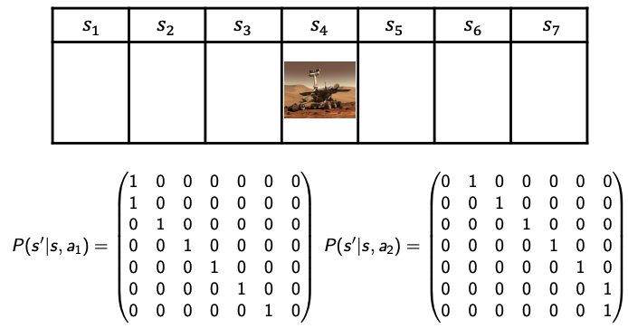

# Given the model of the world
# Markov Processes

- Markov Property
    - Future is independent of past given present.
    - Information state: sufficient statistic of history.
    - State $s_t$ is Markov if and only if:

$$
p(s_{t+1} | s_t, a_t) = p(s_{t+1} | h_t, a_t)
$$

- Markov Processes
    - Definition of Markov Process.
      1. $S$ is a (finite) set of states ($s \in S$).
      2. $P$ is a dynamics/transition model that specifices $p(s_{t+1} = s^{\prime} | s_t = s)$.
    - If finite number ($N$) of states, can express $P$ as a matrix:
    $$
    P = 
    \begin{bmatrix}
        p(s_1 | s_1) & p(s_2 | s_1) & \cdots & p(s_N | s_1)\\
        p(s_1 | s_2) & p(s_2 | s_2) & \cdots & p(s_N | s_2)\\
        \vdots       & \vdots       & \ddots & \vdots\\
        p(s_1 | s_N) & p(s_2 | s_N) & \cdots & p(s_N | s_N)
        \end{bmatrix}
    $$
    - Example:

        

$$

P = 
\begin{bmatrix}
    0.6 & 0.4 & 0   & 0   & 0   & 0   & 0   \\
    0.4 & 0.2 & 0.4 & 0   & 0   & 0   & 0   \\
    0   & 0.4 & 0.2 & 0.4 & 0   & 0   & 0   \\
    0   & 0   & 0.4 & 0.2 & 0.4 & 0   & 0\\
    0   & 0   & 0   & 0.4 & 0.2 & 0.4 & 0\\
    0   & 0   & 0   & 0   & 0.4 & 0.2 & 0.4\\
    0   & 0   & 0   & 0   & 0   & 0.4 & 0.6
\end{bmatrix}
$$

# Markov Reward Processes (MRPS)

- $S$ is a (finite) set of states ($s \in S$).
- $P$ is a dynamics/transition model that specifices $p(s_{t+1} = s^{\prime} | s_t = s)$.
- $R$ is a reward function $R(s_t = s) = \mathbb{E}[r_t | s_t = s]$, if finite number ($N$) of states, can express $R$ as a vector:
  $$R(S) = \begin{bmatrix}R(s_1) \\\vdots\\R(s_N)\end{bmatrix}$$
- $\gamma$ is the discount factor such that $\gamma \in [0,1]$.
    - Humans often acts as if there's a discount factor $< 1$.
    - $\gamma = 0$: only care about immediate reward.
    - $\gamma = 1$: Future reward is as benefical as immediate reward.
    - If episode lengths are always finite ($H < \infty$), can use $\gamma = 1$.
- $H$ is the number of steps is each episode.
- $G$ is the discount sum of rewards from time step $t$ yo $H$
    $$G_t = r_t + \gamma r_{t + 1} + \gamma^2 r_{t + 2} + \cdots + \gamma^{H - 1} r_{t + H - 1}$$
- $V$ is the state value function, return the expected value from starting in state s:
  $$V(s) = \mathbb{E}[G_t | s_t = s] = \mathbb{E}[r_t + \gamma r_{t + 1} + \gamma^2 r_{t + 2} + \cdots + \gamma^{H - 1} r_{t + H - 1} | s_t = s]$$
- MRP value function satisfies (Bellman equation):
  $$\begin{aligned}V(s) &= \underbrace{R(s)}_{\text{Immediate reward}} + \underbrace{\gamma \sum_{s^{\prime}\in S} P(s^{\prime} | s) V(s^{\prime})}_{\text{Discounted sum of future rewards}}\\
  \begin{bmatrix}V(s_1) \\V(s_2) \\\vdots\\V(s_N)\end{bmatrix}&= \begin{bmatrix}R(s_1) \\R(s_2) \\\vdots\\R(s_N)\end{bmatrix} + \gamma\begin{bmatrix}
        p(s_1 | s_1) & p(s_2 | s_1) & \cdots & p(s_N | s_1)\\
        p(s_1 | s_2) & p(s_2 | s_2) & \cdots & p(s_N | s_2)\\
        \vdots       & \vdots       & \ddots & \vdots\\
        p(s_1 | s_N) & p(s_2 | s_N) & \cdots & p(s_N | s_N)
        \end{bmatrix}

        \begin{bmatrix}V(s_1) \\V(s_2) \\\vdots\\V(s_N)\end{bmatrix}\\

        V &= R + \gamma PV\\
        V & = (I - \gamma P)^{-1} R
  
  \end{aligned}$$
  Note: Matrix inverse takes $O(n^3)$, this can be reduced to $O(S^2)$ if we use Dymamic programming and initialize $V_0(s) = 0$ and for $k = 1$ until convergence:
  $$
    V_k(s) = R(s) + \gamma \sum_{s^{\prime} \in S}  P(s^{\prime} | s) V_{k-1}(s^{\prime})
  $$
- Example: Suppose in the mars rover problem, reward is $+1$ in $s_1$, $+10$ in $s_7$, $0$ in other states, $\gamma = 0.5$.
    

            
    

    $$
        P = 
        \begin{bmatrix}
            0.6 & 0.4 & 0   & 0   & 0   & 0   & 0   \\
            0.4 & 0.2 & 0.4 & 0   & 0   & 0   & 0   \\
            0   & 0.4 & 0.2 & 0.4 & 0   & 0   & 0   \\
            0   & 0   & 0.4 & 0.2 & 0.4 & 0   & 0\\
            0   & 0   & 0   & 0.4 & 0.2 & 0.4 & 0\\
            0   & 0   & 0   & 0   & 0.4 & 0.2 & 0.4\\
            0   & 0   & 0   & 0   & 0   & 0.4 & 0.6
        \end{bmatrix}
    $$
  - Sample returns for 4-step episodes:
    - $s_4, s_5, s_6, s_7$ = $0 + \frac{1}{2} \times 0 + \frac{1}{4}\times 0 + \frac{1}{8}\times 10 = 1.25$
    - $s_4, s_4, s_5, s_4$ = $0 + \frac{1}{2} \times 0 + \frac{1}{4}\times 0 + \frac{1}{8}\times 0 = 0$
  - State value function:
    $$
    \begin{aligned}
    V & = (I - \gamma P)^{-1} R\\
    & = \begin{bmatrix}
            0.7 & 0.2 & 0   & 0   & 0   & 0   & 0   \\
            0.2 & 0.9 & 0.2 & 0   & 0   & 0   & 0   \\
            0   & 0.2 & 0.9 & 0.2 & 0   & 0   & 0   \\
            0   & 0   & 0.2 & 0.9 & 0.2 & 0   & 0\\
            0   & 0   & 0   & 0.2 & 0.9 & 0.2 & 0\\
            0   & 0   & 0   & 0   & 0.2 & 0.9 & 0.2\\
            0   & 0   & 0   & 0   & 0   & 0.2 & 0.7
        \end{bmatrix}^{-1} 
        \begin{bmatrix}
            1 \\0 \\ 0   \\ 0   \\ 0   \\ 0 \\ 10   
        \end{bmatrix}

    \end{aligned}
    $$

# Markov Decision Processes (MDPS)
- Definition of MDPS
  - $S$ is a (finite) set of states ($s \in S$).
  - $A$ is a (finite) set of actions ($a \in A$).
  - $P$ is a dynamics/transition model for each action, that specifices $p(s_{t+1} = s^{\prime} | s_t = s, a_t = a)$.
  - $R$ is a reward function 
  $$R(s_t = s, a_t = a) = \mathbb{E}[r_t | s_t = s, a_t = a]$$
  - Discount factor $\gamma \in [0, 1]$
  - MDP is a tuple: $(S,A,P,R,\gamma)$
  - Example: $a_1$ specifices go left and $a_2$ specifices go right

     

- MDPS Policies
    - Policy specifies what action to take in each state (Can be deterministic or stochastic).
    - Policy: $\pi(a|s) = P(a_t = a|s_t = s)$
    - MDP + Policy:
    $$
    \begin{aligned}
    R^{\pi}(s) &= \sum_{a\in A} \pi(a | s)R(s, a)\\
    P^{\pi}(s^{\prime} | s) &= \pi(a | s)P(s^{\prime} | s, a)
    \end{aligned}
    $$
    - MDP Policy Evaluation:  
    initialize $V_0(s) = 0$ and for $k=1$ until convergence:
    $$
    V_k^\pi(s) = R(s, \pi(s)) + \gamma \sum_{s^{\prime} \in S}  P(s^{\prime} | s, \pi(s)) V_{k-1}^\pi(s^{\prime})
    $$

- Examples:

     

$$
\begin{aligned}
V_{k+1}(s_6) &= r(s_6, a_1) + \gamma \times 0.5 \times V_k(s_6) + \gamma \times 0.5 \times V_k(s_7)\\
&= 2.5
\end{aligned}
$$
# Evaluation and Control in MDPS

- Policy Search
    - One option is searching to compute best policy
    - Number of determinisitic policies is $|A|^{|S|}$
    - Policy iteration is generally more efficient than enumeration

- State-Action Value Q
  - Take action a, then follow the policy $\pi$
  - Policy Improvement:
    - Compute state-action value of a policy $\pi_i$ for $s$ in $S$ and $a$ in $A$
    $$
      Q^{\pi_i}(s,a) = R(s,a) + \gamma \sum_{s^{\prime} \in S} P(s^{\prime} | s, a)V^{\pi_i}(s^{\prime})
    $$
    - Compute new policy $\pi_{i + 1}$, for all $s \in S$
    $$
    \pi_{i + 1} (s) = \arg \underset{a}{\mathrm{ max}} \ Q^{\pi_i} (s,a) \ \forall s \in S
    $$
  

- MDP Policy Iteration 
  - Set i = 0
  - Initialize $\pi_0(s)$ randomly for all state s
  - while $i = 0$ or $\| \pi_i - \pi_{i - 1}\|_1 > 0$ (measures if the policy
changed for any state):
    - $V^{\pi_i} \gets$ MDP $V$ function policy evaluation of $\pi_i$
    - $\pi_{i + 1} \gets$   Policy improvement
    - $i = i + 1$

- Monotonice Improvement in Policy:
  - Definition:
  $$
   V^{\pi_1} \geq V^{\pi_2}: V^{\pi_1}(s) \geq  V^{\pi_2}(s), \forall s \in S
  $$
  - Proof：
  $$
  \begin{aligned}
   V^{\pi_i}(s) &\leq \arg \underset{a}{\mathrm{max}} \ Q^{\pi_i} (s, a)\\
   &=  \arg \underset{a}{\mathrm{max}}\  R(s,a) + \gamma \sum_{s^{\prime} \in S} P(s^{\prime} | s, a)V^{\pi_i}(s^{\prime})\\
   &= R(s, \pi_{i + 1} (s)) + \gamma \sum_{s^{\prime} \in S} P(s^{\prime} | s, \pi_{i + 1} (s))V^{\pi_i}(s^{\prime})\\
   &\leq R(s, \pi_{i + 1} (s)) + \gamma \sum_{s^{\prime} \in S} P(s^{\prime} | s, \pi_{i + 1} (s))( \underset{a^{\prime}}{\mathrm{max}} \ Q^{\pi_i} (s^{\prime}, a^{\prime}))\\
   &= R(s, \pi_{i + 1} (s)) + \gamma \sum_{s^{\prime} \in S} P(s^{\prime} | s, \pi_{i + 1} (s))(\cdots)\\
   \vdots\\
   &=    V^{\pi_{i + 1}}(s)
  \end{aligned}
  $$

- Bellman Equation and Bellman Backup Operators
  - Recall Bellman Equation:
  $$
  V(s) = \underbrace{R(s)}_{\text{Immediate reward}} + \underbrace{\gamma \sum_{s^{\prime}\in S} P(s^{\prime} | s) V(s^{\prime})}_{\text{Discounted sum of future rewards}}
  $$
  - Bellman Backup Operators:
    - Applied to a value funciton and can return a new value function
    - Bellman Backup Operators improve the value if possible
    $$
    BV(s) = \underset{a}{\mathrm{max}} \ R(s,a ) + \gamma \sum_{s^{\prime}\in S} P(s^{\prime} | s) V(s^{\prime})
    $$
    - $BV$ yields a value function over all states $s$
    - Bellman backup operator $B^{\pi}$ for a particular policy is defined as: 
    $$
    B^{\pi}V(s) = \underset{a}{\mathrm{max}} \ R^{\pi}(s,a ) + \gamma \sum_{s^{\prime}\in S} P^{\pi}(s^{\prime} | s) V(s^{\prime})
    $$
    - Policy evaluation: repeatedly apply operator untill V stops changing
    $$
    V^{\pi} = B^{\pi}B^{\pi}\cdots B^{\pi}V
    $$
    - Policy improvement:
    $$
    \pi_{k + 1}(s) = \arg \underset{a}{\mathrm{max}} R(s, a) + \gamma \sum_{s^{\prime} \in S} P(s^{\prime} | s)V^{\pi_k}(s^{\prime})
    $$

  - Value Iteration for Finite Horizon $H$
      - $V_k = \text{optimal value if making k more decisions}$
      - $\pi_k = \text{optimal policy if making k more decisions}$
        - Initialize $V_0(s) = 0$ for all states $s$
        - For $K = 1 : H$
          - For each state s:
            $$
            V_{k+1}(s) = \underset{a}{\mathrm{max}} \ R(s,a ) + \gamma \sum_{s^{\prime}\in S} P(s^{\prime} | s) V_k(s^{\prime})\\
            \pi_{k + 1}(s) = \arg \underset{a}{\mathrm{max}} R(s, a) + \gamma \sum_{s^{\prime} \in S} P(s^{\prime} | s)V_k(s^{\prime})
            $$