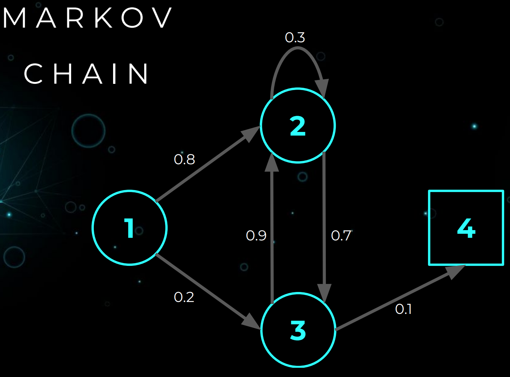

# Markov Processes

# The Markov Property
- The Markov property means a process or state is memoryless: what happens next only depends on where you are right now.
- Future is independent of past given present.
- Information state: sufficient statistic of history.
- State $s_t$ is Markov if and only if:

$$
p(s_{t+1} | s_t) = p(s_{t+1} | s_1, s_2,\cdots, s_t)
$$

# The Markov Chain

A Markov Chain | Markov Process is a tuple $\mathcal{(S, P)}$, where:

- $\mathcal{S}$ is a finite set of states
- $\mathcal{P}$ is our state-transition probability matrix.
$$
P(S_{t+1} = s^{\prime}| S_t = s)
$$
- If finite number ($N$) of states, can express $P$ as a matrix:
    $$
    P = 
    \begin{bmatrix}
        p(s_1 | s_1) & p(s_2 | s_1) & \cdots & p(s_N | s_1)\\
        p(s_1 | s_2) & p(s_2 | s_2) & \cdots & p(s_N | s_2)\\
        \vdots       & \vdots       & \ddots & \vdots\\
        p(s_1 | s_N) & p(s_2 | s_N) & \cdots & p(s_N | s_N)
        \end{bmatrix}
    $$

Example:

        

$$

P = 
\begin{bmatrix}
    0   & 0.8 & 0.2 & 0     \\
    0   & 0.3 & 0.7 & 0  \\
    0   & 0.9 & 0   & 0.1  \\
    0   & 0   & 0   & 1\\
\end{bmatrix}
$$

# Markov Reward Processes

A Markov Decision Process is a tuple $\mathcal{(S, P, R, \gamma)}$ where:

- $\mathcal{S}$ is a finite set of states.
- $\mathcal{P}$ is our state-transition probability matrix.
- $\mathcal{R}$ is a reward function, $R_s = \mathbb{E}[R_{t+1} | S_t = s]$
- $\mathcal{\gamma}$ is a discount factor $\gamma \in [0, 1]$
    - $\gamma = 0$: only care about immediate reward.
    - $\gamma = 1$: Future reward is as benefical as immediate reward.

# Markov Decision Processes (MDPS)

A Markov Decision Process is a tuple $\mathcal{(S, P, R, \gamma, A)}$  where:
- $\mathcal{S}$ is a finite set of states.
- $\mathcal{A}$ is a finite set of actions.
- $\mathcal{P}$ is our state-transition probability matrix.
$$
P(S_{t+1} = s^{\prime}| S_t = s, A_t = a)
$$
- $\mathcal{R}$ is a reward function, $R_s = \mathbb{E}[r_{t+1} | S_t = s, A_t = a]$
- $\mathcal{\gamma}$ is a discount factor $\gamma \in [0, 1]$
- $G$ is the discount sum of rewards from time step $t$ yo $H$

$$\begin{aligned}
    G_t &= r_{t + 1} + \gamma r_{t + 2} + \gamma^2 r_{t + 3} + \cdots\\
        &= \sum_{k=0}^{\infty}\gamma^k r_{t + k + 1}
\end{aligned}$$

- $V$ is the state value function, return the expected value from starting in state $s$ (The long-term value of state $s$):
$$\begin{aligned}
    V(s) &= \mathbb{E}[G_t | s_t = s] \\
    &= \mathbb{E}[r_{t + 1} + \gamma r_{t + 2} + \gamma^2 r_{t + 3} + \cdots | S_t = s]\\
    &= \mathbb{E}[r_{t + 1} + \gamma G_{t+1}| S_t = s]\\
    &= \mathbb{E}[r_{t + 1} + \gamma v(S_{t+1})| S_t = s]
\end{aligned}$$

-  $q$ is the action value function.
$$\begin{aligned}
q(s, a) &= \mathbb{E} [G_t | S_t = s, A_t = a]\\
&= \mathbb{E}[r_{t + 1} + \gamma r_{t + 2} + \gamma^2 r_{t + 3} + \cdots | S_t = s, A_t = a]\\
&= \mathbb{E}[r_{t + 1} + \gamma q(S_{t+1}, A_{t+1}) | S_t = s, A_t = a]
\end{aligned}
$$

- Bellman equation:
$$\begin{aligned}V(s) &= \underbrace{R(s)}_{\text{Immediate reward}} + \underbrace{\gamma \sum_{s^{\prime}\in S} P(s^{\prime} | s) V(s^{\prime})}_{\text{Discounted sum of future rewards}}\\
  \begin{bmatrix}V(s_1) \\V(s_2) \\\vdots\\V(s_N)\end{bmatrix}&= \begin{bmatrix}R(s_1) \\R(s_2) \\\vdots\\R(s_N)\end{bmatrix} + \gamma\begin{bmatrix}
        p(s_1 | s_1) & p(s_2 | s_1) & \cdots & p(s_N | s_1)\\
        p(s_1 | s_2) & p(s_2 | s_2) & \cdots & p(s_N | s_2)\\
        \vdots       & \vdots       & \ddots & \vdots\\
        p(s_1 | s_N) & p(s_2 | s_N) & \cdots & p(s_N | s_N)
        \end{bmatrix}

        \begin{bmatrix}V(s_1) \\V(s_2) \\\vdots\\V(s_N)\end{bmatrix}\\

        V &= R + \gamma PV\\
        V & = (I - \gamma P)^{-1} R
  
  \end{aligned}$$

