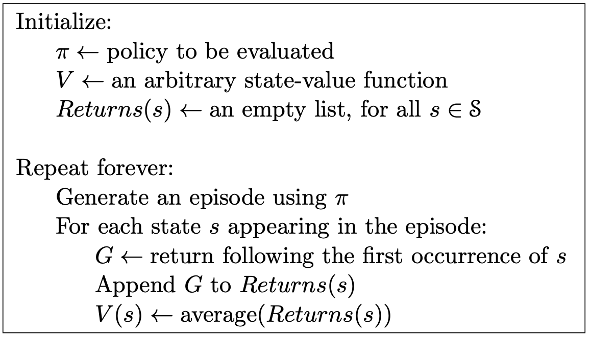
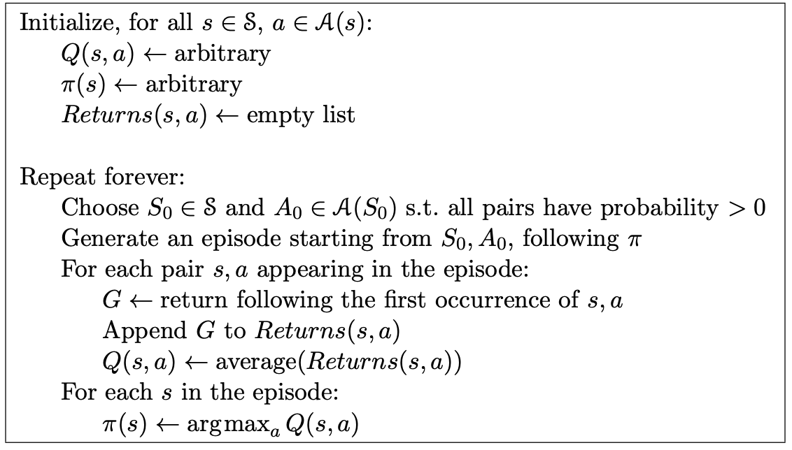
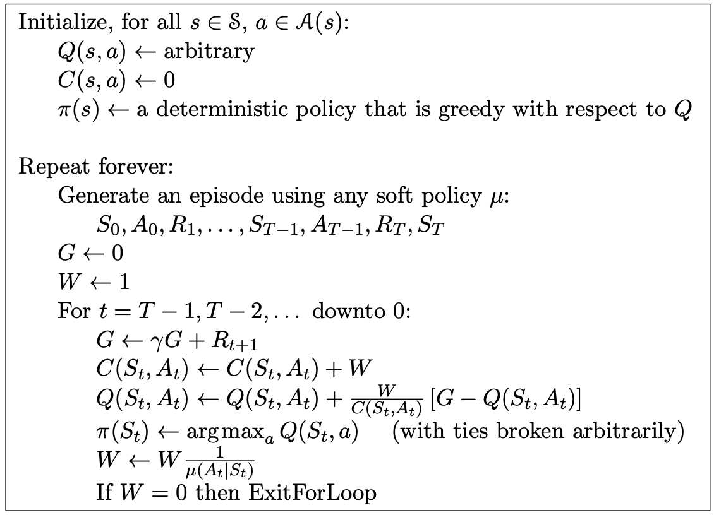
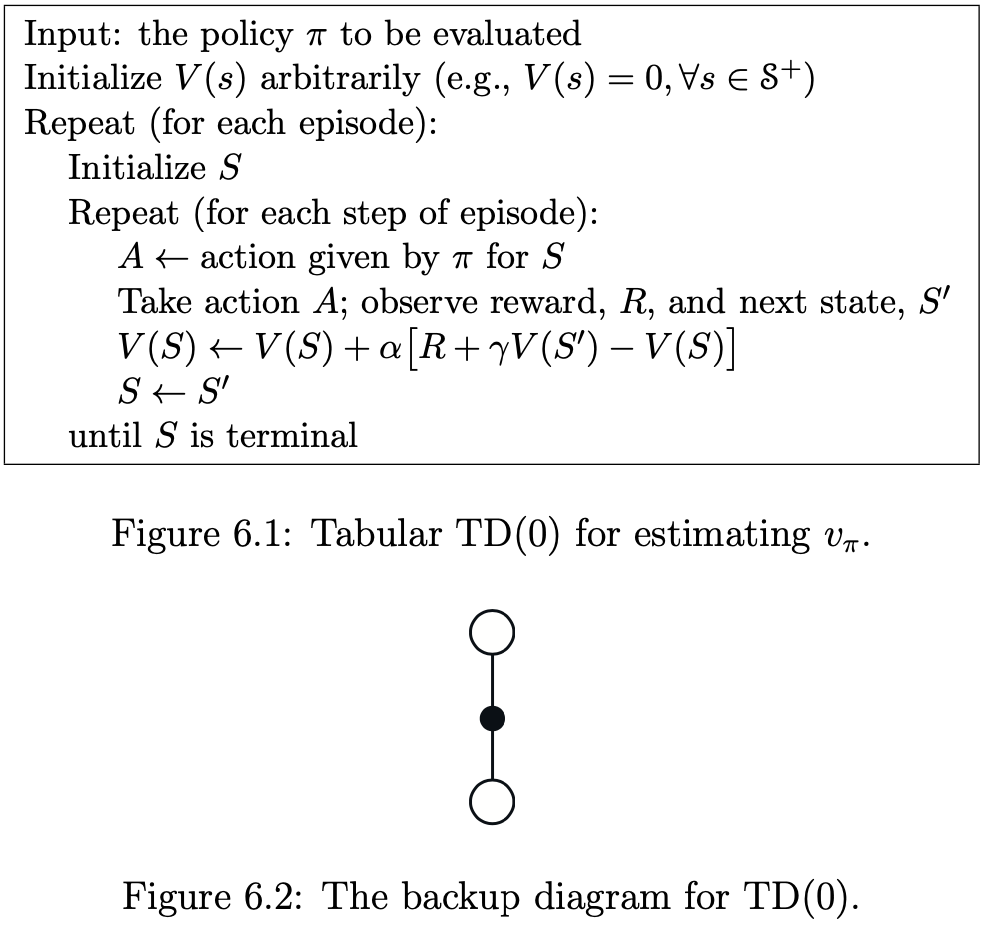
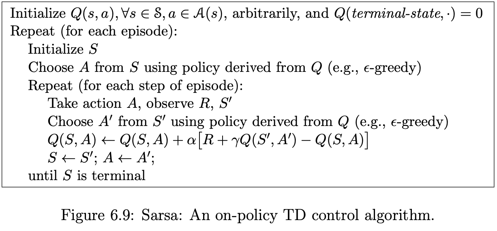
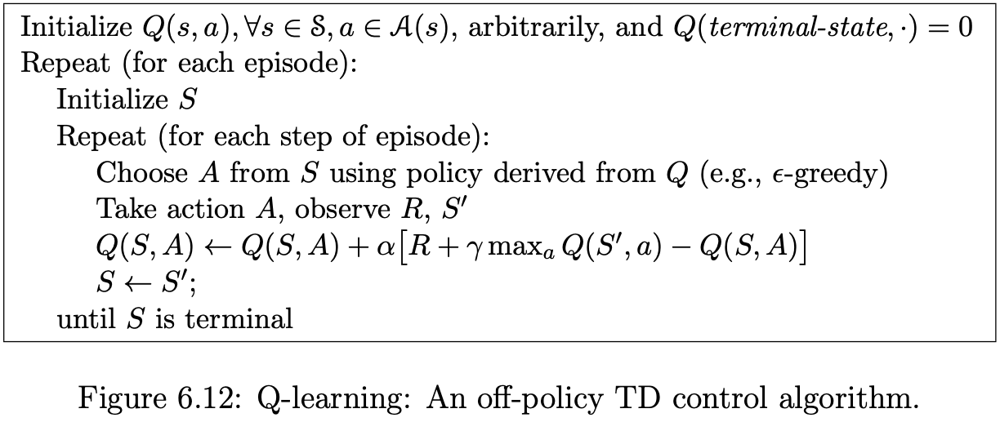
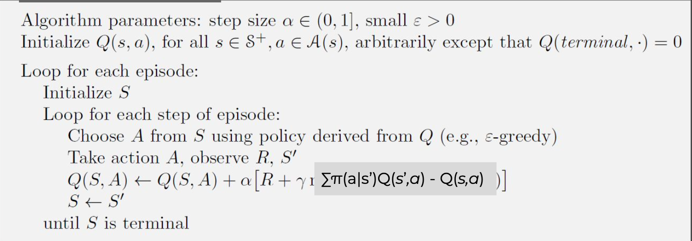
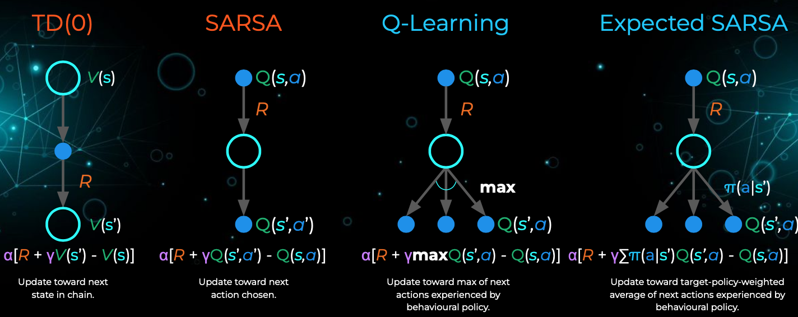
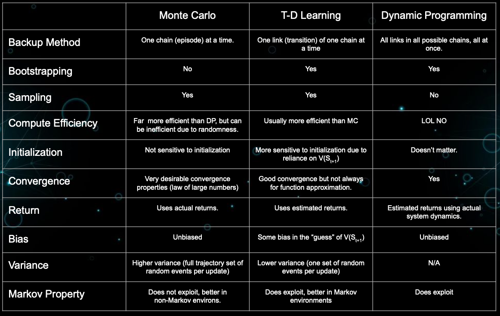

- [Bandit-Algorithm](#bandit-algorithm)
  - [N-arm bandit](#n-arm-bandit)
  - [Action-Value Methods](#action-value-methods)
  - [Incremental Implementation](#incremental-implementation)
  - [Tracking a Nonstationary Problem](#tracking-a-nonstationary-problem)
  - [$\epsilon$ greedy](#epsilon-greedy)
  - [Upper confidence bound](#upper-confidence-bound)
- [Markov Processes](#markov-processes)
  - [The Markov Property](#the-markov-property)
  - [Markov Decision Processes (MDPS)](#markov-decision-processes-mdps)
- [Monte Carlo](#monte-carlo)
  - [Monte Carlo methods](#monte-carlo-methods)
  - [First visit Monte Carlo method for estimating $v_\pi$](#first-visit-monte-carlo-method-for-estimating-v_pi)
  - [Monte Carlo control](#monte-carlo-control)
  - [Off policy](#off-policy)
- [Temporal-Difference Learning](#temporal-difference-learning)
  - [Difference between TD and Monte Carlo](#difference-between-td-and-monte-carlo)
  - [TD(0)](#td0)
  - [Advantages of TD Prediction Methods](#advantages-of-td-prediction-methods)
  - [Sarsa: On-Policy TD Control](#sarsa-on-policy-td-control)
  - [Q-Learning: Off-Policy TD Control](#q-learning-off-policy-td-control)
  - [Expected SARSA](#expected-sarsa)
  - [Summary:](#summary)

# Bandit-Algorithm

## N-arm bandit
You are faced repeatedly with a choice among n different options, or actions. After each choice you receive a numerical reward chosen from a stationary probability distribution that depends on the action you selected. Your objective is to maximize the expected total reward over some time period.

## Action-Value Methods
We denote the true (actual) value of action a as $q(a)$, and the estimated value on the tth time step as $Q_t(a)$,
If by the t-th time step action a has been chosen $N_t(a)$ times prior to $t$, yielding rewards $R_1, R_2, \cdots , R_{N_t(a)}$, then its value is estimated to be

$$
Q_t(a) = \frac{R_1 + R_2 + \cdots R_{N_t(a)}}{N_t(a)}
$$

## Incremental Implementation

For some action, let $Q_k$ denote the estimate for its kth reward, that is, the average of its first $k − 1$ rewards. Given this average and a $k$th reward for the action, $R_k$, then the average of all $k$ rewards can be computed by

$$
\begin{aligned}
    Q_{k+1} &= \frac{1}{k} \sum_{i = 1}^k R_i\\
    &= \frac{1}{k} (R_k + \sum_{i = 1}^{k - 1} R_i)\\
    &= \frac{1}{k}(R_k  + (k -1) Q_k + Q_k - Q_k)\\
    &= Q_k + \frac{1}{k}(R_k - Q_k)
\end{aligned}
$$
This implementation requires memory only for Qk and k, and only the small computation for each new reward.

## Tracking a Nonstationary Problem
- The averaging methods discussed so far are appropriate in a stationary envi- ronment, but not if the bandit is changing over time.
- In such cases it makes sense to weight recent rewards more heavily than long-past ones. One of the most popular ways of doing this is to use a constant step-size parameter.

$$
\begin{aligned}
    Q_{k+1} &= Q_k + \alpha[R_k - Q_k]\\
    &= \alpha R_k + (1 - \alpha) Q_k\\
    &= (1 - \alpha)^k Q_1 + \sum_{i = 1}^k \alpha(1 - \alpha)^{k - i} R_i
\end{aligned}
$$

## $\epsilon$ greedy
- With small probability $\epsilon$ , instead to select randomly from amongst all the actions with equal probability independently of the action- value estimates.
- Advantage: in the limit as the number of plays increases, every action will be sampled an infinite number of times, guaranteeing that $N_t(a) \rightarrow \infty$ for all $a$, and thus ensuring that all the $Q_t(a)$ converge to $q(a)$.
- The advantage of ε-greedy over greedy methods depends on the task. For example, suppose the reward variance had been larger, say 10 instead of 1. With noisier rewards it takes more exploration to find the optimal action, and ε-greedy methods should fare even better relative to the greedy method.

## Upper confidence bound
$$
A_t = argmax\  Q_t(a) + c[\sqrt{\frac{\log(t)}{N_t(a)}}]
$$

The bias term encourage the agent to explore. If the number of an action has been choosen is small, then the bias term got bigger. As the time goes on, it will more likely to encourage the agent to explore.

# Markov Processes

## The Markov Property
- The Markov property means a process or state is memoryless: what happens next only depends on where you are right now.
- Future is independent of past given present.
- Information state: sufficient statistic of history.
- State $s_t$ is Markov if and only if:
$$
p(s_{t+1} | s_t) = p(s_{t+1} | s_1, s_2,\cdots, s_t)
$$

## Markov Decision Processes (MDPS)

A Markov Decision Process is a tuple $\mathcal{(S, P, R, \gamma, A)}$  where:
- $\mathcal{S}$ is a finite set of states.
- $\mathcal{A}$ is a finite set of actions.
- $\mathcal{P}$ is our state-transition probability matrix.
$$
P(S_{t+1} = s^{\prime}| S_t = s, A_t = a)
$$
- $\mathcal{R}$ is a reward function, $R_s = \mathbb{E}[r_{t+1} | S_t = s, A_t = a]$
- $\mathcal{\gamma}$ is a discount factor $\gamma \in [0, 1]$
- $G$ is the discount sum of rewards from time step $t$ yo $H$

$$\begin{aligned}
    G_t &= r_{t + 1} + \gamma r_{t + 2} + \gamma^2 r_{t + 3} + \cdots\\
        &= \sum_{k=0}^{\infty}\gamma^k r_{t + k + 1}
\end{aligned}$$

- $V$ is the state value function, return the expected value from starting in state $s$ (The long-term value of state $s$):
$$\begin{aligned}
    V(s) &= \mathbb{E}[G_t | s_t = s] \\
    &= \mathbb{E}[r_{t + 1} + \gamma r_{t + 2} + \gamma^2 r_{t + 3} + \cdots | S_t = s]\\
    &= \mathbb{E}[r_{t + 1} + \gamma G_{t+1}| S_t = s]\\
    &= \mathbb{E}[r_{t + 1} + \gamma V(S_{t+1})| S_t = s]
\end{aligned}$$

- Bellman equation:
$$\begin{aligned}V(s) &= \underbrace{R(s)}_{\text{Immediate reward}} + \underbrace{\gamma \sum_{s^{\prime}\in S} P(s^{\prime} | s) V(s^{\prime})}_{\text{Discounted sum of future rewards}}\\
  \begin{bmatrix}V(s_1) \\V(s_2) \\\vdots\\V(s_N)\end{bmatrix}&= 
  \begin{bmatrix}R(s_1) \\R(s_2) \\\vdots\\R(s_N)\end{bmatrix} + \gamma\begin{bmatrix}
        p(s_1 | s_1) & p(s_2 | s_1) & \cdots & p(s_N | s_1)\\
        p(s_1 | s_2) & p(s_2 | s_2) & \cdots & p(s_N | s_2)\\
        \vdots       & \vdots       & \ddots & \vdots\\
        p(s_1 | s_N) & p(s_2 | s_N) & \cdots & p(s_N | s_N)
        \end{bmatrix}

        \begin{bmatrix}V(s_1) \\V(s_2) \\\vdots\\V(s_N)\end{bmatrix}\\

        V &= R + \gamma PV\\
        V & = (I - \gamma P)^{-1} R
  
  \end{aligned}$$
-  $q$ is the action value function.
$$\begin{aligned}
q(s, a) &= \mathbb{E} [G_t | S_t = s, A_t = a]\\
&= \mathbb{E}[r_{t + 1} + \gamma r_{t + 2} + \gamma^2 r_{t + 3} + \cdots | S_t = s, A_t = a]\\
&= \mathbb{E}[r_{t + 1} + \gamma q(S_{t+1}, A_{t+1}) | S_t = s, A_t = a]
\end{aligned}
$$

- Policies fully define the behaviour of an agent. Policies are how an agent chooses actions decides how to behave in each state.
$$
 \pi(a|s) = P(A_t = a| S_t = s) 
$$

- Bellman equation:
  - $V_{\pi}(s)$: The expected discounted reward earned from the environment, if the agent **starts in state s and makes decisions according to policy $\pi$ thereafter**.
  - $q_{\pi}(s, a)$: The expected discounted reward earned from the
environment, if the agent **takes action a from state s and makes decisions according to policy π thereafter**.

$$
\begin{aligned}
V_{\pi}(s) &= \sum_{a^{\prime} \in A} \pi(a^{\prime} | s) \cdot \sum_{s^{\prime} \in S} p(s^{\prime}, r | s, a^\prime) \cdot [r + \gamma V_{\pi}(s^\prime)]\\
& = \sum_{a^{\prime} \in A} \pi(a^{\prime} | s) \cdot q_{\pi}(s, a)\\

q_{\pi}(s, a) &= \sum_{s^{\prime} \in S} p(s^{\prime} | s, a) \cdot [r_{s, a} + \gamma \sum \pi(a^{\prime}| s^{\prime}) \cdot q_{\pi} (s^{\prime}, a^{\prime})]\\
& = \sum_{s^{\prime} \in S} p(s^{\prime} | s, a)\cdot [r + \gamma V_{\pi}(s^{\prime})]
\end{aligned}
$$

$$
\begin{aligned}
V_{\pi}(s)
 & = 
\sum_{a^{\prime} \in A}  P(a^{\prime} | s)
\begin{bmatrix}
p(s_1 | s_1, a^{\prime}) & p(s_2 | s_1, a^{\prime}) & \cdots & p(s_N | s_1, a^{\prime})
\end{bmatrix}

(
\begin{bmatrix}
R(s_1, a^{\prime})\\
R(s_2, a^{\prime})\\
\vdots\\
R(s_N, a^{\prime})\\
\end{bmatrix} + \gamma 
\begin{bmatrix}
V(s_1) \\
V(s_2) \\
\vdots \\
V(s_N) 
\end{bmatrix}
)

\end{aligned}
$$

# Monte Carlo
## Monte Carlo methods 
- Monte Carlo methods require only experience—sample sequences of states, actions, and rewards from actual or simulated interaction with an environment.
- Monte Carlo methods can be incremental in an episode-by-episode sense, but not in a step-by-step (online) sense. 
- Monte Carlo methods sample and average returns for each state–action pair.

## First visit Monte Carlo method for estimating $v_\pi$

        

Note: we use a capital letter V for the approximate value function because, after initialization, it soon becomes a random variable.

## Monte Carlo control
It is easy to see that Monte Carlo ES cannot converge to any sub-optimal policy. If it did, then the value function would eventually converge to the value function for that policy, and that in turn would cause the policy to change. Stability is achieved only when both the policy and the value func- tion are optimal. Convergence to this optimal fixed point seems inevitable as the changes to the action-value function decrease over time,

        

## Off policy
- Suppose now that all we have are episodes generated from a different policy. That is, suppose we wish to estimate $v_π$ or $q_π$, but all we have are episodes following another policy $\mu$, where $\mu \neq π$. 
- We call π the target policy because learning its value function is the target of the learning process, and we call $\mu$ the behavior policy because it is the policy controlling the agent and generating behavior. 
- The overall problem is called off-policy learning because it is learning about a policy given only experience “off” (not following) that policy.

        

# Temporal-Difference Learning

## Difference between TD and Monte Carlo

Monte Carlo methods wait until the return following the visit is known, then use that return as a target for V (St). A simple every-visit Monte Carlo method suitable for nonstationary environments is

$$
V(S_t) = V(S_t) + \alpha  [G_t - V(S_t)]
$$
where G(t) is the actual return following time t. Whereas Monte Carlo methods must wait until the end of the episode to determine the increment to $V (S_t)$. TD methods need wait only until the next time step. At time $t+1$ they immediately form a target and make a useful update using the observed reward Rt+1 and the estimate $V (S_{t+1})$. The simplest TD method, known as TD(0), is

$$
V(S_t) = V(S_t) + \alpha[R_{t+1} + \gamma V(S_{t+1} - V(S_t))]
$$

## TD(0)

        

## Advantages of TD Prediction Methods

- TD methods have an advantage over DP methods in that they do not require a model of the environment, of its reward and next-state probability distributions.

- TD are naturally implemented in an on-line, fully incremental fashion. With Monte Carlo methods one must wait until the end of an episode, because only then is the return known, whereas with TD methods one need wait only one time step. Surprisingly often this turns out to be a critical consideration. Some applications have very long episodes, so that delaying all learning until an episode’s end is too slow. Other applications are continuing tasks and have no episodes at all. Finally, as we noted in the previous chapter, some Monte Carlo methods must ignore or discount episodes on which experimental actions are taken, which can greatly slow learning. TD meth- ods are much less susceptible to these problems because they learn from each transition regardless of what subsequent actions are taken.

## Sarsa: On-Policy TD Control
It is straightforward to design an on-policy control algorithm based on the Sarsa prediction method. As in all on-policy methods, we continually estimate $q_\pi$ for the behavior policy $\pi$, and at the same time change $\pi$ toward greediness with respect to $q_\pi$.

        

## Q-Learning: Off-Policy TD Control

        

## Expected SARSA

        

## Summary:
**TD(0)**: 
- TD(0) is essentially a policy evaluation algorithm; it is for prediction, rather than control. 
- It updates each V(s) toward $R+\gamma V(s^\prime)$ in order to “chain predictions forward”, which results in V(s)
converging to the true long-term return. 
- Put another way, as more and more episodes are run, each V(s) becomes closer to V(s’) and information propagates backward through every trajectory chain. While TD(0) is better than Monte Carlo in terms of variance and efficiency, it is significantly more biased as the target contains a guess about the long-term return of the successor state.
  
**SARSA**: 
- SARSA is on-policy TD(0) that updates according to the action that was actually selected. 
- It functions similarly, and critically can learn while the episode is still going on. SARSA, being on-policy, requires an exploratory component (e.g., e-soft) to explore enough to ensure convergence. 
- SARSA is a solid “workhorse” algorithm that is **relatively conservative compared to Q-Learning**
- However it only learns a near-optimal policy while exploring; to get directly at the optimal policy we would need to decay exploration over time and choose the decay parameter “correctly”.

**Q-Learning**: 
- In contrast to SARSA, Q-Learning is an off-policy algorithm that uses only the maximal available action in its updates regardless of the action that was actually taken (Q-learning is called off-policy because the updated policy is different from the behavior policy). This gives Q-Learning the advantage of “not getting discouraged”, or “walking the razor’s edge”. 
- **Because Q-Learning focuses on the optimal action only, it will be willing to take risks and learn potentially more dangerous paths to success.** 
- Similar to SARSA, it requires an exploratory component to ensure convergence, yet due to the off-policy nature of Q-Learning it directly learns the optimal policy.

**Expected SARSA**:
- Expected SARSA updates each Q-estimates not according to the max, but to the policy-weighted average of
the available actions.
- It trains more quickly than SARSA (using all available actions in proportion to
their likelihood of being selected), and is significantly less risky than Q-Learning (if one or more actions are
heavily negative, that information is always included in the update in proportion to the likelihood of the negative
events coming to pass). 
- Similar to SARSA, we would need to decay exploration over time to learn the optimal policy rather than a near-optimal policy.

        

        

