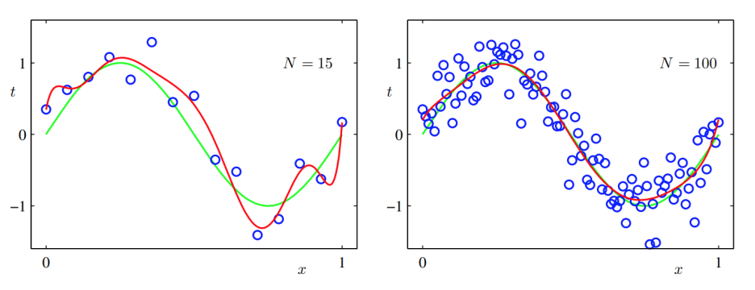
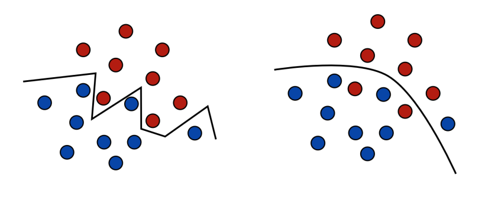

- [Introduction to Theoretical Machine Learning](#introduction-to-theoretical-machine-learning)
  - [Definitions and Terminology](#definitions-and-terminology)
  - [Supervised Learning Setup](#supervised-learning-setup)
  - [Generalization](#generalization)
  - [Generalization Bounds](#generalization-bounds)

# Introduction to Theoretical Machine Learning
  
## Definitions and Terminology
- Examples: instances,data points used
  - E.g., a pair $(x, y)$ in supervised learning.
- Features: attributes associated to an example,often represented as a vector: $x\in \mathbb{R}^n$
  - E.g., age, tumor size for cancer diagnosis; pixels for image classification
- Labels: category(classification) or real value(regression) associated to an item:
  - E.g., malignant/benign; stock index
- Data: a set of examples:
  - Training data: examples used for building a model h
  - Test data: examples used for evaluating the performance of h (unseen during training)
  - Validation data: examples used for tuning hyperparameters of h (e.g., number of layers of a neural network)
- Space: 
  - Feature/input space $\mathcal{X}$:
    - Usually $\mathcal{X}\subseteq \mathbb{R}^n$
  - Label/output space $\mathcal{Y}$ 
    - Usually $\mathcal{Y}\subseteq \{0,1\}$ or $\{1,-1\}$ for classification
    - $\mathcal{Y}\subseteq R$ for regression
- Loss function:
  - $\mathcal{l}: Y \times Y \rightarrow \mathbb{R}_+$
  - $\mathcal{l}(y^\prime, y)$: the cost of predicting $y^{\prime}$ instead of $y$.
    - 0-1 loss for binary classification: $\mathcal{l}(y^\prime, y) = \mathbb{1}_{y\neq y^{\prime}}$
    - Squared loss for regression: $\mathcal{l}(y^\prime, y) = (y - y^{\prime})^2$
- Hypothesisset/space $\mathcal{H}$: A set of functions mapping features to the set of labels $\mathcal{Y}$.
  
## Supervised Learning Setup
- Training data: sample $S$ of size $m$ drawn i.i.d.(independentand identically distributed) from $\mathcal{X} \times \mathcal{Y}$ according to distribution $\mathcal{D}$:
  
$$
S = \{(x_1, y_1), \cdots, (x_m, y_m)\}
$$

- Problem: find a hypothesis $h\in \mathcal{H}$, such that $\mathcal{l}(h(x), y)$ is small for any $(x, y)\backsim\mathcal{D}$
- Generalization error: for any $h\in \mathcal{H}$:

$$
\mathcal{R}(h) = \mathbb{E}_{(x, y)\backsim \mathcal{D}}[ \mathcal{l}(h(x), y)]
$$
- Empirical/training error: given $S$, for any $h\in \mathcal{H}$:

$$
\mathcal{\hat{R}}(h) = \frac{1}{m} \sum_{i = 1}^m l(h(x_i), y_i)
$$
-  Is minimizing empirical error a good idea?

      

      

## Generalization

- A small error on the training set CANNOT guarantee a small
generalization error (i.e., the error on the test set)
- Complex models can be poor predictors
- There is a tradeoff between the sample size and model
complexity – when the sample size is small, choosing from a too complex hypothesis class $\mathcal{H}$ may lead to poor generalization
(overfitting).
- If we have infinite amount of training examples and
computational resources, there won’t be any problem!
- We want to understand the behavior of a learning algorithm
given finite number of training examples (non-asymptotic
behavior)

## Generalization Bounds
- Definition: given $\mathcal{H}$, the upper bound on $sup_{h\in\mathcal{H}} |R(h) − \hat{R}(h)|$.
In other words, it holds for any $h \in \mathcal{H}$.

- Let $h^*$ be the optimal hypothesis in $\mathcal{H}$. Then, if $h_0$ is the minimizer of $\hat{R}(h)$, we have:
$$
\begin{aligned}
\mathcal{R}(h_0) - \mathcal{R}(h^*) &= \mathcal{R}(h_0) - \hat{R}(h_0) + \hat{R}(h_0) - \mathcal{R}(h^*)\\
&\leq  \mathcal{R}(h_0) - \hat{R}(h_0) + \hat{R}(h^*) - \mathcal{R}(h^*)\\
&= 2 sup_{h\in\mathcal{H}} |R(h) − \hat{R}(h)|
\end{aligned}
$$
- Principle: Choose H in the way such that both $R(h^∗)$ and
$sup_{h\in\mathcal{H}} |R(h) − \hat{R}(h)|$ are small.